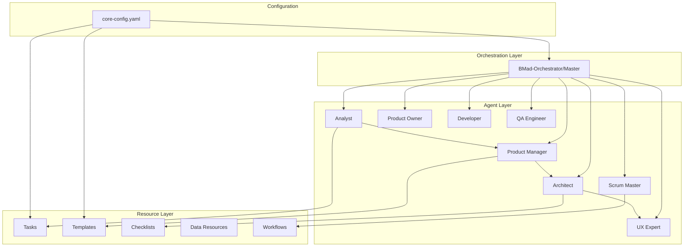

# BMad Method Overview - Entry Point

## What is BMad?

BMad (Breakthrough Method of Agile AI-Driven Development) is a sophisticated AI-powered software development orchestration system that uses specialized AI agents, workflows, and templates to manage the entire software development lifecycle. It transforms any domain with specialized AI expertise through a structured, agent-based approach.

## System Purpose

BMad solves the two biggest problems in AI-assisted development:
- **Planning Inconsistency**: Through dedicated planning agents (Analyst, PM, Architect) that create detailed, consistent PRDs and Architecture documents
- **Context Loss**: Through context-engineered development where stories contain full implementation details directly embedded

## Quick Architecture

## Navigation Guide

### For Different Audiences

#### 🚀 **Developers Using BMad**
Start here to use BMad for your projects:
- **Primary**: [30-bmad-usage-guide.md](30-bmad-usage-guide.md) - Complete end-to-end workflow
- **Next**: [32-bmad-troubleshooting-guide.md](32-bmad-troubleshooting-guide.md) - Common issues and solutions
- **Reference**: [90-bmad-glossary.md](90-bmad-glossary.md) - BMad terminology

#### 🔧 **Creating Expansion Packs**
Build your own domain-specific agents:
- **Primary**: [31-bmad-expansion-guide.md](31-bmad-expansion-guide.md) - Step-by-step expansion pack creation
- **Components**: Review all files in section 10-19 for component specifications
- **Patterns**: Review files 20-29 for integration patterns

#### 🏗️ **Understanding Internals**
Deep dive into BMad architecture:
- **Start**: [02-bmad-philosophy-architecture.md](02-bmad-philosophy-architecture.md) - Core principles and design
- **Components**: Files 10-19 - Deep dives into each component type
- **Interactions**: Files 20-29 - How components work together

#### 🤖 **AI Agents Extending BMad**
For LLMs processing BMad documentation:
- **Index**: [99-bmad-index.md](99-bmad-index.md) - Complete document listing with keywords
- **Glossary**: [90-bmad-glossary.md](90-bmad-glossary.md) - All BMad-specific terms
- **Pattern**: Files follow `[number]-bmad-[topic]-[type].md` naming

## Quick Start Paths

### Path 1: Run a BMad Project (User)
1. Read [30-bmad-usage-guide.md](30-bmad-usage-guide.md)
2. Follow planning workflow (Web UI)
3. Execute development cycle (IDE)
4. Refer to [32-bmad-troubleshooting-guide.md](32-bmad-troubleshooting-guide.md) if issues

### Path 2: Create an Expansion Pack (Developer)
1. Understand basics: [02-bmad-philosophy-architecture.md](02-bmad-philosophy-architecture.md)
2. Learn components: Review files 10-17 (agents, tasks, templates, etc.)
3. Follow guide: [31-bmad-expansion-guide.md](31-bmad-expansion-guide.md)
4. Test using patterns from files 20-23

### Path 3: Understand the System (Architect)
1. Philosophy: [02-bmad-philosophy-architecture.md](02-bmad-philosophy-architecture.md)
2. Components: Files 10-17 in sequence
3. Interactions: Files 20-23 for patterns
4. Implementation: Files 30-32 for practical usage

## Document Organization

### Foundations (01-09)
Core concepts and system overview

### Core Components (10-19)
Deep dives into each BMad component type:
- Agents, Tasks, Templates, Checklists
- Workflows, Teams, Configuration, Data

### System Interactions (20-29)
How components work together:
- Workflow patterns, Document lifecycle
- Execution patterns, Component distinctions

### Implementation Guides (30-39)
Practical usage and creation:
- User journeys, Expansion packs
- Troubleshooting

### Reference (90-99)
Supporting documentation:
- Glossary of terms
- Master index

## Key Concepts

- **Agents**: AI personas with specific professional roles
- **Tasks**: Executable procedures in markdown format
- **Templates**: YAML schemas for structured documents
- **Workflows**: Multi-agent orchestration sequences
- **Checklists**: Quality validation criteria
- **Core-config**: Central configuration hub

## Getting Started

Choose your path above based on your goal, and follow the recommended document sequence. Each document builds on previous knowledge, so following the numbered order within each section ensures the best understanding.

## See Also

- [99-bmad-index.md](99-bmad-index.md) - Complete document index
- [90-bmad-glossary.md](90-bmad-glossary.md) - All BMad terms defined
- [02-bmad-philosophy-architecture.md](02-bmad-philosophy-architecture.md) - Deep dive into BMad principles