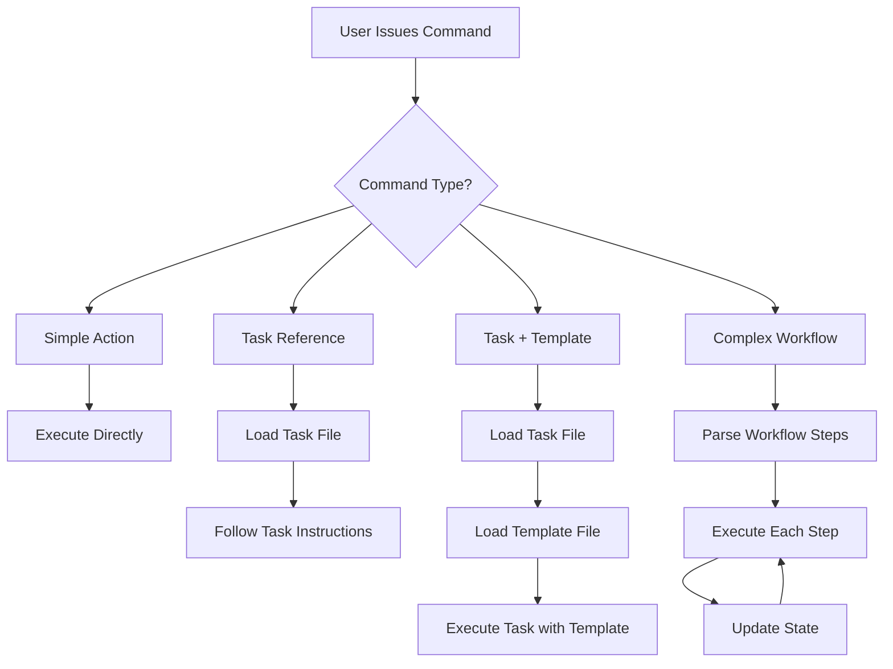

# BMad Tasks Complete Reference

## Overview

Tasks in BMad are executable procedures written in markdown that agents run to perform specific actions. They are the implementation layer that bridges agent commands to actual work. This comprehensive reference covers both BMad-core tasks (domain-specific) and common tasks (universal processors).

## Part 1: Task System Architecture

### Task Types and Hierarchy

BMad uses two categories of tasks:

| Type | Location | Purpose | Scope |
|------|----------|---------|-------|
| **Common Tasks** | `/workspace/common/tasks/` | Universal processors | Generic, reusable across all contexts |
| **BMad-Core Tasks** | `/workspace/bmad-core/tasks/` | Domain-specific procedures | Project-focused, agent-specific |

### Task Structure

Every task follows a consistent markdown structure:

```markdown
---
template: "{root}/templates/template-name.yaml"  # Optional frontmatter
docOutputLocation: docs/output.md                # Output specification
elicit: true                                      # Interaction requirement
---

# Task Name

## Purpose
[Clear description of what the task does]

## Execution Rules
[Critical requirements and constraints]

## Processing Flow
1. Step 1
2. Step 2
3. Step 3

## Integration Points
[How it connects with other components]
```

### Task Execution Principles

1. **Task Override Authority**: Task instructions OVERRIDE agent's default behavior
2. **Interactive Requirements**: `elicit: true` CANNOT be bypassed
3. **Lazy Loading**: Tasks are NEVER pre-loaded, only loaded when executed
4. **Template Integration**: Tasks can reference templates via frontmatter or parameters
5. **Output Management**: Tasks specify output locations explicitly

## Part 2: Common Tasks - Universal Processors

### Task #1: create-doc.md - The Document Factory

#### Purpose
Universal document generator that transforms YAML templates into interactive, AI-generated documents with strict human oversight.

#### Core Architecture
```markdown
# Critical Execution Model
1. DISABLE ALL EFFICIENCY OPTIMIZATIONS
2. MANDATORY STEP-BY-STEP EXECUTION  
3. ELICITATION IS REQUIRED when elicit: true
4. NO SHORTCUTS ALLOWED
```

#### The Elicitation Pattern
When `elicit: true`:
1. Present section content
2. Provide detailed rationale
3. STOP and present numbered options 1-9:
   - Option 1: "Proceed to next section"
   - Options 2-9: Select from elicitation methods
4. WAIT FOR USER RESPONSE

#### Processing Flow
```yaml
1. Parse YAML template
2. Set preferences (mode, output file)
3. For each section:
   a. Check conditions
   b. Verify agent permissions
   c. Draft content
   d. Present with rationale
   e. IF elicit: Apply 1-9 options
   f. Save to file
4. Continue until complete
```

#### Agent Permission System
```yaml
section:
  owner: architect      # Who creates initially
  editors: [architect]  # Who can modify
  readonly: false      # Can be changed later?
```

#### YOLO Mode
- User types `#yolo`
- Processes all sections at once
- Still respects conditions and permissions
- Trades interaction for speed

### Task #2: execute-checklist.md - The Validator

#### Purpose
Universal validation engine that ensures document quality and completeness across all BMad components.

#### Validation Architecture
```markdown
# Two execution modes
1. Interactive Mode (section by section)
2. YOLO Mode (all at once)
```

#### Processing Pattern
```yaml
1. Initial Assessment
   - Fuzzy match checklist name
   - Load appropriate checklist
   - Confirm execution mode
   
2. Document Gathering
   - Each checklist specifies requirements
   - Gather specified artifacts
   - Resolve file locations
   
3. Checklist Processing
   - Work through each section
   - Check items against documents
   - Report findings
   - Get user confirmation
   
4. Final Report
   - Summary of all findings
   - Action items
   - Compliance status
```

#### Validation Approaches
For each checklist item:
1. Read requirement
2. Locate relevant content
3. Assess compliance:
   - ✅ Meets requirement
   - ⚠️ Partially meets
   - ❌ Does not meet
   - ➖ Not applicable
4. Document rationale
5. Suggest improvements

## Part 3: BMad-Core Tasks - Domain Procedures

### Command-to-Task Mapping Patterns

#### Command Structure Types

##### Simple Action Commands
Execute immediate actions without external dependencies:
```yaml
- help: Show numbered list of commands
- exit: Exit agent persona
- yolo: Toggle Yolo Mode
- doc-out: Output full document
```

##### Task Reference Commands
Explicitly call a task file:
```yaml
- document-project: execute the task document-project.md
- brainstorm {topic}: run task facilitate-brainstorming-session.md
- elicit: run the task advanced-elicitation
- shard-doc: run the task shard-doc.md
```

##### Task + Template Combination Commands
Combine a task with a specific template:
```yaml
- create-prd: run task create-doc.md with template prd-tmpl.yaml
- create-architecture: use create-doc with architecture-tmpl.yaml
- create-project-brief: use task create-doc with project-brief-tmpl.yaml
```

##### Conditional/Contextual Commands
Have conditional behavior or defaults:
```yaml
- task {task}: Execute task, if not found show available tasks
- create-doc {template}: execute task (no template = show available)
- execute-checklist {checklist}: Run task (no checklist = show available)
```

##### Complex Workflow Commands
Define multi-step processes inline:
```yaml
- develop-story:
    order-of-execution: "Read task→Implement→Test→Validate→Update→Repeat"
    story-file-updates-ONLY: [specific sections]
    blocking: [halt conditions]
    ready-for-review: [completion criteria]
```

### Command Execution Flow



### Task Loading and Resolution

#### File Resolution Pattern
All tasks are resolved using the IDE-FILE-RESOLUTION pattern:
```yaml
IDE-FILE-RESOLUTION:
  - Dependencies map to {root}/{type}/{name}
  - type=folder (tasks|templates|checklists|data)
  - Example: create-doc.md → {root}/tasks/create-doc.md
```

#### Lazy Loading Principle
- Tasks are NEVER pre-loaded during agent activation
- Only loaded when command is executed
- Reduces memory footprint and startup time

### Special Command Behaviors

#### Commands with State Management
Some commands maintain state across execution:
```yaml
develop-story:
  - Tracks task completion with checkboxes
  - Updates specific file sections
  - Maintains debug log
  - Has blocking conditions
```

#### Commands with User Interaction
Commands that require user input:
```yaml
create-doc:
  - Uses elicitation when elicit: true
  - Presents numbered options (1-9)
  - Waits for user response
  - Cannot skip interaction
```

#### Commands with Validation
Commands that include quality checks:
```yaml
execute-checklist:
  - Validates against criteria
  - Marks items as PASS/FAIL/PARTIAL/N/A
  - Generates reports
  - Can run interactive or YOLO mode
```

## Part 4: Task Patterns and Best Practices

### Design Patterns in Tasks

#### 1. Strict Enforcement Pattern
```markdown
⚠️ CRITICAL EXECUTION NOTICE ⚠️
DISABLE ALL EFFICIENCY OPTIMIZATIONS
MANDATORY STEP-BY-STEP EXECUTION
```
**Purpose**: Prevent AI from taking shortcuts
**Implementation**: Clear violation indicators
**Result**: Consistent user experience

#### 2. Interactive Elicitation Pattern
```markdown
1. Present content
2. Explain rationale
3. Offer numbered choices (1-9)
4. Wait for response
```
**Purpose**: Ensure human oversight
**Implementation**: Forced stop points
**Result**: Quality control

#### 3. Fuzzy Matching Pattern
```markdown
If user provides "architecture checklist":
- Try fuzzy match → "architect-checklist"
- If multiple matches → ask for clarification
- Load appropriate resource
```
**Purpose**: User-friendly input
**Implementation**: Intelligent resolution
**Result**: Reduced friction

#### 4. Mode Toggle Pattern
```markdown
Interactive Mode: Step-by-step
YOLO Mode: All at once (#yolo to toggle)
```
**Purpose**: Balance thoroughness and speed
**Implementation**: User-controlled switching
**Result**: Flexible execution

### Common vs Core Tasks Comparison

| Aspect | Common Tasks | Core Tasks |
|--------|-------------|------------|
| **Scope** | Universal | Domain-specific |
| **Dependencies** | Minimal | May require others |
| **Templates** | Any YAML | Specific templates |
| **Agents** | All can use | May be agent-specific |
| **Logic** | Generic processing | Business logic |
| **Reusability** | 100% reusable | Project-focused |

### Task Dependencies

Commands declare their dependencies explicitly:
```yaml
dependencies:
  tasks:
    - create-doc.md
    - execute-checklist.md
  templates:
    - prd-tmpl.yaml
    - architecture-tmpl.yaml
  checklists:
    - architect-checklist.md
  data:
    - technical-preferences.md
```

These dependencies:
- Are NOT loaded at agent startup
- Are loaded on-demand when command executes
- Must exist for command to work properly
- Can be shared across multiple agents

### Command Naming Conventions

#### Prefix Requirements
- All commands require `*` prefix when invoked
- Example: User types `*create-prd` not `create-prd`

#### Naming Patterns
- **Action-Object**: create-prd, execute-checklist
- **Single Word**: help, exit, yolo
- **Mode Toggles**: kb-mode, chat-mode
- **Object-Action**: doc-out, story-review

## Part 5: Creating New Tasks

### Criteria for Common Tasks
1. **Universal applicability**: Works across domains
2. **No domain logic**: Pure processing
3. **Template/data driven**: Configurable behavior
4. **Reusable pattern**: Used by multiple agents

### Template for New Tasks
```markdown
# Task Name

## Purpose
[Clear description of what the task accomplishes]

## Critical Execution Rules
- Rule 1: [Enforcement requirement]
- Rule 2: [Processing constraint]

## Processing Flow
1. Step 1: [Action]
2. Step 2: [Action]
3. Step 3: [Action]

## Integration
- Works with: [components]
- Requires: [dependencies]
- Outputs: [results]
```

### Best Practices

#### For Using Tasks
1. **Respect the Process**:
   - Don't skip interactive steps
   - Follow elicitation requirements
   - Honor agent permissions

2. **Provide Clear Input**:
   - Specify template clearly
   - Name checklists accurately
   - Set preferences upfront

3. **Handle Outputs Properly**:
   - Save to correct locations
   - Maintain document structure
   - Preserve formatting

#### For Creating Tasks
1. **Be Descriptive**: Task names should clearly indicate purpose
2. **Use Consistent Patterns**: Follow existing naming conventions
3. **Document Dependencies**: List all required resources
4. **Support Discovery**: Implement help and list options
5. **Enable Fuzzy Matching**: Use REQUEST-RESOLUTION
6. **Respect User Control**: Include exit and mode toggles
7. **Validate Inputs**: Check parameters before execution
8. **Provide Feedback**: Announce what's happening
9. **Handle Errors Gracefully**: Include blocking conditions
10. **Enable Both Modes**: Support interactive and YOLO where appropriate

## Part 6: Utils - Supporting Infrastructure

### workflow-management.md - The Orchestrator Guide

**Purpose**: Documents how BMad orchestrator manages workflows

**Key Capabilities**:
```markdown
/workflows - List available workflows
/workflow-start {id} - Begin workflow
/workflow-status - Check progress
/workflow-resume - Continue from checkpoint
/workflow-next - Show next step
```

**Design Patterns**:
- **Dynamic loading**: Workflows loaded from team config
- **State tracking**: Maintains workflow position
- **Context passing**: Preserves artifacts between stages
- **Interruption handling**: Can resume from any point

### bmad-doc-template.md - The Template Specification

**Purpose**: Defines YAML template structure for documents

**Core Structure**:
```yaml
template:
  id: identifier
  name: Human name
  version: 1.0
  output:
    format: markdown
    filename: path/to/file.md
    
sections:
  - id: section-id
    title: Section Title
    instruction: LLM guidance
    elicit: true/false
    condition: when to include
```

**Key Features**:
- **Variable substitution**: `{{variable}}`
- **Conditional sections**: Based on project needs
- **Mermaid diagrams**: Visual representations
- **Agent permissions**: Ownership control
- **Repeatable sections**: For lists, items

## Troubleshooting Tasks

### Common Issues

| Issue | Cause | Solution |
|-------|-------|----------|
| Document created without interaction | YOLO mode or violation | Check mode, enforce interaction |
| Checklist not found | Name mismatch | Use fuzzy matching |
| Template parse error | Invalid YAML | Validate template structure |
| Permission denied | Agent restrictions | Check owner/editors fields |
| Elicitation skipped | Missing elicit flag | Set elicit: true in template |
| Task not found | Incorrect path | Verify IDE-FILE-RESOLUTION |
| Command not recognized | Missing prefix | Use * before command |

### Debugging Strategies

1. **Check Execution Mode**:
   - Interactive vs YOLO
   - Verify user didn't toggle

2. **Validate Inputs**:
   - Template structure
   - Checklist format
   - File paths

3. **Review Permissions**:
   - Agent ownership
   - Editor lists
   - Readonly flags

4. **Trace Execution**:
   - Follow processing flow
   - Check each step
   - Identify failure point

## Key Insights for Expansion Pack Creation

1. **Commands are the API**: They define what users can do with an agent
2. **Tasks are the implementation**: They contain the actual logic
3. **Templates provide structure**: They ensure consistency
4. **Dependencies enable modularity**: Components can be shared
5. **Lazy loading is critical**: Never pre-load resources
6. **User interaction is sacred**: Never skip elicitation
7. **Task authority is absolute**: Tasks override agent defaults
8. **Fuzzy matching improves UX**: Users don't need exact commands
9. **State management enables complex workflows**: Like story development
10. **Validation ensures quality**: Through checklists and tests

## Summary

Tasks are the execution engine of BMad, providing:
- **Universal capabilities** through common tasks
- **Domain-specific procedures** through core tasks
- **Consistent interfaces** for all operations
- **Strict enforcement** of quality processes
- **Flexible execution** modes for different needs

Understanding the task system is essential for using BMad effectively, creating quality documents, extending capabilities, and troubleshooting issues. The task architecture embodies BMad's core principle: structured procedures with human oversight enable consistent, high-quality output across diverse projects and domains.

## See Also

- [10-bmad-agents-reference.md](10-bmad-agents-reference.md) - How agents use tasks
- [12-bmad-templates-reference.md](12-bmad-templates-reference.md) - Template structures tasks process
- [22-bmad-execution-patterns.md](22-bmad-execution-patterns.md) - Checklist execution through tasks
- [23-bmad-distinction-patterns.md](23-bmad-distinction-patterns.md) - Tasks vs data distinction