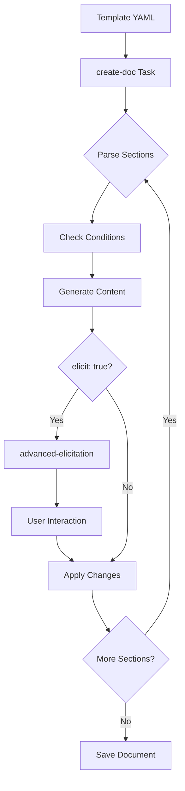

# Deep Dive: Templates in BMad - The Document Generation System

## Overview

Templates are the backbone of BMad's document generation system, defining structured schemas for creating consistent project artifacts. As YAML-based specifications, templates serve as intelligent forms that guide both AI agents and users through document creation while maintaining architectural consistency across the entire BMad ecosystem.

### Core Principles

- **Self-contained intelligence**: Templates embed both structure and generation instructions
- **Agent-agnostic design**: Any agent with proper dependencies can use any template  
- **Interactive refinement**: Built-in elicitation enables iterative improvement
- **Clean separation**: YAML structure keeps processing logic separate from content

### What Makes Templates Unique

Unlike simple document outlines, BMad templates are active participants in the creation process:
- They contain detailed instructions for LLMs on how to generate each section
- They support conditional logic to adapt to different project types
- They integrate with the elicitation system for user-guided refinement
- They maintain agent permissions for collaborative workflows

### Template Structure at a Glance

Every BMad template follows the specification defined in `/workspace/bmad-method/common/utils/bmad-doc-template.md`:
- **Template Metadata Block** - Identity and output configuration
- **Workflow Configuration** - Processing behavior and elicitation settings
- **Sections Array** - Hierarchical document structure with embedded intelligence

## Template Anatomy

BMad templates are structured YAML files with three main blocks and a comprehensive set of section properties. Each component plays a specific role in the document generation process.

### Template Metadata Block

**Purpose**: Defines the template's identity, versioning, and output configuration. This block tells the system what the template is and where its output should go.

**Requirement**: Required
- When to include: Always - every template must have complete metadata
- When NOT to include: Never - templates without metadata cannot be processed

**Format**:
```yaml
template:
  id: kebab-case-identifier  # Unique identifier
  name: Human Readable Name   # Display name in UI
  version: 1.0 or 2.0         # Template version
  output:
    format: markdown          # Output format (markdown or yaml)
    filename: path/to/file.md # Default output path
    title: "Document Title"   # H1 heading in output
```

**Examples from actual templates**:

From `prd-tmpl.yaml:2-9`:
```yaml
template:
  id: prd-template-v2
  name: Product Requirements Document  
  version: 2.0
  output:
    format: markdown
    filename: docs/prd.md
    title: "{{project_name}} Product Requirements Document (PRD)"
```

From `qa-gate-tmpl.yaml:2-9`:
```yaml
template:
  id: qa-gate-template-v1
  name: Quality Gate Decision
  version: 1.0
  output:
    format: yaml  # Note: Different format for QA gates
    filename: qa.qaLocation/gates/{{epic_num}}.{{story_num}}-{{story_slug}}.yml
```

**Best Practices**:
- Use kebab-case for template IDs
- Include version suffix in ID for major versions (e.g., `prd-template-v2`)
- Use variables in filename and title for dynamic content (e.g., `{{epic_num}}`)
- Config references use dot notation without braces (e.g., `qa.qaLocation`)
- Most templates use markdown format; only qa-gate uses yaml

### Workflow Configuration Block

**Purpose**: Controls how the template is processed, including interaction mode and elicitation behavior.

**Requirement**: Recommended
- When to include: For all interactive templates (most common)
- When NOT to include: Only for non-interactive output templates like `brainstorming-output-tmpl.yaml`

**Format**:
```yaml
workflow:
  mode: interactive | non-interactive  # Processing mode
  elicitation: advanced-elicitation     # Elicitation task reference (for interactive mode)
  custom_elicitation:                   # Optional: Template-specific elicitation actions
    title: "Custom Actions Title"       # Display title for the actions
    options:                             # Array of custom action descriptions
      - "Action 1 description"
      - "Action 2 description"

**Examples from actual templates**:

From `prd-tmpl.yaml:11-13`:
```yaml
workflow:
  mode: interactive
  elicitation: advanced-elicitation
```

From `brainstorming-output-tmpl.yaml:10-11` (non-interactive):
```yaml
workflow:
  mode: non-interactive
```

From `project-brief-tmpl.yaml:12-24` (with custom elicitation):
```yaml
workflow:
  mode: interactive
  elicitation: advanced-elicitation
  custom_elicitation:
    title: "Project Brief Elicitation Actions"
    options:
      - "Expand section with more specific details"
      - "Validate against similar successful products"
      - "Stress test assumptions with edge cases"
```

**Best Practices**:
- Default to `mode: interactive` for user-facing documents
- Use `mode: non-interactive` for output-only templates that format existing data
- Always specify `elicitation: advanced-elicitation` for interactive templates
- Add `custom_elicitation` for template-specific refinement actions
- Note: While the spec primarily documents interactive mode, non-interactive is valid in practice

### Sections Array

**Purpose**: Defines the hierarchical structure and content of the generated document. This is the heart of any template.

**Requirement**: Required
- When to include: Always - templates without sections have nothing to generate
- When NOT to include: Never - even minimal templates need at least one section

**Format**:
```yaml
sections:
  - id: unique-section-id
    title: Section Heading
    instruction: |
      Detailed instructions for the LLM
      on how to generate this section
    # Additional properties as needed
    sections:  # Optional nested subsections
      - id: subsection-id
        title: Subsection Heading
```

**Examples from actual templates**:

From `story-tmpl.yaml:15-35`:
```yaml
sections:
  - id: status
    title: Status
    content: TODO
    instruction: The current status of the story
  - id: story-details
    title: Story
    owner: scrum-master
    editors: [scrum-master]
    sections:
      - id: epic
        title: "Epic {{epic_num}}: {{epic_title}}"
      - id: story
        title: "Story {{story_num}}: {{story_title}}"
        template: "As a {{user}}, I want {{action}}, so that {{benefit}}."
```

**Best Practices**:
- Use meaningful, descriptive IDs
- Structure sections to mirror the logical flow of the document
- Nest related content appropriately
- Keep instruction text clear and actionable

## Section Properties Reference

Each section in the sections array can have multiple properties that control its behavior, appearance, and processing.

### Core Section Properties

#### id (Required)

**Purpose**: Unique identifier for the section within the template. Used for referencing and conditional logic.

**Requirement**: Required
- When to include: Always - every section must have a unique ID
- When NOT to include: Never

**Format**:
```yaml
id: kebab-case-identifier
```

**Examples from actual templates**:
```yaml
id: functional-requirements
id: ui-goals  
id: dev-notes
```

**Best Practices**:
- Use kebab-case for consistency
- Make IDs descriptive of content
- Ensure uniqueness within the template

#### title (Required)

**Purpose**: The heading text that appears in the generated document. Can include variables for dynamic content.

**Requirement**: Required
- When to include: Always - users need to see section headings
- When NOT to include: Never

**Format**:
```yaml
title: "Static Title"
title: "Dynamic {{variable}} Title"
```

**Examples from actual templates**:
```yaml
title: "Goals and Background Context"
title: "Epic {{epic_num}}: {{epic_title}}"
title: "Accessibility: {None|WCAG AA|WCAG AAA|Custom Requirements}"
```

**Best Practices**:
- Use title case for main sections
- Include variables for dynamic content
- Keep titles concise but descriptive

#### instruction (Recommended)

**Purpose**: Detailed guidance for the LLM on how to generate or handle this section's content.

**Requirement**: Recommended for content sections
- When to include: For sections that generate content or need specific guidance
- When NOT to include: For structural containers, simple labels, or sections with self-explanatory titles

**Format**:
```yaml
instruction: "Brief single-line instruction"
instruction: |
  Multi-line detailed instructions
  with specific guidance on:
  - What to include
  - How to format it
  - What to consider
```

**Examples from actual templates**:

From `prd-tmpl.yaml:18-19`:
```yaml
instruction: |
  Ask if Project Brief document is available. If NO Project Brief exists, STRONGLY recommend creating one first using project-brief-tmpl...
```

**Best Practices**:
- Be specific about expected content format
- Include decision criteria for the LLM
- Reference other documents when needed
- Use pipe notation (|) for multi-line instructions
- Omit instruction for structural sections with self-evident purposes

### Content Control Properties

#### type

**Purpose**: Specifies the content structure for the section, influencing how the LLM formats the output.

**Requirement**: Optional
- When to include: When you need specific formatting (lists, tables, etc.)
- When NOT to include: For standard paragraph text

**Format**:
```yaml
type: bullet-list | numbered-list | table | paragraphs | mermaid | code-block | template-text | choice
```

**Examples from actual templates**:

From `prd-tmpl.yaml:23-24`:
```yaml
- id: goals
  title: Goals
  type: bullet-list
```

From `prd-tmpl.yaml:30-32`:
```yaml
- id: changelog
  title: Change Log
  type: table
  columns: [Date, Version, Description, Author]
```

From `story-tmpl.yaml:26-29`:
```yaml
- id: status
  title: Status
  type: choice
  choices: [Draft, Approved, InProgress, Review, Done]
```

**Best Practices**:
- Use appropriate type for content structure
- Combine with other properties (columns for tables, mermaid_type for diagrams, choices array for choice type)
- Default is paragraph text if not specified
- Use `choice` type with `choices` array for constrained selection fields

#### template

**Purpose**: Provides a fixed template string with variable placeholders for consistent formatting.

**Requirement**: Optional
- When to include: When sections need consistent structure
- When NOT to include: For free-form content

**Format**:
```yaml
template: "As a {{user}}, I want {{action}}, so that {{benefit}}."
```

**Examples from actual templates**:

From `story-tmpl.yaml`:
```yaml
template: "As a {{user}}, I want {{action}}, so that {{benefit}}."
```

**Best Practices**:
- Use for user stories, requirements, and other structured text
- Combine with variable substitution
- Keep templates readable and meaningful

#### content

**Purpose**: Pre-filled static content that appears in the section.

**Requirement**: Optional
- When to include: For default values or static text
- When NOT to include: For dynamic generated content

**Format**:
```yaml
content: "Static text content"
```

**Examples from actual templates**:

From `story-tmpl.yaml:17`:
```yaml
- id: status
  title: Status
  content: TODO
```

### Behavior Control Properties

#### elicit

**Purpose**: Triggers the elicitation system after section generation, requiring user interaction for refinement.

**Requirement**: Optional
- When to include: For critical sections needing user review
- When NOT to include: For straightforward or automated sections

**Format**:
```yaml
elicit: true
```

**Examples from actual templates**:

From `prd-tmpl.yaml:38`:
```yaml
- id: requirements
  title: Requirements
  instruction: Draft the list of functional and non functional requirements...
  elicit: true
```

**Best Practices**:
- Use for sections with significant decisions
- Apply to sections that benefit from iteration
- Don't overuse - it slows down document creation

#### condition

**Purpose**: Defines when a section should be included based on project context.

**Requirement**: Optional
- When to include: For sections that only apply to certain project types
- When NOT to include: For universal sections

**Format**:
```yaml
condition: "Expression describing when to include"
```

**Examples from actual templates**:

From `prd-tmpl.yaml:56`:
```yaml
- id: ui-goals
  title: User Interface Design Goals
  condition: PRD has UX/UI requirements
```

**Best Practices**:
- Write clear, evaluable conditions
- Use natural language the LLM can interpret
- Document what triggers the condition

#### repeatable

**Purpose**: Allows a section to be instantiated multiple times with different content.

**Requirement**: Optional
- When to include: For sections with variable quantity (e.g., multiple epics)
- When NOT to include: For single-instance sections

**Format**:
```yaml
repeatable: true
```

**Examples from actual templates**:

From expansion pack templates:
```yaml
- id: technique-sessions
  title: Technique Sessions
  repeatable: true
```

**Best Practices**:
- Use for epics, stories, requirements lists
- Combine with variables for numbering
- Consider user experience with multiple instances

### List Properties

#### prefix

**Purpose**: Adds a prefix to numbered list items for identification.

**Requirement**: Optional
- When to include: For requirements, user stories, or other numbered items needing IDs
- When NOT to include: For simple numbered lists

**Format**:
```yaml
prefix: "FR" | "NFR" | "US" | custom_prefix
```

**Examples from actual templates**:

From `prd-tmpl.yaml:42-43`:
```yaml
- id: functional
  title: Functional
  type: numbered-list
  prefix: FR
```

**Best Practices**:
- Use standard prefixes (FR, NFR, US)
- Keep prefixes short and meaningful
- Ensure uniqueness across the document

#### examples

**Purpose**: Provides example content to guide LLM generation. Never included in output.

**Requirement**: Optional
- When to include: For complex sections needing clarity
- When NOT to include: For self-explanatory sections

**Format**:
```yaml
examples:
  - "Example 1"
  - "Example 2"
```

**Examples from actual templates**:

From `prd-tmpl.yaml:45-46`:
```yaml
examples:
  - "FR6: The Todo List uses AI to detect and warn against potentially duplicate todo items that are worded differently."
```

**Best Practices**:
- Provide realistic, project-relevant examples
- Include both simple and complex cases
- Use actual formatting expected in output

### Table Properties

#### columns

**Purpose**: Defines column headers for table-type sections.

**Requirement**: Required when type is "table"
- When to include: Always with table type
- When NOT to include: For non-table sections

**Format**:
```yaml
columns: [Column1, Column2, Column3]
```

**Examples from actual templates**:

From `prd-tmpl.yaml:33`:
```yaml
type: table
columns: [Date, Version, Description, Author]
```

### Mermaid Properties

#### mermaid_type

**Purpose**: Specifies the type of Mermaid diagram to generate.

**Requirement**: Required when type is "mermaid"
- When to include: Always with mermaid type
- When NOT to include: For non-diagram sections

**Format**:
```yaml
mermaid_type: flowchart | sequenceDiagram | classDiagram | stateDiagram | erDiagram | gantt | pie | journey | mindmap | timeline | quadrantChart | xyChart | sankey | c4Context | requirement | packet | block | kanban
```

**Examples from actual templates**:
```yaml
type: mermaid
mermaid_type: flowchart
```

**Best Practices**:
- Choose appropriate diagram type for content
- Include details property for specific requirements
- Test diagram rendering in target environment

#### details

**Purpose**: Provides specific requirements for diagram generation.

**Requirement**: Optional
- When to include: When diagram needs specific elements
- When NOT to include: For simple diagrams

**Format**:
```yaml
details: |
  Show the following components:
  - Component 1
  - Component 2
```

### Agent Permission Properties

#### owner

**Purpose**: Specifies which agent role initially creates/populates the section.

**Requirement**: Optional
- When to include: In collaborative workflows with multiple agents
- When NOT to include: For single-agent documents

**Format**:
```yaml
owner: agent-role
```

**Examples from actual templates**:

From `story-tmpl.yaml:20`:
```yaml
- id: story-details
  title: Story
  owner: scrum-master
  editors: [scrum-master]
```

**Best Practices**:
- Match agent roles to their expertise
- Document ownership in generated content
- Use with editors for access control

#### editors

**Purpose**: Lists agent roles allowed to modify the section after creation.

**Requirement**: Optional
- When to include: For sections with restricted modification rights
- When NOT to include: For openly editable sections

**Format**:
```yaml
editors: [agent1, agent2]
```

**Examples from actual templates**:

From `story-tmpl.yaml:21`:
```yaml
editors: [scrum-master]
```

#### readonly

**Purpose**: Prevents modification after initial creation.

**Requirement**: Optional
- When to include: For audit trails or final decisions
- When NOT to include: For evolving content

**Format**:
```yaml
readonly: true
```

### Choice Properties

#### choices

**Purpose**: Provides predefined options for selection in the section.

**Requirement**: Optional
- When to include: For sections with limited valid options
- When NOT to include: For open-ended content

**Format**:
```yaml
choices:
  category_name: [Option1, Option2, Option3]
```

**Examples from actual templates**:

From `prd-tmpl.yaml:67-69`:
```yaml
choices:
  accessibility: [None, WCAG AA, WCAG AAA]
  platforms: [Web Responsive, Mobile Only, Desktop Only, Cross-Platform]
```

### Advanced Properties

#### item_template

**Purpose**: Template for individual items within a list or repeatable section.

**Requirement**: Optional
- When to include: For consistent item formatting in lists
- When NOT to include: For free-form lists

**Format**:
```yaml
item_template: "{{variable1}}: {{variable2}}"
```

**Examples from actual templates**:

From `prd-tmpl.yaml:179`:
```yaml
- id: acceptance-criteria
  title: Acceptance Criteria
  type: numbered-list
  item_template: "{{criterion_number}}: {{criteria}}"
  repeatable: true
```

**Best Practices**:
- Use with numbered-list or bullet-list types
- Combine with repeatable: true for dynamic lists
- Variables in template are filled during content generation

#### placeholder

**Purpose**: Default text shown when section is empty.

**Requirement**: Optional
- When to include: To guide users on expected content
- When NOT to include: For required sections

**Format**:
```yaml
placeholder: "Enter description here..."
```

#### sections (Nested)

**Purpose**: Defines child sections creating hierarchical document structure.

**Requirement**: Optional
- When to include: For logical content grouping
- When NOT to include: For flat document structure

**Format**:
```yaml
sections:
  - id: child-section
    title: Child Section
```

## Template-Task Integration

### 1. Task References Template

Tasks reference templates primarily through command parameters:

#### **Via Command Parameter (Primary Method)**

```yaml
commands:
  - create-prd: run task create-doc.md with template prd-tmpl.yaml
```

**Note:** Frontmatter is rarely used for template references. Most tasks use runtime parameter passing or configuration-driven discovery.

#### **Via Configuration**

Some tasks (like qa-gate) get template locations from core-config.yaml:

```yaml
qa:
  qaLocation: "docs/qa" # Template uses this for output paths
```

### 2. The create-doc Task Pattern

The `create-doc.md` task is the primary template processor:

```
Task Flow:
1. Load template YAML
2. Parse sections
3. For each section:
   - Check conditions
   - Draft content using instructions
   - If elicit: true → Present options 1-9
   - Wait for user input
   - Apply changes
4. Save to output file
```

### 3. Template Variables

Templates use double-brace syntax for variables:

- `{{project_name}}` - Project-specific variable
- `{{epic_num}}`, `{{story_num}}` - Numbering variables
- `{{iso_timestamp}}` - System-generated timestamp

## Template-Agent Relationships

### 1. Agent Template Dependencies

Agents declare which templates they can use:

```yaml
dependencies:
  templates:
    - prd-tmpl.yaml
    - architecture-tmpl.yaml
```

### 2. Agent-Specific Templates

Different agents own different document types:

| Agent               | Primary Templates                                                                     |
| ------------------- | ------------------------------------------------------------------------------------- |
| analyst             | project-brief, market-research, competitor-analysis                                   |
| pm                  | prd, brownfield-prd                                                                   |
| architect           | architecture, brownfield-architecture, front-end-architecture, fullstack-architecture |
| ux-expert           | front-end-spec                                                                        |
| sm/po               | story-tmpl                                                                            |
| qa (Test Architect) | qa-gate                                                                               |

### 3. Template Ownership Pattern

Templates can specify which agents can edit sections:

```yaml
# In agent_config section (story-tmpl.yaml):
agent_config:
  editable_sections:
    - Status
    - Story
    - Acceptance Criteria
    # ... etc

# In individual sections:
sections:
  - id: dev-notes
    owner: scrum-master # Who creates it
    editors: [scrum-master] # Who can modify it
```

**Note:** The story template uniquely includes an `agent_config` section that defines which sections agents can edit.

## Advanced Template Patterns

### 1. Nested Sections

Templates support hierarchical section organization:

```yaml
sections:
  - id: parent-section
    title: Parent Section
    sections:
      - id: child-1
        title: Child Section 1
      - id: child-2
        title: Child Section 2
        sections:
          - id: grandchild
            title: Nested Deeper
```

### 2. Conditional Sections

Sections can be conditionally included:

```yaml
- id: ui-section
  condition: PRD has UX/UI requirements
  title: User Interface Goals
```

### 3. Repeatable Sections

For dynamic content that varies in quantity:

```yaml
- id: technique-sessions
  title: Technique Sessions
  repeatable: true # Can have multiple instances
  template: "{{technique_content}}"
```

### 4. Mixed Content Sections

Sections can combine multiple content types:

```yaml
sections:
  - id: complex-section
    content: "Static intro text"
    template: "Dynamic: {{variable}}"
    sections:
      - type: bullet-list
      - type: table
        columns: [A, B, C]
```

## Template Workflow Modes

### 1. Interactive Mode

- Default for most templates
- Requires user interaction via elicitation
- Presents numbered options (1-9)
- Cannot be skipped or automated
- Ensures user control and input

### 2. Non-Interactive Mode

- Used for output templates (e.g., brainstorming-output)
- Processes all sections automatically
- No user prompts or elicitation
- Suitable for data transformation

### 3. YOLO Mode

- User-triggered via `#yolo` command
- Accelerates initial draft generation
- **Important**: Still enforces `elicit: true` for critical sections
- Does NOT skip mandatory elicitation points - only speeds up initial content generation
- Useful for getting a complete first draft quickly before refinement

## Template Processing Rules

### 1. Elicitation Protocol

When `elicit: true`:

```
1. Present section content
2. Provide detailed rationale
3. Show options 1-9:
   - Option 1: "Proceed to next section"
   - Options 2-9: From elicitation-methods data file
4. WAIT for user response (mandatory)
```

**The Elicitation System:**
BMad has a comprehensive elicitation system with ~20 methods defined in `data/elicitation-methods.md`, including:

- **Core Reflective**: Expand/Contract, Explain Reasoning, Critique and Refine
- **Structural Analysis**: Logical Flow, Goal Alignment
- **Risk and Challenge**: Risk Identification, Critical Perspective
- **Creative Exploration**: Tree of Thoughts, Hindsight Reflection
- **Multi-Persona**: Agile Team Perspectives, Stakeholder Roundtable
- **Advanced Techniques**: Self-Consistency, ReWOO, Meta-Prompting
- **Game-Based**: Red Team vs Blue Team, Innovation Tournament

The `advanced-elicitation.md` task intelligently selects which 9 methods to offer based on content type and context.

### 2. Section Processing Order

- Sections processed sequentially
- Parent sections before children
- Conditions evaluated before processing
- Repeatable sections handled dynamically

### 3. Variable Resolution

- Variables resolved at runtime
- User inputs captured and stored
- Cross-section references supported
- Default values can be specified

## Template Types by Purpose

### 1. Planning Templates

- **project-brief**: Initial project definition
- **prd/brownfield-prd**: Requirements documentation
- **architecture**: Technical design

### 2. Design Templates

- **front-end-spec**: UI/UX specifications
- **fullstack-architecture**: Combined architecture

### 3. Analysis Templates

- **market-research**: Market analysis
- **competitor-analysis**: Competitive landscape

### 4. Execution Templates

- **story-tmpl**: User story format
- **brainstorming-output**: Session results

### 5. Quality Templates

- **qa-gate-tmpl**: Quality gate decisions (v1.0, outputs YAML not markdown)

## Template Creation Guidelines

### 1. Structure Guidelines

```yaml
template:
  id: kebab-case-id
  name: Human Readable
  version: Start at 1.0 or 2.0
  output:
    format: markdown (typically)
    filename: docs/category/name.md
    title: Use {{variables}} for dynamic parts
```

### 2. Section Design Principles

- **Hierarchical**: Organize related content
- **Progressive**: Build from general to specific
- **Complete**: Include all necessary information
- **Flexible**: Support variations via conditions
- **Interactive**: Use elicitation for critical decisions

### 3. Instruction Writing

- Be specific about what's needed
- Provide examples where helpful
- Reference source documents
- Include validation criteria
- Guide decision-making

### 4. Variable Naming

- Use snake_case for most variables
- Be descriptive: `{{story_title}}`, `{{epic_num}}`, `{{story_num}}`
- Some use special prefixes: `{{iso_timestamp}}` for dates
- Avoid ambiguity
- Document expected values

**Important distinction:**
- Template variables use double braces: `{{variable_name}}`
- Config references use dot notation WITHOUT braces: `qa.qaLocation`
- Config values are resolved from core-config.yaml by tasks, not template processing

## Template-Workflow Integration

Templates integrate with workflows at multiple points:

```yaml
workflow:
  sequence:
    - agent: pm
      creates: prd.md # Uses prd-tmpl
      requires: project-brief.md
    - agent: architect
      creates: architecture.md # Uses architecture-tmpl
      requires: prd.md
```

## Best Practices for Template Design

### 1. Consistency

- Use consistent section structures
- Maintain naming conventions
- Standardize instruction formats

### 2. Modularity

- Create reusable section patterns
- Avoid duplication
- Support composition

### 3. User Experience

- Clear instructions
- Logical flow
- Appropriate elicitation points
- Helpful examples

### 4. Flexibility

- Support multiple use cases
- Conditional sections for variations
- Extensible structure

### 5. Documentation

- Include inline help
- Provide examples
- Document dependencies
- Explain conditions

## Template Instructions vs Task Instructions: When to Use Which

### The Division of Responsibility Pattern

There's a clear pattern in BMad for when instructions belong in templates versus tasks:

#### **Template Instructions - The "What"**

Templates contain instructions for **content creation** - what should go in each section:

```yaml
# Template instruction example
- id: technical-summary
  instruction: |
    Provide a brief paragraph (3-5 sentences) overview of:
    - The system's overall architecture style
    - Key components and their relationships
    - Primary technology choices
```

**Use template instructions when:**

- Defining what content belongs in a section
- Providing examples of expected output
- Explaining the purpose of a section
- Giving formatting guidelines
- Specifying validation criteria for content
- Setting elicitation requirements

#### **Task Instructions - The "How"**

Tasks contain instructions for **process and orchestration** - how to gather information and populate templates:

```markdown
# Task instruction example

### 3. Gather Architecture Context

#### 3.1 Determine Architecture Reading Strategy

- If `architectureVersion: >= v4` and `architectureSharded: true`: Read `{architectureShardedLocation}/index.md`
- Extract ONLY information directly relevant to implementing the current story
- Every technical detail MUST include its source reference
```

**Use task instructions when:**

- Defining multi-step processes
- Specifying data gathering procedures
- Orchestrating between multiple files/sources
- Setting up conditional logic flows
- Managing state between operations
- Coordinating validation steps

### Common Patterns

#### **Pattern 1: Simple Document Creation**

```
Template: Contains all section instructions
Task: Generic create-doc.md just processes the template
Example: project-brief-tmpl.yaml
```

#### **Pattern 2: Complex Document Assembly**

```
Template: Basic section structure and output format
Task: Complex logic for gathering and assembling content
Example: create-next-story.md task with story-tmpl.yaml
```

#### **Pattern 3: Transform and Output**

```
Template: Output structure only (non-interactive)
Task: All transformation logic and data processing
Example: facilitate-brainstorming-session.md with brainstorming-output-tmpl.yaml
```

#### **Pattern 4: Guided Creation**

```
Template: Detailed instructions with elicitation points
Task: Minimal - just invokes create-doc
Example: prd-tmpl.yaml with extensive instructions
```

### Decision Framework

Choose **template instructions** when:

1. Instructions are about content requirements
2. User needs guidance on what to write
3. Examples would help clarify expectations
4. The instruction applies to a specific section
5. Elicitation is needed for that section

Choose **task instructions** when:

1. Instructions involve multiple steps
2. External data needs to be gathered
3. Files need to be analyzed or processed
4. Complex conditional logic is required
5. Multiple templates might be involved
6. State needs to be maintained across operations

### Real-World Examples

#### **Story Creation (Complex Task + Simple Template)**

- **Task** (`create-next-story.md`):
  - Identifies next story number
  - Gathers from multiple architecture docs
  - Extracts relevant technical details
  - Manages source references
  - Runs validation checklist
- **Template** (`story-tmpl.yaml`):
  - Defines story structure
  - Sets section ownership
  - Provides basic field instructions

#### **PRD Creation (Simple Task + Complex Template)**

- **Task** (`create-doc.md`):
  - Generic template processor
  - Handles elicitation flow
- **Template** (`prd-tmpl.yaml`):
  - Extensive instructions per section
  - Examples for each field
  - Conditional sections
  - Detailed elicitation requirements

#### **Brainstorming (Process Task + Output Template)**

- **Task** (`facilitate-brainstorming-session.md`):
  - Interactive facilitation process
  - Technique selection and execution
  - Data capture during session
- **Template** (`brainstorming-output-tmpl.yaml`):
  - Output structure only
  - No instructions (non-interactive)
  - Just formatting for results

### Best Practices

1. **Keep templates focused on content**: Templates should describe WHAT goes in each section, not HOW to get it
2. **Keep tasks focused on process**: Tasks should describe HOW to gather/process information, not WHAT the final content should look like
3. **Use elicitation in templates**: When user input is needed for content decisions
4. **Use tasks for orchestration**: When multiple sources or complex logic is involved
5. **Avoid duplication**: Don't repeat instructions between task and template
6. **Consider reusability**: Generic tasks (create-doc) can work with many templates
7. **Document the division**: Make it clear why instructions are where they are

### The Key Principle

**Templates define the destination (what the document should contain), while tasks define the journey (how to create it).**

This separation enables:

- Template reuse across different tasks
- Task reuse across different templates
- Clear separation of concerns
- Easier maintenance and updates
- Flexible composition of capabilities

## Template Processing System

The BMad framework employs a sophisticated template processing system that transforms YAML specifications into fully-realized documents through intelligent orchestration.

### Core Processing Components

The template processing system consists of three key components working in concert:

#### The BMad Document Template Specification
Located at `/workspace/bmad-method/common/utils/bmad-doc-template.md`, this specification defines:
- YAML structure requirements for all templates
- Supported section properties and their behaviors
- Variable substitution syntax (`{{placeholders}}`)
- Conditional logic and nested section rules
- Migration guidelines from legacy formats

#### The create-doc Task  
Located at `/workspace/bmad-method/common/tasks/create-doc.md`, this task serves as the primary template processor:
- Loads and validates template YAML files
- Manages interactive vs. non-interactive processing modes
- Enforces elicitation protocols for user interaction
- Handles section conditions and repeatable sections
- Saves generated documents to specified outputs

#### The advanced-elicitation Task
Located at `/workspace/bmad-method/bmad-core/tasks/advanced-elicitation.md`, this provides intelligent refinement:
- Selects 9 contextually relevant elicitation methods from 30+ available
- Presents numbered options (1-9) for user selection
- Executes chosen elicitation techniques
- Iterates until user proceeds to next section

### Processing Flow



### Key Processing Principles

1. **Sequential Processing**: Sections are processed in order, with parent sections before children
2. **Condition Evaluation**: Each section's condition is evaluated before processing
3. **Variable Resolution**: Variables are resolved at runtime using context and user input
4. **Elicitation Enforcement**: When `elicit: true`, user interaction is mandatory - cannot be bypassed
5. **Clean Output**: All processing instructions stay in YAML; only content appears in output

## Creating New Templates

Building effective BMad templates requires understanding both the technical structure and the user experience design principles.

### Step-by-Step Template Creation

#### 1. Define Template Identity

Start with clear metadata that identifies your template:

```yaml
template:
  id: your-template-id-v1  # Unique, versioned identifier
  name: Your Template Name   # Human-readable name
  version: 1.0               # Start at 1.0 for new templates
  output:
    format: markdown         # Usually markdown, yaml for special cases
    filename: docs/your-doc.md
    title: "{{project_name}} Your Document"
```

#### 2. Configure Workflow Behavior

Determine how users will interact with your template:

```yaml
workflow:
  mode: interactive          # Most templates are interactive
  elicitation: advanced-elicitation  # Enable refinement
```

#### 3. Design Section Hierarchy

Structure your sections logically, moving from general to specific:

```yaml
sections:
  - id: overview
    title: Overview
    instruction: |
      Provide a high-level summary that captures:
      - The main purpose
      - Key stakeholders
      - Expected outcomes
    elicit: true  # Critical sections need review
    
  - id: details
    title: Detailed Specifications
    sections:  # Nest related content
      - id: technical
        title: Technical Requirements
        type: numbered-list
        prefix: TR
```

#### 4. Add Conditional Logic

Make templates adaptive to different project types:

```yaml
- id: mobile-section
  title: Mobile Considerations
  condition: Project targets mobile platforms
  instruction: |
    Detail mobile-specific requirements including:
    - Platform support (iOS/Android)
    - Device compatibility
    - Offline capabilities
```

#### 5. Include Examples and Guidance

Help users understand expectations:

```yaml
- id: acceptance-criteria
  title: Acceptance Criteria
  type: numbered-list
  instruction: Define measurable success criteria
  examples:
    - "AC1: System responds within 2 seconds under normal load"
    - "AC2: All forms include validation with clear error messages"
```

### Template Design Patterns

#### Pattern: Progressive Disclosure

Start with essential information, then add detail:

```yaml
sections:
  - id: executive-summary
    title: Executive Summary
    instruction: One paragraph overview for stakeholders
    
  - id: detailed-analysis
    title: Detailed Analysis
    condition: User requests detailed documentation
    sections:
      # Multiple detailed subsections
```

#### Pattern: Role-Based Sections

Different agents contribute different sections:

```yaml
- id: technical-architecture
  title: Technical Architecture
  owner: architect
  editors: [architect, tech-lead]
  
- id: user-experience
  title: User Experience Design
  owner: ux-expert
  editors: [ux-expert, pm]
```

#### Pattern: Reusable Components

Create consistent structures across sections:

```yaml
- id: requirement-1
  title: "Requirement {{req_num}}"
  repeatable: true
  sections:
    - id: description
      title: Description
    - id: rationale
      title: Rationale
    - id: acceptance
      title: Acceptance Criteria
```

### Testing Your Template

1. **Validate YAML Syntax**: Ensure proper YAML formatting
2. **Test with create-doc Task**: Run through the full generation flow
3. **Check Variable Resolution**: Verify all `{{variables}}` resolve correctly
4. **Test Conditions**: Ensure conditional sections appear appropriately
5. **Review Elicitation Points**: Confirm critical sections trigger review
6. **Verify Output Format**: Check generated document structure

### Common Pitfalls to Avoid

1. **Over-Elicitation**: Don't add `elicit: true` to every section - it slows creation
2. **Unclear Instructions**: Be specific about what content is expected
3. **Missing Examples**: Complex sections need concrete examples
4. **Flat Structure**: Use nesting to organize related content
5. **Rigid Design**: Include conditions and options for flexibility

## Template Evolution

Templates evolve through versions as requirements change:

### Version Progression

- **v1.0**: Initial release with basic structure
- **v1.x**: Minor improvements and bug fixes
- **v2.0**: Major enhancement (usually adding elicitation)
- **v2.x**: Refinements based on usage feedback

### Version Migration

When upgrading templates:

1. Increment version in metadata
2. Update ID to reflect new version
3. Document changes in changelog
4. Test with existing content
5. Provide migration instructions if needed

Most BMad templates are at v2.0 with advanced elicitation support, while newer templates like qa-gate start at v1.0.

## Key Insights

1. **Templates are contracts**: They define the structure all documents must follow
2. **Tasks are processors**: They execute template-based document creation
3. **Agents are users**: They invoke tasks with specific templates
4. **Elicitation is sacred**: User interaction points cannot be bypassed
5. **Sections are flexible**: Support various types and behaviors
6. **Workflow modes matter**: Interactive vs non-interactive changes behavior
7. **Variables enable reuse**: Same template, different contexts (including config references)
8. **Hierarchy provides organization**: Nested sections create logical structure
9. **Conditions enable adaptability**: Templates adjust to project needs
10. **Integration is seamless**: Templates work with entire BMad ecosystem
11. **Output formats vary**: Most use markdown, but qa-gate uses YAML
12. **Agent configuration**: Story template includes agent_config for section editability
13. **Instructions have homes**: Template instructions for "what", task instructions for "how"
