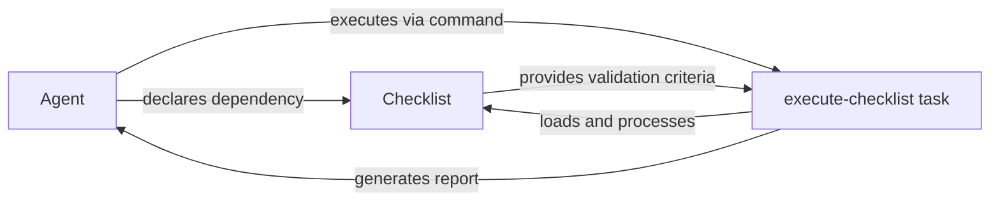
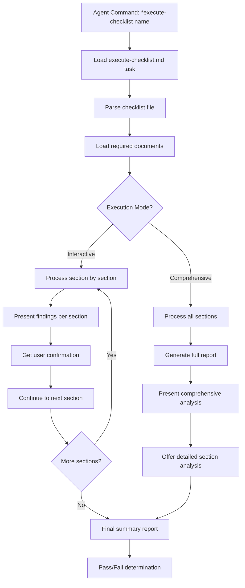

# Deep Dive: Checklists in BMad - Quality Gates and Validation

## Overview

Checklists in BMad are intelligent validation frameworks that act as **quality gates** at critical project junctures. They're not simple to-do lists - they're sophisticated validation tools with embedded AI instructions, conditional logic, and comprehensive reporting capabilities.

## Checklist Architecture

### Core Components

#### 1. **LLM Instructions (`[[LLM: ]]` blocks)**
```markdown
[[LLM: INITIALIZATION INSTRUCTIONS - STORY DOD VALIDATION

This checklist is for DEVELOPER AGENTS to self-validate their work...

EXECUTION APPROACH:
1. Go through each section systematically
2. Mark items as [x] Done, [ ] Not Done, or [N/A] Not Applicable
3. Add brief comments explaining any [ ] or [N/A] items
]]
```

These blocks provide:
- Context and purpose
- Execution methodology
- AI agent guidance
- Critical thinking prompts
- Validation approaches

#### 2. **Structured Validation Items**
```markdown
- [ ] All functional requirements specified in the story are implemented.
- [ ] All acceptance criteria defined in the story are met.
- [ ] Project builds successfully without errors.
```

Each item:
- Has clear, actionable criteria
- Can be marked: `[x]` Done, `[ ]` Not Done, `[N/A]` Not Applicable
- Requires evidence-based validation
- May have sub-items for detailed checking

#### 3. **Conditional Sections**
```markdown
[[FRONTEND ONLY]]
- Skip sections marked with [[FRONTEND ONLY]]
- Focus extra attention on API design...

[[BROWNFIELD ONLY]]
- Additional validation for existing systems
```

#### 4. **Interactive Elements**
```markdown
EXECUTION MODE:
Ask the user if they want to work through the checklist:
- Section by section (interactive mode)
- All at once (comprehensive mode)
```

## Types of Checklists

### 1. **Definition of Done (DoD) Checklists**
- **Purpose**: Self-validation before marking work complete
- **Example**: `story-dod-checklist.md`
- **Used by**: Developer agents
- **When**: Before changing story status to "Review"

**Categories covered:**
- Requirements fulfillment
- Coding standards adherence
- Testing completeness
- Functionality verification
- Documentation updates
- Dependencies and builds

### 2. **Architecture Validation Checklists**
- **Purpose**: Validate technical design completeness
- **Example**: `architect-checklist.md`
- **Used by**: Architect agents
- **When**: After architecture document creation

**Categories covered:**
- Requirements alignment
- Architecture fundamentals
- Technology stack validation
- Security considerations
- Performance planning
- Integration points

### 3. **Product Owner Master Checklists**
- **Purpose**: Comprehensive project validation
- **Example**: `po-master-checklist.md`
- **Used by**: Product Owner agents
- **When**: End-to-end project validation

**Categories covered:**
- Project setup validation
- Document consistency checks
- Workflow feasibility
- Risk assessment
- Quality standards

### 4. **Change Management Checklists**
- **Purpose**: Guide through significant changes
- **Example**: `change-checklist.md`
- **Used by**: PM/PO agents
- **When**: Major pivots or issues discovered

**Categories covered:**
- Trigger understanding
- Epic impact assessment
- Artifact conflict analysis
- Solution planning
- Communication strategy

### 5. **Draft Quality Checklists**
- **Purpose**: Validate document quality
- **Example**: `story-draft-checklist.md`
- **Used by**: Scrum Master agents
- **When**: After story creation

## Execution Patterns

### Pattern 1: Agent Self-Validation
```yaml
Agent Command: develop-story
↓
Implementation complete
↓
Agent runs: execute-checklist story-dod-checklist
↓
Self-assessment against criteria
↓
Mark story as "Ready for Review" or fix issues
```

### Pattern 2: Workflow Quality Gates
```yaml
Workflow Step: po validates artifacts
↓
Agent runs: execute-checklist po-master-checklist
↓
Comprehensive validation
↓
Pass: Continue workflow
Fail: Return to previous agents for fixes
```

### Pattern 3: Change Management
```yaml
Issue Discovery
↓
Agent runs: execute-checklist change-checklist
↓
Structured analysis of impact
↓
Plan adaptation strategy
```

## Checklist-Component Interactions

### Checklists ↔ Agents


**Agent-Checklist Mapping:**
- **Developer**: story-dod-checklist
- **Architect**: architect-checklist  
- **Product Owner**: po-master-checklist, change-checklist
- **Product Manager**: pm-checklist, change-checklist
- **Scrum Master**: story-draft-checklist
- **BMad-Master**: All checklists (universal access)

### Checklists ↔ Tasks
The `execute-checklist.md` task is the universal checklist processor:

```markdown
1. Load specified checklist
2. Parse LLM instructions
3. Process sections systematically
4. Execute validation against documents
5. Generate comprehensive report
6. Present findings with pass/fail rates
```

### Checklists ↔ Workflows
Workflows integrate checklists as quality gates:

```yaml
- agent: po
  validates: all_artifacts
  uses: po-master-checklist
  condition: po_checklist_issues
  notes: "If PO finds issues, return to relevant agent to fix"
```

### Checklists ↔ Documents
Checklists validate against project artifacts:
- **PRD**: Requirements alignment
- **Architecture**: Technical design validation
- **Stories**: Implementation completeness
- **Code**: Quality standards adherence

## Advanced Checklist Features

### 1. **AI-Guided Validation**
```markdown
[[LLM: Deep Analysis - Don't just check boxes, thoroughly analyze each item against the provided documentation]]
```

Checklists include AI instructions for:
- Critical thinking approaches
- Evidence requirements
- Risk assessment techniques
- Comprehensive analysis methods

### 2. **Conditional Logic**
```markdown
[[FRONTEND ONLY]] - Skip for backend projects
[[BROWNFIELD ONLY]] - Additional checks for existing systems
[[UI/UX ONLY]] - Skip sections for API-only projects
```

### 3. **Document Integration Requirements**
```markdown
Before proceeding with this checklist, ensure you have access to:
1. architecture.md - The primary architecture document
2. prd.md - Product Requirements Document
3. frontend-architecture.md - If this is a UI project
```

### 4. **Execution Mode Selection**
```markdown
EXECUTION MODE:
- Section by section (interactive mode)
- All at once (comprehensive mode)
```

### 5. **Evidence-Based Validation**
```markdown
- Evidence-Based - Cite specific sections or quotes from documents
- Critical Thinking - Question assumptions and identify gaps
- Risk Assessment - Consider what could go wrong
```

## Checklist Processing Flow



## Quality Assurance Mechanisms

### 1. **Multi-Level Validation**
- **Self-assessment**: Agents validate their own work
- **Peer review**: Other agents validate cross-functionally
- **Comprehensive review**: PO validates entire project

### 2. **Evidence Requirements**
- Must cite specific document sections
- Provide concrete examples
- Explain reasoning for decisions

### 3. **Pass/Fail Criteria**
```markdown
✅ PASS: Requirement clearly met
❌ FAIL: Requirement not met or insufficient coverage
⚠️ PARTIAL: Some aspects covered but needs improvement
N/A: Not applicable to this case
```

### 4. **Iterative Improvement**
- Failed items return to responsible agents
- Re-validation after fixes
- Documentation of lessons learned

## Creating Checklists for Expansion Packs

### Structure Template
```markdown
# [Domain] Validation Checklist

[Purpose description]

[[LLM: INITIALIZATION INSTRUCTIONS
[AI guidance for execution]
[Required documents/artifacts]
[Validation approach]
[Execution modes]
]]

## Section 1: [Category Name]

[[LLM: [Specific guidance for this section]]]

### Subsection 1.1
- [ ] Validation item 1
- [ ] Validation item 2
  - [ ] Sub-item if needed

## Section 2: [Next Category]
...

## Final Confirmation
[[LLM: FINAL SUMMARY
[Instructions for summary generation]
]]
```

### Best Practices

1. **Clear Purpose**: Define exactly what the checklist validates
2. **Specific Criteria**: Each item should be objectively assessable
3. **AI Guidance**: Include LLM instructions for proper execution
4. **Evidence-Based**: Require citations and concrete examples
5. **Conditional Logic**: Support different project types
6. **Comprehensive Coverage**: Address all critical aspects
7. **Actionable Items**: Each failure should have clear remediation
8. **User Interaction**: Support both interactive and batch modes

### Integration Points

1. **Agent Dependencies**: Declare in agent YAML
2. **Command Access**: Via execute-checklist command
3. **Workflow Gates**: Reference in workflow YAML
4. **Document Validation**: Specify required artifacts
5. **Task Coordination**: Integrate with execute-checklist task

## Key Insights

1. **Checklists are Smart**: They contain AI instructions, not just items
2. **Quality Gates**: They act as project quality control points
3. **Evidence-Based**: They require concrete validation, not just checking boxes
4. **Conditional**: They adapt to different project types and contexts
5. **Interactive**: They support both collaborative and automated execution
6. **Integrated**: They work seamlessly with agents, tasks, and workflows
7. **Comprehensive**: They validate multiple aspects simultaneously
8. **Iterative**: They support fix-and-revalidate cycles
9. **Documented**: They generate detailed reports with findings
10. **Expandable**: Easy to create domain-specific validation frameworks

## The Checklist Advantage

Checklists in BMad provide:
- **Consistency**: Same quality standards across all projects
- **Completeness**: Nothing falls through the cracks
- **Traceability**: Clear validation audit trail
- **Learning**: Embedded best practices and guidance
- **Efficiency**: Automated validation with human oversight
- **Quality**: Multiple validation layers ensure high standards
- **Flexibility**: Adaptable to different project types and domains