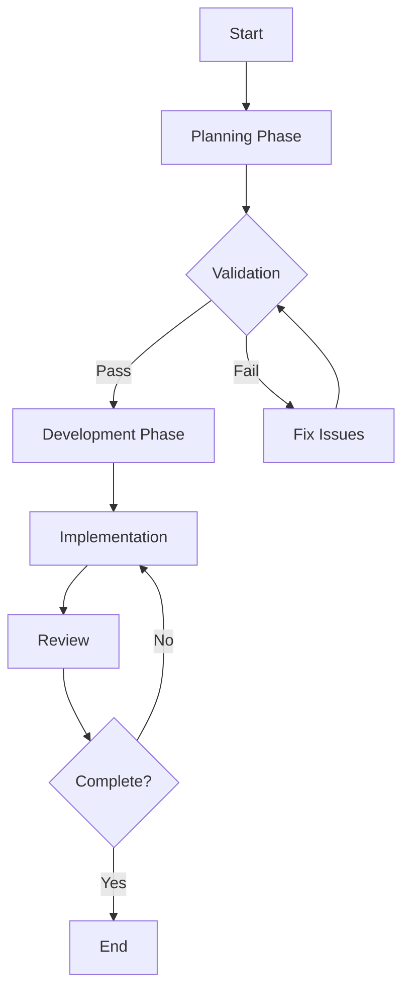

# Deep Dive: Workflows in BMad - The Orchestration Engine

## Overview

Workflows in BMad are sophisticated orchestration blueprints that coordinate multiple AI agents through complete software development lifecycles. They define not just the sequence of agent activities, but also conditional logic, decision points, validation gates, and handoff protocols. Workflows are the "conductors" that turn individual agent capabilities into cohesive development processes.

## Workflow Anatomy

### Core Structure

Every workflow is defined in a YAML file with this standardized structure:

```yaml
workflow:
  id: unique-identifier
  name: Human-readable name
  description: >-
    Detailed description explaining purpose and use cases
  type: greenfield | brownfield
  project_types: [list of applicable project types]
  
  sequence: [ordered list of workflow steps]
  
  flow_diagram: |
    ```mermaid
    [visual representation]
    ```
  
  decision_guidance:
    when_to_use: [criteria for selecting this workflow]
  
  handoff_prompts:
    [agent-to-agent communication templates]
```

### 1. **Workflow Identity Block**

```yaml
workflow:
  id: greenfield-fullstack
  name: Greenfield Full-Stack Application Development
  description: >-
    Agent workflow for building full-stack applications from concept to development.
    Supports both comprehensive planning for complex projects and rapid prototyping.
  type: greenfield
  project_types:
    - web-app
    - saas
    - enterprise-app
    - prototype
    - mvp
```

**Key Components:**
- **id**: Unique identifier referenced by agent-teams
- **name**: Descriptive title for human understanding
- **description**: Comprehensive explanation of workflow purpose
- **type**: Either `greenfield` (new projects) or `brownfield` (existing codebases)
- **project_types**: List of project categories this workflow handles

### 2. **Sequence Orchestration**

The `sequence` section defines the ordered steps of the workflow:

```yaml
sequence:
  - agent: analyst
    creates: project-brief.md
    optional_steps:
      - brainstorming_session
      - market_research_prompt
    notes: "Can do brainstorming first, then optional deep research..."
    
  - agent: pm
    creates: prd.md
    requires: project-brief.md
    notes: "Creates PRD from project brief using prd-tmpl..."
```

**Step Components:**
- **agent**: Which agent persona to activate
- **creates**: Primary output document
- **requires**: Input dependencies from previous steps
- **optional_steps**: Additional activities the agent may perform
- **notes**: Guidance for the human operator
- **condition**: Conditional execution logic
- **repeats**: Loop conditions for iterative steps

### 3. **Conditional Execution Logic**

Workflows support sophisticated branching and conditional logic:

```yaml
# Example from brownfield-fullstack.yaml
- step: enhancement_classification
  agent: analyst
  action: classify enhancement scope
  notes: |
    Determine enhancement complexity to route to appropriate path:
    - Single story (< 4 hours) → Use brownfield-create-story task
    - Small feature (1-3 stories) → Use brownfield-create-epic task  
    - Major enhancement (multiple epics) → Continue with full workflow

- step: routing_decision
  condition: based_on_classification
  routes:
    single_story:
      agent: pm
      uses: brownfield-create-story
      notes: "Create single story for immediate implementation."
    small_feature:
      agent: pm
      uses: brownfield-create-epic
      notes: "Create focused epic with 1-3 stories."
    major_enhancement:
      continue: to_next_step
      notes: "Continue with comprehensive planning workflow."
```

**Conditional Patterns:**
- **Classification-based routing**: Different paths based on scope assessment
- **Validation gates**: Proceed only if validation passes
- **Optional steps**: Execute based on user preference
- **Loop conditions**: Repeat steps for multiple items (epics, stories)

### 4. **Agent Handoff Mechanisms**

Workflows define how context and artifacts pass between agents:

```yaml
handoff_prompts:
  analyst_to_pm: "Project brief is complete. Save it as docs/project-brief.md, then create the PRD."
  
  pm_to_architect: "PRD is ready. Save it as docs/prd.md, then create the architecture."
  
  architect_to_po: "Architecture complete. Save as docs/architecture.md. Please validate all artifacts."
  
  po_to_sm: |
    All artifacts validated. 
    Documentation type available: {{sharded_prd / brownfield_docs}}
    {{if sharded}}: Use standard create-next-story task.
    {{if brownfield}}: Use create-brownfield-story task.
```

**Handoff Patterns:**
- **Document passing**: Explicit file locations and naming
- **Context preservation**: Key findings and decisions
- **Conditional instructions**: Different handoffs based on workflow state
- **Validation checkpoints**: Quality gates between phases

## Workflow Categories

### Greenfield Workflows

For new projects starting from scratch:

#### 1. **greenfield-fullstack.yaml**
- **Purpose**: Complete full-stack application development
- **Flow**: analyst → pm → ux-expert → architect → po → sm → dev → qa
- **Key Features**:
  - Optional AI UI generation step (v0, Lovable)
  - Comprehensive planning before coding
  - Frontend and backend coordination

#### 2. **greenfield-service.yaml**
- **Purpose**: Backend services and APIs
- **Flow**: analyst → pm → architect → po → sm → dev → qa
- **Key Features**:
  - No UX phase (backend only)
  - Focus on API design and architecture
  - Service-oriented patterns

#### 3. **greenfield-ui.yaml**
- **Purpose**: Frontend-only applications
- **Flow**: analyst → pm → ux-expert → po → sm → dev → qa
- **Key Features**:
  - Heavy UX/UI focus
  - Frontend architecture patterns
  - No backend architecture phase

### Brownfield Workflows

For enhancing existing codebases:

#### 1. **brownfield-fullstack.yaml**
- **Purpose**: Major enhancements to existing full-stack apps
- **Key Features**:
  - Enhancement classification routing
  - Documentation adequacy check
  - Optional document-project task
  - Flexible story creation patterns

#### 2. **brownfield-service.yaml**
- **Purpose**: Backend service enhancements
- **Key Features**:
  - Direct to service analysis (no classification routing)
  - API versioning considerations
  - Backward compatibility checks
  - Integration safety validation

#### 3. **brownfield-ui.yaml**
- **Purpose**: UI/UX improvements to existing apps
- **Key Features**:
  - Direct to UI analysis (no classification routing)
  - Component reuse analysis
  - Design system alignment
  - Progressive enhancement patterns

## Workflow Patterns

### 1. **Document Sharding Pattern**

All workflows include a sharding step for large documents:

```yaml
- agent: po
  action: shard_documents
  creates: sharded_docs
  requires: all_artifacts_in_project
  notes: |
    Shard documents for IDE development:
    - Option A: Use PO agent to shard: @po then ask to shard docs/prd.md
    - Option B: Manual: Drag shard-doc task + docs/prd.md into chat
```

**Purpose**: Break large documents into manageable chunks for AI processing
**Output**: Creates `docs/prd/` and `docs/architecture/` folders with sharded content

### 2. **Story Development Cycle**

Common pattern across all workflows:

```yaml
- agent: sm
  action: create_story
  creates: story.md
  repeats: for_each_epic
  
- agent: dev
  action: implement_story
  creates: implementation_files
  
- agent: qa
  action: review_implementation
  optional: true
  
- repeat_development_cycle:
  action: continue_for_all_stories
```

**Pattern**: SM creates story → Dev implements → QA reviews → Repeat
**Status Flow**: Draft → Approved → In Progress → Review → Done

### 3. **Validation Gates**

Critical quality checkpoints:

```yaml
- agent: po
  validates: all_artifacts
  uses: po-master-checklist
  
- agent: various
  updates: any_flagged_documents
  condition: po_checklist_issues
```

**Purpose**: Ensure document consistency and completeness
**Recovery**: Return to relevant agent if issues found

## Workflow Selection Criteria

### Decision Matrix

| Workflow Type | When to Use | Key Indicators |
|--------------|-------------|----------------|
| **Greenfield Fullstack** | New complete applications | No existing code, need UI + backend |
| **Greenfield Service** | New APIs/microservices | Backend only, API-first design |
| **Greenfield UI** | New frontend applications | UI only, existing backend |
| **Brownfield Fullstack** | Major feature additions | Existing app, architectural changes |
| **Brownfield Service** | API enhancements | Existing service, new endpoints |
| **Brownfield UI** | UX improvements | Existing UI, modernization needed |

### Complexity Routing (Brownfield)

The brownfield-fullstack workflow includes intelligent routing based on enhancement scope:

1. **Single Story** (< 4 hours)
   - Direct to story creation
   - Skip planning phases
   - Immediate implementation

2. **Small Feature** (1-3 stories)
   - Create focused epic
   - Light planning
   - Quick turnaround

3. **Major Enhancement** (multiple epics)
   - Full workflow execution
   - Comprehensive planning
   - Architecture review

**Note**: This classification routing is only implemented in `brownfield-fullstack.yaml`. The `brownfield-service.yaml` and `brownfield-ui.yaml` workflows proceed directly to comprehensive planning without classification routing.

## State Management

### Document State Flow

```
Created → Validated → Sharded → Implemented → Reviewed → Complete
```

### Story State Machine

```
Draft → Approved → In Progress → Review → Done
      ↓                        ↓
   (rejected)              (needs work)
      ↓                        ↓
   Revision                Revision
```

### Workflow Context Preservation

Workflows maintain context through:
- **Explicit file outputs**: Each step saves to specific locations
- **Handoff prompts**: Structured context passing
- **Required inputs**: Dependencies ensure proper sequencing
- **Validation checkpoints**: Prevent context loss

## Configuration Integration

Workflows interact with `core-config.yaml`:

```yaml
# Referenced in workflows for document locations
prd:
  prdFile: docs/prd.md
  prdShardedLocation: docs/prd
  
architecture:
  architectureFile: docs/architecture.md
  architectureShardedLocation: docs/architecture
  
devStoryLocation: docs/stories
```

Workflows use these paths to:
- Save documents to correct locations
- Find sharded content
- Organize story files
- Maintain project structure

## Error Handling and Recovery

### Validation Failures

When PO validation fails:
1. Identify specific issues
2. Return to responsible agent
3. Fix and re-export documents
4. Re-validate until passing

### Missing Dependencies

If required documents missing:
1. Workflow halts with clear error
2. User directed to create missing artifact
3. Workflow resumes from checkpoint

### Agent Activation Issues

If agent fails to activate:
1. Check agent-team bundle includes agent
2. Verify agent file exists
3. Confirm dependencies available

## Visual Flow Representation

All workflows include Mermaid diagrams for visual understanding:



Color coding in diagrams:
- 🟦 Blue: Planning documents
- 🟨 Yellow: Validation/review steps
- 🟩 Green: Completion states
- 🟧 Orange: Development activities

## Best Practices

### 1. **Always Save Outputs**
Each workflow step includes explicit save instructions:
```
"SAVE OUTPUT: Copy final prd.md to your project's docs/ folder."
```

### 2. **Use Optional Steps Wisely**
Optional steps add value for complex projects:
- Brainstorming for unclear requirements
- Market research for competitive products
- Technical research for new technologies

### 3. **Respect Validation Gates**
Never skip PO validation - it ensures:
- Document consistency
- Story completeness
- Architectural alignment
- Implementation readiness

### 4. **Handle Brownfield Complexity**
Use classification step to avoid over-engineering:
- Small changes don't need full workflow
- Match process weight to change scope
- Preserve existing patterns when possible

## Workflow Extension Patterns

### Creating Custom Workflows

When creating expansion pack workflows:

1. **Follow Standard Structure**:
```yaml
workflow:
  id: domain-specific-id
  name: Domain Specific Workflow
  type: greenfield | brownfield
  sequence: [...]
```

2. **Reuse Common Patterns**:
- Document sharding
- Validation gates
- Story cycles
- Handoff prompts

3. **Add Domain Steps**:
```yaml
- agent: game-designer  # Domain-specific agent
  creates: game-design-doc.md
  uses: game-design-tmpl  # Domain template
```

4. **Maintain State Flow**:
- Clear inputs/outputs
- Explicit dependencies
- Validation checkpoints
- Error recovery paths

## Troubleshooting Workflows

### Common Issues and Solutions

| Issue | Cause | Solution |
|-------|-------|----------|
| Workflow won't start | Missing agent-team | Ensure team bundle includes workflow |
| Agent activation fails | Missing dependencies | Check agent's required tasks/templates |
| Document not found | Wrong path | Verify core-config.yaml paths |
| Validation keeps failing | Inconsistent documents | Review handoff prompts for context |
| Stories not created | Sharding failed | Manually shard with shard-doc task |

## Summary

Workflows are the orchestration layer that transforms individual agent capabilities into comprehensive development processes. They provide:

- **Structured sequencing** of complex multi-agent processes
- **Intelligent routing** based on project characteristics
- **Quality gates** through validation checkpoints
- **Flexibility** through optional steps and conditions
- **Consistency** through standardized patterns
- **Scalability** through modular, reusable components

Understanding workflows is essential for:
- Selecting the right process for your project
- Creating custom workflows for new domains
- Debugging process execution issues
- Optimizing development efficiency
- Maintaining quality standards

The workflow system demonstrates BMad's core philosophy: AI agents are most effective when orchestrated through well-defined, purposeful processes that maintain human oversight while automating routine coordination.