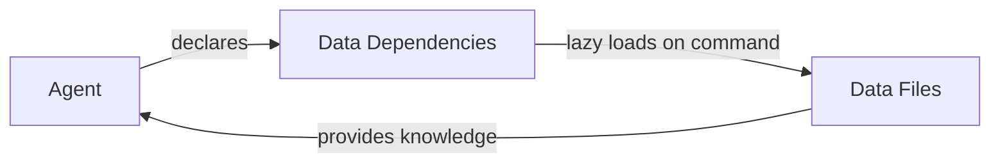
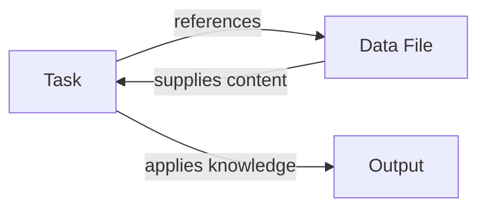

# Deep Dive: Data Resources in BMad

## Overview of Data Resources

Data resources in BMad are reference files that provide domain knowledge, methodologies, preferences, and techniques. They act as the "knowledge library" that agents and tasks can access on-demand to enhance their capabilities.

### Lazy Loading Implementation

Critical to BMad's efficiency is the **lazy loading** pattern for data resources:

**Core Principle**: Components never pre-load data resources. They load only what's needed when specifically commanded.

**Loading Pattern**:
```
Agent Activation → Command Issued → Task Loaded → Data Referenced → Resource Loaded
```

**Implementation Details**:
- Data files are referenced in agent dependencies but not loaded at startup
- Resources load when tasks execute commands like `*kb` or `*brainstorm`
- Each load is contextual - only the relevant sections are used
- Multiple requests may load different parts of the same resource

**Granular Loading Discovery**: Tasks can load specific sections of data files, not entire files. For example, test-design task loads "detailed criteria" from test-levels-framework.md and "classification" from test-priorities-matrix.md - selective extraction keeps contexts minimal.

**Benefits for Extension Creators**:
- Keeps agent contexts lean (critical for dev agents)
- Enables large knowledge bases without context bloat
- Allows fine-grained resource access
- Supports modular knowledge organization

**Example Loading Sequence**:
1. User: `*brainstorm product features`
2. Agent loads `brainstorming-techniques.md`
3. Agent selects 3-5 relevant techniques
4. Agent facilitates session with selected techniques
5. Resource unloaded after task completion

## Core Data Files in BMad

**Summary**: BMad includes 6 core data files:
1. bmad-kb.md - Central knowledge base
2. elicitation-methods.md - Elicitation techniques library
3. brainstorming-techniques.md - Creative facilitation methods
4. technical-preferences.md - User-defined preferences
5. test-levels-framework.md - Test level decision guide
6. test-priorities-matrix.md - Test priority classification

### 1. **bmad-kb.md** - The Knowledge Base
**Purpose:** Central repository of BMad methodology knowledge
**Content:**
- Framework overview and philosophy
- When to use BMad
- Core method explanation
- Two-phase approach (Planning vs Development)
- Agent roles and responsibilities
- Workflow patterns
- Best practices
- Cost optimization strategies

**Used by:**
- BMad-Master and BMad-Orchestrator agents (via *kb command)
- Analyst agent (for methodology questions)
- Any agent when user needs BMad-specific guidance

**Loading Pattern**: Loaded when `*kb` command is issued, specific sections extracted based on user query context.

### 2. **elicitation-methods.md** - Elicitation Techniques Library
**Purpose:** Comprehensive collection of elicitation and refinement techniques
**Content:** Multiple elicitation methods organized into categories:
- Core Reflective Methods (Expand/Contract, Explain Reasoning, Critique)
- Structural Analysis Methods (Logical Flow, Goal Alignment)
- Risk and Challenge Methods (Risk Identification, Critical Perspective)
- Creative Exploration (Tree of Thoughts, Hindsight Reflection)
- Multi-Persona Collaboration (Agile Team Perspectives, Stakeholder Roundtable)
- Advanced 2025 Techniques (Self-Consistency, ReWOO, Meta-Prompting)
- Game-Based Methods (Red Team vs Blue Team, Innovation Tournament)

**Used by:**
- Advanced-elicitation task (primary consumer)
- Create-doc task (when processing templates with elicit: true)
- BMad-Master and BMad-Orchestrator (dependencies)

**Loading Pattern**: Loaded when advanced-elicitation task is executed, 9 relevant techniques selected based on context.

### 3. **brainstorming-techniques.md** - Creative Facilitation Methods
**Purpose:** Techniques for structured brainstorming sessions
**Content:** 20 interactive brainstorming techniques including:
- Creative Expansion (What If, Analogical Thinking, Reversal)
- Structured Frameworks (SCAMPER, Six Thinking Hats, Mind Mapping)
- Collaborative Techniques (Yes And, Brainwriting, Random Stimulation)
- Deep Exploration (Five Whys, Morphological Analysis, Provocation)
- Advanced Techniques (Forced Relationships, Time Shifting, Metaphor Mapping)

**Used by:**
- Facilitate-brainstorming-session task
- Analyst agent (for brainstorming sessions)
- BMad-Master (as dependency)

**Loading Pattern**: **Interactive conversational loading** - When `*brainstorm` command is issued, techniques are presented one at a time, waiting for user response before presenting the next. This creates a dialogue pattern, not batch selection. Example: "Ask one provocative question, get their response, then ask another."

### 4. **technical-preferences.md** - User Preferences Repository
**Purpose:** Store user-defined technical patterns and preferences
**Content:** Initially empty (contains only "None Listed"), filled by users with:
- Preferred technology stacks
- Coding standards
- Architectural patterns
- Framework choices
- Best practices specific to the project

**Used by:**
- PM, Architect, UX-Expert, QA agents
- Referenced during document creation
- Ensures consistency across all generated artifacts

**Loading Pattern**: Loaded when agents create documents, preferences applied to maintain consistency across artifacts.

### 5. **test-levels-framework.md** - Test Level Decision Guide
**Purpose:** Framework for determining appropriate test levels (unit, integration, E2E)
**Content:** Comprehensive decision matrix including:
- Test Level Decision Matrix (when to use each level)
- Unit Tests: Pure functions, algorithms, isolated components
- Integration Tests: Component interactions, DB operations, API contracts
- End-to-End Tests: Critical user journeys, compliance, visual regression
- Test Level Selection Rules
- Example scenarios with YAML structures

**Used by:**
- test-design task (primary consumer)
- Test Architect agent (when designing test strategies)

**Loading Pattern**: **Task-exclusive loading** - Only loaded by test-design task, NOT in any agent dependencies (including Test Architect). The Test Architect gains this knowledge indirectly through task execution. Pattern: Agent → Command → Task → Data (not Agent → Data).

### 6. **test-priorities-matrix.md** - Test Priority Classification
**Purpose:** Guide for prioritizing test scenarios based on risk and business impact
**Content:** Priority classification system:
- P0 (Critical): Revenue-impacting, security, compliance
- P1 (High): Core user journeys, frequently used features
- P2 (Medium): Secondary features, admin functionality
- P3 (Low): Rarely used features, nice-to-have
- Testing requirements for each priority level
- Example scenarios and criteria

**Used by:**
- test-design task (for priority assignment)
- Test Architect agent (for test planning)

**Loading Pattern**: **Task-exclusive loading** - Like test-levels-framework, this is only referenced by test-design task. Provides decision logic criteria, not just reference information.

## How Data Resources Work

### Loading Patterns

#### **1. Lazy Loading Principle**
Data files are NEVER pre-loaded during agent activation:
```yaml
activation-instructions:
  - CRITICAL: NEVER LOAD {root}/data/bmad-kb.md UNLESS USER TYPES *kb
  - Do NOT scan filesystem or load any resources during startup
```

#### **2. On-Demand Loading**
Data is loaded only when:
- User issues specific command (e.g., *kb for knowledge base)
- Task explicitly references the data file
- Agent needs to execute a command that requires the data

#### **3. Dependency Declaration**
Agents declare data dependencies but don't load them:
```yaml
dependencies:
  data:
    - bmad-kb.md
    - brainstorming-techniques.md
    - elicitation-methods.md
```

### Access Patterns

#### **Pattern 1: Command-Triggered Loading**
```yaml
commands:
  - kb: Toggle KB mode, load {root}/data/bmad-kb.md
```
User types `*kb` → Agent loads bmad-kb.md → Enters KB mode

#### **Pattern 2: Task-Exclusive Loading**
```markdown
# In test-design.md
**Reference:** Load `test-levels-framework.md` for detailed criteria
```
Important: Some data files (test frameworks) are ONLY accessed through tasks, not agent dependencies. This creates indirect knowledge transfer: Agent → Command → Task → Data.

#### **Pattern 3: Interactive Conversational Loading**
```markdown
# In brainstorming-techniques.md
"Ask one provocative question, get their response, then ask another"
```
Data structures the interaction pattern itself - creating turn-based dialogues rather than batch processing.

#### **Pattern 4: Granular Section Loading**
```markdown
# In test-design.md
**Reference:** Load `test-priorities-matrix.md` for classification
```
Tasks can load specific sections or aspects of data files, not entire documents, keeping context windows minimal.

## Data-Component Interactions

### Data ↔ Agents


**Examples:**
- BMad-Master: Can access all data files via commands
- Analyst: Uses brainstorming-techniques for facilitation
- Architect: References technical-preferences for standards

### Data ↔ Tasks


**Examples:**
- advanced-elicitation → elicitation-methods.md
- facilitate-brainstorming → brainstorming-techniques.md
- kb-mode-interaction → bmad-kb.md

### Data ↔ Templates
Templates don't directly reference data files, but:
- Templates with `elicit: true` trigger advanced-elicitation task
- Advanced-elicitation task loads elicitation-methods.md
- Methods are presented as numbered options

### Data ↔ Workflows
Workflows don't directly use data files, but:
- Workflows orchestrate agents
- Agents may have data dependencies
- Data is loaded when agents execute specific commands

## Special Data Behaviors

### 1. **KB Mode Toggle**
```yaml
*kb command:
  - ON: Load bmad-kb.md, enter conversational mode
  - OFF: Unload KB, return to normal operation
```

### 2. **Interactive Selection**
Data files containing lists (techniques, methods) are presented as numbered options:
```
1. Technique One
2. Technique Two
3. Technique Three
...
9. Proceed
```

### 3. **User Customization**
technical-preferences.md is designed to be user-modified:
- Initially empty
- Users add their preferences
- All agents respect these preferences
- Creates project consistency

## Data Resource Types and Behavioral Patterns

### Data as Behavioral Modifiers
Data files aren't just information storage - they're **behavioral modifiers** that change how agents and tasks operate based on the type of data loaded. There's an implicit hierarchy:

### 1. **Knowledge Bases** (Conversational)
- Comprehensive information repositories
- Educational content for conversational exploration
- Toggle modes (like KB mode) for different interaction styles
- Example: bmad-kb.md
- **Behavior**: Enables conversational, educational interactions

### 2. **Technique Libraries** (Interactive/Methodological)
- Collections of methods/approaches
- Structured for interactive, turn-based execution
- Each technique has clear instructions for dialogue
- Examples: elicitation-methods.md, brainstorming-techniques.md
- **Behavior**: Creates structured dialogues with turn-taking patterns

### 3. **Decision Frameworks** (Structured/Criterial)
- Not just reference lists but structured decision matrices
- Provide decision logic with "when to use" criteria
- Include YAML examples for implementation patterns
- Examples: test-levels-framework.md, test-priorities-matrix.md
- **Behavior**: Guide algorithmic decision-making with specific criteria

### 4. **Preference Stores** (Configuration)
- User-defined configurations
- Project-specific standards that modify all agent outputs
- Customization points for consistency
- Example: technical-preferences.md
- **Behavior**: Acts as global modifiers for document generation

### 5. **Reference Data** (potential for expansion packs)
- Domain-specific information
- Industry standards
- Regulatory requirements
- Technology documentation
- **Behavior**: Provides domain context without changing interaction patterns

## Creating Data Resources for Expansion Packs

### Structure Guidelines

#### **For Knowledge Bases:**
```markdown
# [Domain] Knowledge Base

## Overview
[High-level introduction]

## Core Concepts
[Fundamental principles]

## When to Use
[Use cases and scenarios]

## How It Works
[Detailed explanations]

## Best Practices
[Recommendations]
```

#### **For Technique Libraries:**
```markdown
# [Technique Category] Methods

## Category 1

**Method Name**
- Description of method
- When to use it
- Step-by-step instructions
- Expected outcomes

**Another Method**
- Format consistently
- Clear instructions
- Actionable steps
```

#### **For Preference Stores:**
```markdown
# [Domain] Preferences

## Category 1
- Preference: Setting
- Another: Value

## Category 2
[User-fillable sections]
```

### Integration Requirements

1. **File Naming:** Use kebab-case: `domain-knowledge.md`
2. **Location:** Place in `data/` folder
3. **Agent Declaration:** Add to agent dependencies
4. **Task Reference:** Reference in relevant tasks
5. **Loading Pattern:** Follow lazy loading principle

### Best Practices

1. **Keep Focused:** Each data file should have a single purpose
2. **Structure Consistently:** Use similar formatting across files
3. **Make Scannable:** Use headers and lists for easy navigation
4. **Include Examples:** Provide concrete examples where helpful
5. **Enable Selection:** For technique lists, structure for numbered selection
6. **Document Usage:** Explain when and how to use the content
7. **Version Carefully:** Data changes affect all dependent components

## Key Insights

1. **Data as Behavioral Modifiers:** Data files don't just provide information - they modify how agents and tasks behave
2. **Granular Lazy Loading:** Tasks can load specific sections of data files, not entire documents
3. **Task-Exclusive Resources:** Some data (test frameworks) is ONLY accessed through tasks, creating indirect agent knowledge
4. **Interactive vs. Batch:** Brainstorming/elicitation use conversational turn-taking, not menu selection
5. **Decision Frameworks:** Test data provides structured decision logic with criteria, not just reference lists
6. **Loading Hierarchy:** Agent → Command → Task → Data (not direct Agent → Data for some resources)
7. **Conversational Patterns:** Data structures can define interaction patterns (one-at-a-time dialogue)
8. **Selective Extraction:** "Load X for detailed criteria" - contextual section loading
9. **Knowledge Modes:** Special modes (KB mode) change entire interaction paradigm
10. **Behavioral Categories:** Knowledge bases (conversational), Technique libraries (interactive), Decision frameworks (criterial), Preference stores (configurational)