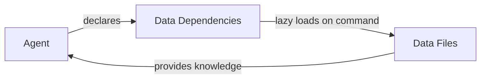
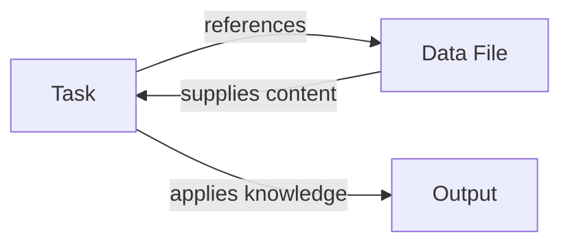

# Deep Dive: Data Resources in BMad

## Overview of Data Resources

Data resources in BMad are reference files that provide domain knowledge, methodologies, preferences, and techniques. They act as the "knowledge library" that agents and tasks can access on-demand to enhance their capabilities.

## Core Data Files in BMad

### 1. **bmad-kb.md** - The Knowledge Base
**Purpose:** Central repository of BMad methodology knowledge
**Content:**
- Framework overview and philosophy
- When to use BMad
- Core method explanation
- Two-phase approach (Planning vs Development)
- Agent roles and responsibilities
- Workflow patterns
- Best practices
- Cost optimization strategies

**Used by:**
- BMad-Master and BMad-Orchestrator agents (via *kb command)
- Analyst agent (for methodology questions)
- Any agent when user needs BMad-specific guidance

### 2. **elicitation-methods.md** - Elicitation Techniques Library
**Purpose:** Comprehensive collection of elicitation and refinement techniques
**Content:** 30+ methods organized into categories:
- Core Reflective Methods (Expand/Contract, Explain Reasoning, Critique)
- Structural Analysis Methods (Logical Flow, Goal Alignment)
- Risk and Challenge Methods (Risk Identification, Critical Perspective)
- Creative Exploration (Tree of Thoughts, Hindsight Reflection)
- Multi-Persona Collaboration (Agile Team Perspectives, Stakeholder Roundtable)
- Advanced 2025 Techniques (Self-Consistency, ReWOO, Meta-Prompting)
- Game-Based Methods (Red Team vs Blue Team, Innovation Tournament)

**Used by:**
- Advanced-elicitation task (primary consumer)
- Create-doc task (when processing templates with elicit: true)
- BMad-Master and BMad-Orchestrator (dependencies)

### 3. **brainstorming-techniques.md** - Creative Facilitation Methods
**Purpose:** Techniques for structured brainstorming sessions
**Content:** 20 brainstorming techniques including:
- Creative Expansion (What If, Analogical Thinking, Reversal)
- Structured Frameworks (SCAMPER, Six Thinking Hats, Mind Mapping)
- Collaborative Techniques (Yes And, Brainwriting, Random Stimulation)
- Deep Exploration (Five Whys, Morphological Analysis, Provocation)
- Advanced Techniques (Forced Relationships, Time Shifting, Metaphor Mapping)

**Used by:**
- Facilitate-brainstorming-session task
- Analyst agent (for brainstorming sessions)
- BMad-Master (as dependency)

### 4. **technical-preferences.md** - User Preferences Repository
**Purpose:** Store user-defined technical patterns and preferences
**Content:** Initially empty, filled by users with:
- Preferred technology stacks
- Coding standards
- Architectural patterns
- Framework choices
- Best practices specific to the project

**Used by:**
- PM, Architect, UX-Expert, QA agents
- Referenced during document creation
- Ensures consistency across all generated artifacts

## How Data Resources Work

### Loading Patterns

#### **1. Lazy Loading Principle**
Data files are NEVER pre-loaded during agent activation:
```yaml
activation-instructions:
  - CRITICAL: NEVER LOAD {root}/data/bmad-kb.md UNLESS USER TYPES *kb
  - Do NOT scan filesystem or load any resources during startup
```

#### **2. On-Demand Loading**
Data is loaded only when:
- User issues specific command (e.g., *kb for knowledge base)
- Task explicitly references the data file
- Agent needs to execute a command that requires the data

#### **3. Dependency Declaration**
Agents declare data dependencies but don't load them:
```yaml
dependencies:
  data:
    - bmad-kb.md
    - brainstorming-techniques.md
    - elicitation-methods.md
```

### Access Patterns

#### **Pattern 1: Command-Triggered Loading**
```yaml
commands:
  - kb: Toggle KB mode, load {root}/data/bmad-kb.md
```
User types `*kb` → Agent loads bmad-kb.md → Enters KB mode

#### **Pattern 2: Task-Referenced Loading**
```markdown
# In facilitate-brainstorming-session.md
Present numbered list of techniques from the brainstorming-techniques data file
```
Task execution → Load specified data file → Use content

#### **Pattern 3: Context-Specific Loading**
```markdown
# In advanced-elicitation.md
Retrieve the specific elicitation method from the elicitation-methods data file
```
Method selection → Load data → Execute specific technique

## Data-Component Interactions

### Data ↔ Agents


**Examples:**
- BMad-Master: Can access all data files via commands
- Analyst: Uses brainstorming-techniques for facilitation
- Architect: References technical-preferences for standards

### Data ↔ Tasks


**Examples:**
- advanced-elicitation → elicitation-methods.md
- facilitate-brainstorming → brainstorming-techniques.md
- kb-mode-interaction → bmad-kb.md

### Data ↔ Templates
Templates don't directly reference data files, but:
- Templates with `elicit: true` trigger advanced-elicitation task
- Advanced-elicitation task loads elicitation-methods.md
- Methods are presented as numbered options

### Data ↔ Workflows
Workflows don't directly use data files, but:
- Workflows orchestrate agents
- Agents may have data dependencies
- Data is loaded when agents execute specific commands

## Special Data Behaviors

### 1. **KB Mode Toggle**
```yaml
*kb command:
  - ON: Load bmad-kb.md, enter conversational mode
  - OFF: Unload KB, return to normal operation
```

### 2. **Interactive Selection**
Data files containing lists (techniques, methods) are presented as numbered options:
```
1. Technique One
2. Technique Two
3. Technique Three
...
9. Proceed
```

### 3. **User Customization**
technical-preferences.md is designed to be user-modified:
- Initially empty
- Users add their preferences
- All agents respect these preferences
- Creates project consistency

## Data Resource Types

### 1. **Knowledge Bases**
- Comprehensive information repositories
- Educational content
- Best practices and guidelines
- Example: bmad-kb.md

### 2. **Technique Libraries**
- Collections of methods/approaches
- Structured for selection and execution
- Each technique has clear instructions
- Examples: elicitation-methods.md, brainstorming-techniques.md

### 3. **Preference Stores**
- User-defined configurations
- Project-specific standards
- Customization points
- Example: technical-preferences.md

### 4. **Reference Data** (potential for expansion packs)
- Domain-specific information
- Industry standards
- Regulatory requirements
- Technology documentation

## Creating Data Resources for Expansion Packs

### Structure Guidelines

#### **For Knowledge Bases:**
```markdown
# [Domain] Knowledge Base

## Overview
[High-level introduction]

## Core Concepts
[Fundamental principles]

## When to Use
[Use cases and scenarios]

## How It Works
[Detailed explanations]

## Best Practices
[Recommendations]
```

#### **For Technique Libraries:**
```markdown
# [Technique Category] Methods

## Category 1

**Method Name**
- Description of method
- When to use it
- Step-by-step instructions
- Expected outcomes

**Another Method**
- Format consistently
- Clear instructions
- Actionable steps
```

#### **For Preference Stores:**
```markdown
# [Domain] Preferences

## Category 1
- Preference: Setting
- Another: Value

## Category 2
[User-fillable sections]
```

### Integration Requirements

1. **File Naming:** Use kebab-case: `domain-knowledge.md`
2. **Location:** Place in `data/` folder
3. **Agent Declaration:** Add to agent dependencies
4. **Task Reference:** Reference in relevant tasks
5. **Loading Pattern:** Follow lazy loading principle

### Best Practices

1. **Keep Focused:** Each data file should have a single purpose
2. **Structure Consistently:** Use similar formatting across files
3. **Make Scannable:** Use headers and lists for easy navigation
4. **Include Examples:** Provide concrete examples where helpful
5. **Enable Selection:** For technique lists, structure for numbered selection
6. **Document Usage:** Explain when and how to use the content
7. **Version Carefully:** Data changes affect all dependent components

## Key Insights

1. **Data is Knowledge:** Data files are the "brain" of specialized agents
2. **Lazy Loading is Key:** Never pre-load, always on-demand
3. **Separation of Concerns:** Data separate from logic (tasks) and structure (templates)
4. **User Customizable:** technical-preferences.md enables project-specific configuration
5. **Technique Libraries:** Enable consistent, reusable methodologies
6. **Command Triggered:** Most data access is user-initiated via commands
7. **Task Referenced:** Tasks know which data they need
8. **Selection Interfaces:** Numbered lists enable user choice
9. **Knowledge Modes:** Special modes (KB mode) for conversational access
10. **Expansion Friendly:** Easy to add domain-specific data resources