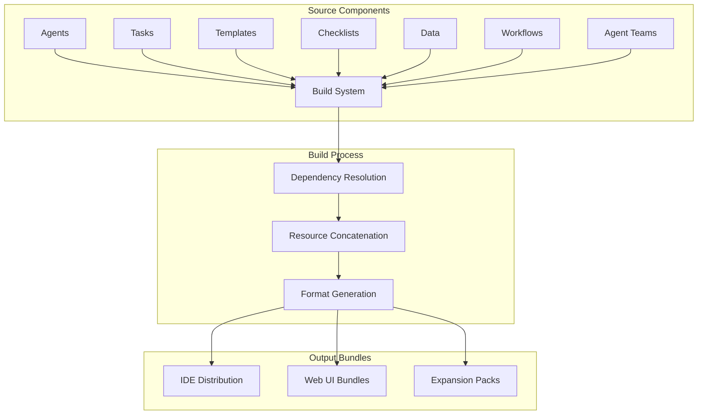

# Deep Dive: Build System in BMad - Distribution and Packaging

## Overview

BMad's build system is responsible for creating deployable bundles from the modular component architecture. It handles dependency resolution, resource packaging, and dual-environment distribution. Understanding the build system is essential for creating expansion packs and customizing BMad distributions.

## Current Version and Installation

BMad is currently at version 4.39.1 and uses Node.js-based installation:

### Installation Methods

#### NPX Installation (Recommended)
- **Command**: `npx bmad-method install`
- **Version**: Current is 4.39.1
- **Requirements**: Node.js v20.10.0 or higher
- **Target**: Production and development environments

#### Local Installation Scripts
- **Location**: `tools/installer/bin/bmad.js` (executable)
- **Command**: `node tools/installer/bin/bmad.js install`
- **Options**: 
  - `-f, --full`: Install complete BMad Method
  - `-x, --expansion-only`: Install only expansion packs
  - `-d, --directory <path>`: Specify installation directory

### Version Information

```json
// package.json (actual current version)
{
  "name": "bmad-method",
  "version": "4.39.1",
  "engines": {
    "node": ">=20.10.0"
  },
  "publishConfig": {
    "access": "public"
  }
}
```

## Build System Architecture

### Core Components



### Build Tool: web-builder.js

The `web-builder.js` tool is the core build engine that:

1. **Reads agent or team definition files**
2. **Recursively resolves all dependencies**
3. **Concatenates content into single text files with clear separators**
4. **Outputs ready-to-upload bundles for web AI interfaces**

**Location**: `/tools/builders/web-builder.js` (actual location)

**Key Functionality**:
- Dependency graph traversal via DependencyResolver class
- Resource deduplication
- Format optimization for web interfaces
- Web-compatible path conversion
- Dynamic web instruction generation
- Support for both bmad-core and expansion pack bundling

## Dependency Resolution System

### Resolution Algorithm

```yaml
# Pseudo-algorithm for dependency resolution
function resolveDependencies(component):
  visited = new Set()
  queue = [component]
  resources = []
  
  while queue is not empty:
    current = queue.pop()
    if current in visited:
      continue
      
    visited.add(current)
    resources.add(current)
    
    # Load component definition
    definition = loadYAML(current)
    
    # Add dependencies to queue
    for dep in definition.dependencies:
      for category in [tasks, templates, checklists, data]:
        if dep in category:
          queue.push(dep)
  
  return resources
```

### Resolution Patterns

#### 1. **Agent-Based Resolution**
```yaml
# Starting from agent file
agent: pm.md
dependencies:
  tasks:
    - create-doc.md
  templates: 
    - prd-tmpl.yaml
  checklists:
    - prd-validation.md
```

**Resolution Process**:
1. Load `pm.md` agent definition
2. Find `create-doc.md` task
3. Task references `prd-tmpl.yaml` template
4. Template may reference additional resources
5. Continue until all dependencies resolved

#### 2. **Team-Based Resolution** 
```yaml
# Starting from team file
team: team-fullstack.yaml
agents:
  - pm.md
  - architect.md
  - dev.md
  - qa.md
workflows:
  - greenfield-fullstack.yaml
```

**Resolution Process**:
1. Resolve each agent's dependencies
2. Resolve workflow dependencies
3. Merge all resources
4. Deduplicate common dependencies
5. Create unified bundle

### Bundle Optimization

#### Deduplication Strategy
```yaml
# Multiple agents may reference same resources
agent-pm:
  dependencies:
    tasks: [create-doc.md]
    
agent-architect:
  dependencies:
    tasks: [create-doc.md]  # Same task
```

**Optimization**:
- Include `create-doc.md` only once
- Reference by ID throughout bundle
- Maintain lookup table for references

#### Resource Ordering
```yaml
# Optimal bundle order for web UI
1. Core data resources (bmad-kb.md, etc.)
2. Templates (structural definitions)
3. Tasks (executable procedures)  
4. Checklists (validation criteria)
5. Agents (orchestrators)
6. Workflows (sequences)
```

**Benefits**:
- Foundation concepts loaded first
- Dependencies available before dependents
- Logical flow for AI processing

## Distribution Formats

### IDE Environment Distribution

**Structure**: Direct file access to source components
```
bmad-core/
├── agents/          # Individual agent files
├── tasks/           # Individual task files  
├── templates/       # Individual template files
├── checklists/      # Individual checklist files
├── data/            # Individual data files
└── workflows/       # Individual workflow files
```

**Access Pattern**: `{root}/{type}/{name}` resolution at runtime
**Benefits**:
- Live editing and development
- Granular component access
- Dynamic loading capabilities
- Version control friendly

### Web UI Bundle Distribution

**Structure**: Pre-built single files in `dist/` directory
```
dist/
├── agents/          # Individual agent bundles
│   ├── analyst.txt
│   ├── architect.txt
│   ├── bmad-master.txt
│   ├── bmad-orchestrator.txt
│   ├── dev.txt
│   ├── pm.txt
│   ├── po.txt
│   ├── qa.txt
│   ├── sm.txt
│   └── ux-expert.txt
├── teams/           # Multi-agent team bundles
│   ├── team-all.txt
│   ├── team-fullstack.txt
│   ├── team-ide-minimal.txt
│   └── team-no-ui.txt
└── expansion-packs/ # Expansion pack bundles
    ├── bmad-2d-phaser-game-dev/
    ├── bmad-2d-unity-game-dev/
    ├── bmad-creative-writing/
    └── bmad-infrastructure-devops/
```

**Bundle Format** (actual format from dist/teams/team-all.txt):
```markdown
# Web Agent Bundle Instructions

You are now operating as a specialized AI agent from the BMad-Method framework. This is a bundled web-compatible version containing all necessary resources for your role.

## Important Instructions

1. **Follow all startup commands**: Your agent configuration includes startup instructions...

2. **Resource Navigation**: This bundle contains all resources you need. Resources are marked with tags like:

- `==================== START: .bmad-core/folder/filename.md ====================`
- `==================== END: .bmad-core/folder/filename.md ====================`

[followed by all bundled resources with START/END separators]
```

**Benefits**:
- Single upload to web interfaces
- Complete context in one package
- No dependency resolution needed at runtime
- Optimized for large context windows

## Build Process Stages

### Stage 1: Source Analysis

```yaml
# Build system analyzes source structure
sourceAnalysis:
  - validateAgentFiles()
  - checkDependencyIntegrity()
  - identifyCircularDependencies()  
  - catalogAvailableResources()
```

**Validation Checks**:
- All declared dependencies exist
- No circular references
- Valid YAML/Markdown syntax
- Required metadata present

### Stage 2: Dependency Graph Construction

```yaml
# Create dependency graph
graphConstruction:
  - buildDependencyTree()
  - topologicalSort()
  - identifySharedResources()
  - optimizeLoadOrder()
```

**Graph Properties**:
- Directed acyclic graph (DAG)
- Topologically sorted
- Shared resources identified
- Load order optimized

### Stage 3: Resource Processing

```yaml
# Process each resource
resourceProcessing:
  - loadSourceContent()
  - applyFormatTransforms()
  - injectMetadata() 
  - validateContent()
```

**Processing Steps**:
- Load raw content from filesystem
- Apply any format transformations
- Inject build metadata (timestamps, versions)
- Validate processed content

### Stage 4: Bundle Generation

```yaml
# Generate final bundles
bundleGeneration:
  - concatenateResources()
  - insertSeparators()
  - addBundleHeaders()
  - writeOutputFiles()
```

**Bundle Structure**:
- Header with metadata
- Sections organized by type
- Clear separators between resources
- Footer with summary information

## Advanced Build Features

### Conditional Bundling

```yaml
# Bundle only specific components
build-config:
  includeComponents:
    - agents: [pm, architect]
    - tasks: [create-doc, shard-doc]
    - templates: [prd-tmpl, architecture-tmpl]
  excludeComponents:
    - checklists: [experimental-*]
```

**Use Cases**:
- Lightweight bundles for specific domains
- Beta feature exclusion
- Custom expansion pack builds

### Environment-Specific Builds

```yaml
# Different builds for different environments
environments:
  development:
    includeDebugInfo: true
    verboseLogging: true
    
  production:  
    includeDebugInfo: false
    minifyContent: true
    
  web-ui:
    format: single-file
    separators: true
    
  ide:
    format: individual-files
    preserveStructure: true
```

### Build Caching

```yaml
# Cache build artifacts for performance
caching:
  enabled: true
  strategy: dependency-hash
  invalidation: file-modification
  location: .bmad-build-cache/
```

**Benefits**:
- Faster incremental builds
- Skip unchanged components
- Reduced build times during development

## Expansion Pack Build Integration

### Pack-Specific Builds

```yaml
# Expansion pack build configuration
pack-build:
  name: game-dev-pack
  extends: core-build
  additionalComponents:
    agents: [game-designer, level-designer]
    templates: [gdd-tmpl, level-spec-tmpl]
    tasks: [create-level, validate-gameplay]
```

**Integration Process**:
1. Inherit core build configuration
2. Add expansion-specific components
3. Resolve combined dependencies
4. Generate integrated bundles

### Distribution Packaging

```yaml
# Package expansion for distribution
distribution:
  format: npm-package
  registry: public
  includes:
    - source: expansion-pack/
    - builds: dist/
    - docs: README.md
    - config: package.json
```

## Build Tool Usage

### Command-Line Interface

```bash
# Primary build commands (from package.json scripts)
npm run build              # Build all components
npm run build:agents       # Build agents only
npm run build:teams        # Build teams only

# Installation commands
npm run install:bmad       # Run installer
npx bmad-method install    # NPX installation

# Other available commands
npm run validate           # Validate components
npm run list:agents        # List available agents
npm run flatten            # Generate flattened codebase
```

### Programmatic API

```javascript
// Use build system programmatically
const Builder = require('./web-builder');

const builder = new Builder({
  sourceDir: 'bmad-core',
  outputDir: 'dist',
  format: 'web-bundle'
});

// Build specific agent
const pmBundle = await builder.buildAgent('pm');

// Build team
const teamBundle = await builder.buildTeam('fullstack');

// Build with custom configuration
const customBundle = await builder.build({
  agents: ['pm', 'dev'],
  tasks: ['create-doc'],
  templates: ['prd-tmpl']
});
```

## Build System Extension

### Custom Build Plugins

```javascript
// Example build plugin
class CustomFormatPlugin {
  constructor(options) {
    this.options = options;
  }
  
  process(resources) {
    // Custom processing logic
    return transformResources(resources, this.options);
  }
  
  generate(processedResources) {
    // Custom output format
    return generateCustomFormat(processedResources);
  }
}

// Register plugin
builder.registerPlugin('custom-format', CustomFormatPlugin);
```

### Build Hooks

```javascript
// Build lifecycle hooks
builder.on('pre-build', (config) => {
  console.log('Starting build with config:', config);
});

builder.on('post-dependency-resolution', (graph) => {
  console.log('Dependencies resolved:', graph.nodes.length);
});

builder.on('pre-bundle', (resources) => {
  // Last chance to modify resources
  return preprocessResources(resources);
});

builder.on('post-build', (bundles) => {
  console.log('Build complete. Generated bundles:', bundles.length);
});
```

## Performance Optimization

### Build Performance Metrics

```yaml
# Typical build performance
metrics:
  full-build-time: 2.3s
  incremental-build-time: 0.8s
  dependency-resolution-time: 0.3s
  resource-processing-time: 1.2s  
  bundle-generation-time: 0.8s
```

### Optimization Strategies

1. **Parallel Processing**: Process independent resources in parallel
2. **Incremental Builds**: Only rebuild changed components
3. **Dependency Caching**: Cache resolved dependency graphs
4. **Resource Compression**: Minimize bundle sizes
5. **Smart Invalidation**: Precise cache invalidation

### Memory Management

```yaml
# Build system memory optimization
memoryManagement:
  streamProcessing: true        # Process large resources in streams
  garbageCollection: aggressive # Aggressive cleanup
  memoryLimit: 512MB           # Maximum memory usage
  chunkSize: 1MB               # Process resources in chunks
```

## Troubleshooting Build Issues

### Common Build Problems

| Problem | Cause | Solution |
|---------|--------|----------|
| **Missing Dependencies** | Broken references | Run dependency validation |
| **Circular Dependencies** | Components reference each other | Refactor architecture |
| **Build Timeout** | Large resource processing | Increase timeout limits |
| **Memory Issues** | Insufficient memory | Enable streaming mode |
| **Invalid Bundles** | Syntax errors | Run content validation |

### Build Debugging

```bash
# Enable debug mode
node web-builder.js --debug --verbose --agent pm

# Validate dependencies
node web-builder.js --validate-deps --agent pm

# Analyze build performance
node web-builder.js --profile --team fullstack

# Generate dependency graph visualization  
node web-builder.js --graph --output deps.dot --team fullstack
```

### Build System Logs

```yaml
# Build logging configuration
logging:
  level: info
  file: .ai/build-log.txt
  format: structured
  includes:
    - dependency-resolution
    - resource-processing
    - bundle-generation
    - performance-metrics
```

## Build System Scripts

### Available npm Scripts (from package.json)

```yaml
# Core build scripts
build: "node tools/cli.js build"
build:agents: "node tools/cli.js build --agents-only" 
build:teams: "node tools/cli.js build --teams-only"

# Installation and setup
install:bmad: "node tools/installer/bin/bmad.js install"

# Validation and listing
validate: "node tools/cli.js validate"
list:agents: "node tools/cli.js list:agents"

# Version management
version:major: "node tools/version-bump.js major"
version:minor: "node tools/version-bump.js minor"
version:patch: "node tools/version-bump.js patch"

# Utility scripts
flatten: "node tools/flattener/main.js"
format: "prettier --write \"**/*.{js,cjs,mjs,json,md,yaml}\""
lint: "eslint . --ext .js,.cjs,.mjs,.yaml --max-warnings=0"
```

### Core-Config Build Integration

The build system reads core-config.yaml to:
- Understand project structure
- Locate source components
- Apply environment-specific settings
- Generate compatible bundles

**Integration Points**:
- Document locations from config
- Sharding preferences
- Custom component definitions
- Output preferences

## Best Practices

### Build System Design

1. **Modular Architecture**: Keep build components loosely coupled
2. **Clear Separation**: Separate source analysis, processing, and generation
3. **Error Handling**: Graceful handling of missing or invalid components
4. **Performance Focus**: Optimize for typical use cases
5. **Extension Points**: Provide hooks for customization

### Bundle Design

1. **Logical Organization**: Group related resources together
2. **Clear Separators**: Use consistent separators between resources
3. **Metadata Headers**: Include build information and timestamps
4. **Size Optimization**: Balance completeness with bundle size
5. **Format Consistency**: Maintain consistent formatting across bundles

### Maintenance Practices

1. **Regular Validation**: Run dependency checks frequently
2. **Performance Monitoring**: Track build performance over time
3. **Cache Management**: Regular cache cleanup and validation
4. **Documentation**: Keep build documentation updated
5. **Testing**: Automated testing of build outputs

## Architectural Patterns Discovered

### Build System Design Patterns:

1. **Installer-as-Tool Pattern**: Installation handled by dedicated Node.js CLI tool (`tools/installer/bin/bmad.js`) with proper executable permissions

2. **Dual Distribution Strategy**: 
   - IDE environment: Individual files for development
   - Web environment: Bundled .txt files for upload to web AI interfaces

3. **Dependency-Driven Bundling**: WebBuilder uses DependencyResolver to create complete bundles with all required resources

4. **Expansion Pack Integration**: Build system supports bundling expansion packs alongside core framework

5. **Web-Compatible Path Convention**: Resources use `.bmad-core/` prefix in web bundles for clear namespace separation

6. **CLI-First Architecture**: Primary interface through `tools/cli.js` with modular build commands

### Installation Architecture:

- **Node.js v20+ Requirement**: Enforced in package.json engines field
- **NPX-First Distribution**: Primary installation via `npx bmad-method install`
- **Modular Installer**: Supports full installation, expansion-only, or custom directory installation
- **Context-Aware Loading**: Installer handles both direct execution and NPX contexts

## Summary

The BMad build system is a sophisticated distribution and packaging engine that:

- **Resolves Dependencies**: Automatically discovers and resolves component dependencies
- **Creates Bundles**: Generates optimized bundles for different environments
- **Supports Extension**: Enables custom expansion pack builds
- **Optimizes Performance**: Provides caching, incremental builds, and parallel processing
- **Ensures Quality**: Validates components and dependencies throughout the build process

Understanding the build system is essential for:
- Creating expansion packs with custom distributions
- Optimizing bundle sizes and performance
- Troubleshooting build and dependency issues
- Customizing BMad for specific deployment environments
- Contributing to BMad's core infrastructure

The build system exemplifies BMad's philosophy of "intelligent automation" - providing powerful capabilities while maintaining simplicity for end users.