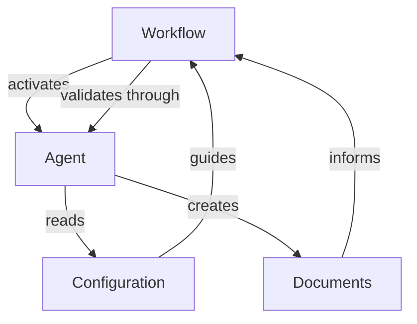
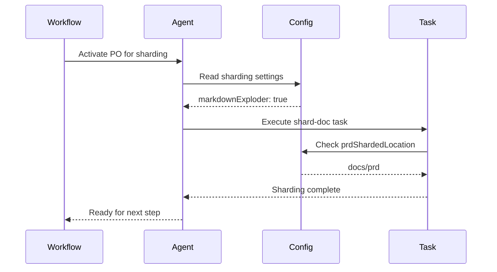
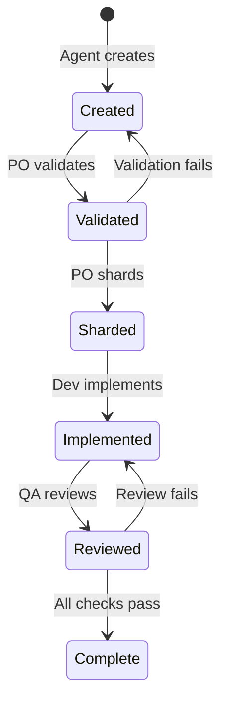
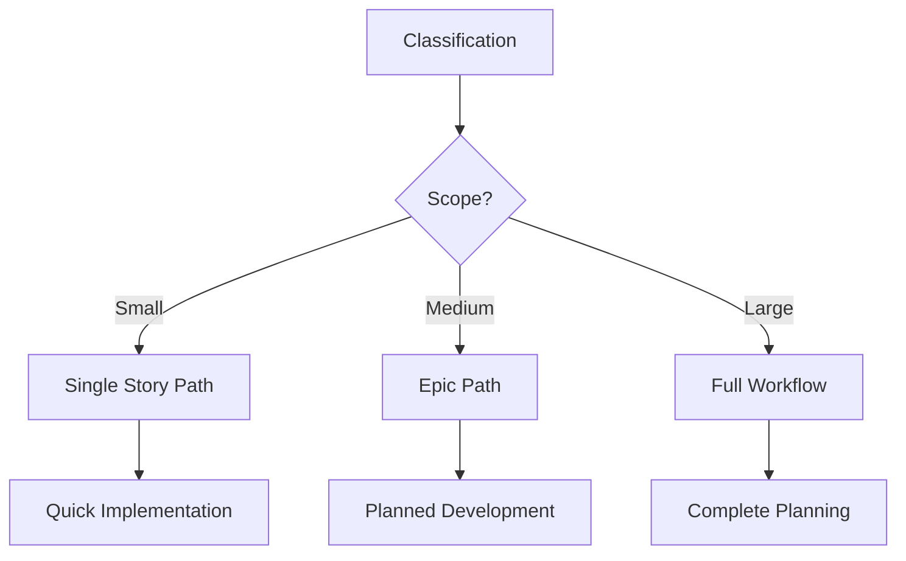
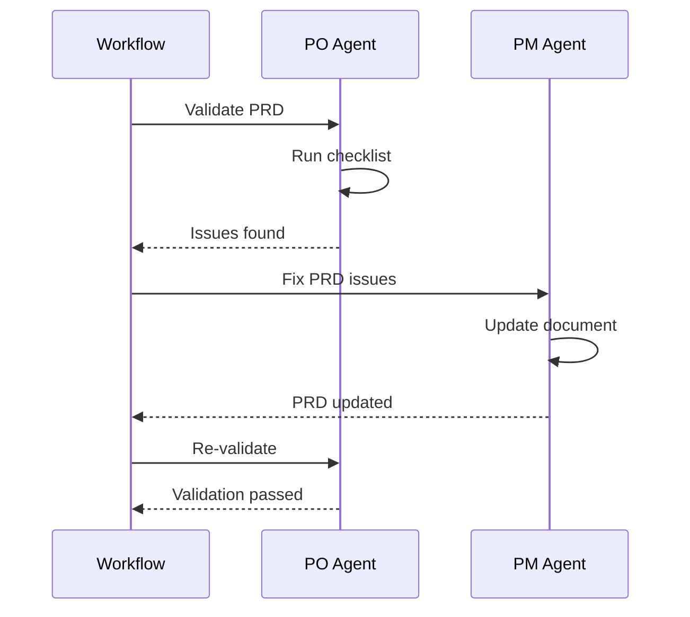
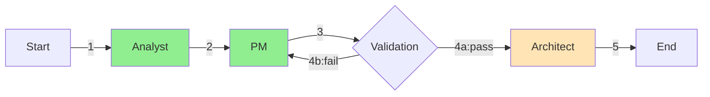

# Deep Dive: Workflow Interactions in BMad - The Orchestration Network

## Overview

Workflow interactions in BMad represent the complex web of relationships between workflows, agents, configuration, and documents. These interactions create a sophisticated orchestration network where components communicate through well-defined interfaces, maintain state across transitions, and adapt to project-specific needs. Understanding these interactions is crucial for debugging issues, optimizing performance, and extending the system.

## Core Interaction Patterns

### The Orchestration Triangle



This triangle represents the fundamental interaction pattern:
1. **Workflows** orchestrate agent sequences
2. **Agents** execute tasks using configuration
3. **Configuration** provides consistent settings
4. **Documents** flow through the system
5. **Validation** ensures quality at each step

## Workflow ↔ Agent Interactions

### Agent Activation Pattern

When a workflow activates an agent:

```yaml
# Workflow definition
sequence:
  - agent: analyst
    creates: project-brief.md
    requires: null
    notes: "Starting point"
```

**Interaction Flow**:
1. Workflow identifies next agent from sequence
2. BMad Orchestrator transforms into specified agent
3. Agent receives context:
   - Previous documents created
   - Expected outputs
   - Workflow position
   - Special instructions

### Context Passing Mechanism

```yaml
# From workflow handoff_prompts
analyst_to_pm: |
  Project brief is complete. 
  Save it as docs/project-brief.md
  Key findings: {{findings}}
  Next: Create PRD focusing on {{focus_areas}}
```

**Context Elements**:
- **Explicit artifacts**: File locations and names
- **Key decisions**: Important choices made
- **Focus areas**: What to emphasize
- **Constraints**: Limitations to observe

### Agent Response Pattern

Agents communicate back to workflows through:

1. **Document creation**: Expected outputs
2. **Status updates**: Progress indicators
3. **Decision points**: Choices needing resolution
4. **Validation results**: Quality checks

Example agent response:
```markdown
✅ PRD created successfully
📁 Saved to: docs/prd.md
⚠️ Note: Added 3 new stories based on architecture review
🔄 Ready for next step: PO validation
```

## Workflow ↔ Configuration Interactions

### Configuration Reading Pattern

Workflows don't directly read configuration, but guide agents to use it:

```yaml
# Workflow instructs agent
notes: "Creates PRD and saves to location specified in core-config"

# Agent reads configuration
config = load('core-config.yaml')
output_path = config.prd.prdFile  # "docs/prd.md"
```

### Dynamic Path Resolution

Configuration provides dynamic paths that workflows reference:

```yaml
# Configuration
prd:
  prdFile: docs/prd.md
  prdShardedLocation: docs/prd

# Workflow uses through agent
agent: po
action: shard_documents
notes: "Shards to location from config"
```

### Sharding Control Flow



## Document Handoff Patterns

### Sequential Document Flow

Documents flow through workflows in defined sequences:

```yaml
# Document creation chain
1. analyst → project-brief.md
2. pm → prd.md (requires project-brief.md)
3. architect → architecture.md (requires prd.md)
4. po → validated documents
5. po → sharded documents
```

### Document State Transitions



### Document Dependency Graph

```yaml
# Dependencies form a directed graph
project-brief.md:
  dependencies: []
  
prd.md:
  dependencies: [project-brief.md]
  
architecture.md:
  dependencies: [prd.md]
  
front-end-spec.md:
  dependencies: [prd.md]
  
story-1.md:
  dependencies: [prd/epic-1.md, architecture/]
```

## State Management Across Execution

### Workflow State Model

Workflows maintain state through:

1. **Implicit State** (document existence):
```bash
# State determined by what exists
if [ -f "docs/prd.md" ]; then
  state="prd_complete"
fi
```

2. **Explicit State** (workflow tracking):
```yaml
workflow_state:
  current_stage: architecture
  completed:
    - project-brief
    - prd
  pending:
    - architecture
    - validation
  artifacts:
    project-brief: docs/project-brief.md
    prd: docs/prd.md
```

### State Persistence Patterns

#### Between Agent Transitions

```yaml
# Agent A completes
state.completed.push('taskA')
state.artifacts['docA'] = 'path/to/docA.md'

# Agent B starts
context = {
  previous: state.completed,
  artifacts: state.artifacts,
  next_expected: 'docB'
}
```

#### Across Sessions

```yaml
# Workflow interruption
/workflow-status
> Current: Architecture phase
> Completed: Brief, PRD
> Next: Complete architecture.md

# Resume later
/workflow-resume
> Resuming from Architecture phase
> Available artifacts: brief, PRD
> Continue with: architect agent
```

### State Recovery Mechanisms

When workflow interrupted:

1. **Artifact Detection**:
```bash
# Scan for existing documents
find docs/ -name "*.md" -type f
```

2. **State Reconstruction**:
```yaml
# Infer position from artifacts
if exists('docs/prd.md') and not exists('docs/architecture.md'):
  position = 'architecture_phase'
```

3. **Continuation Strategy**:
```yaml
# Determine next action
if position == 'architecture_phase':
  next_agent = 'architect'
  next_action = 'create architecture.md'
```

## Conditional Execution Flows

### Condition Evaluation

Workflows evaluate conditions to determine paths:

```yaml
# Brownfield workflow example
- step: routing_decision
  condition: based_on_classification
  routes:
    single_story:
      agent: pm
      uses: brownfield-create-story
    major_enhancement:
      continue: to_next_step
```

**Evaluation Process**:
1. Agent provides classification
2. Workflow evaluates condition
3. Appropriate route selected
4. Different agent/task activated

### Dynamic Branching



### Optional Step Execution

```yaml
- agent: analyst
  optional_steps:
    - brainstorming_session
    - market_research_prompt
```

**Decision Flow**:
1. Agent activated
2. Core task executed
3. Optional steps offered
4. User decides inclusion
5. Workflow adapts path

## Validation and Error Recovery

### Validation Gates

```yaml
# PO validation gate
- agent: po
  validates: all_artifacts
  uses: po-master-checklist

- agent: various
  updates: any_flagged_documents
  condition: po_checklist_issues
```

**Gate Operation**:
1. PO runs validation checklist
2. Issues identified and documented
3. Workflow branches based on results
4. Original agents fix issues
5. Re-validation occurs

### Error Recovery Patterns

#### Document Correction Loop



#### State Rollback

When errors occur:
```yaml
# Rollback to last valid state
on_error:
  - identify_last_valid_state
  - restore_artifacts
  - determine_recovery_point
  - resume_from_recovery
```

## Workflow Composition Patterns

### Nested Workflow Inclusion

Workflows can reference sub-workflows:

```yaml
# Main workflow
- step: feature_development
  condition: has_features
  include: feature-workflow.yaml
  
# Sub-workflow executed
feature-workflow:
  sequence:
    - agent: pm
    - agent: dev
```

### Parallel Execution Branches

Some workflows support parallel paths:

```yaml
# Parallel development
- parallel:
    - branch: frontend
      agent: ux-expert
      creates: ui-spec.md
    - branch: backend
      agent: architect
      creates: api-spec.md
```

### Workflow Chaining

Workflows can chain to others:

```yaml
# Workflow A completes
- workflow_end:
    next_workflow: deployment-workflow
    pass_artifacts:
      - docs/prd.md
      - docs/architecture.md
```

## Performance Optimization Patterns

### Lazy Loading

Components loaded only when needed:

```yaml
# Agent not loaded until activated
- agent: architect  # Loaded here
  creates: architecture.md
  
# Templates loaded on demand
uses: architecture-tmpl  # Loaded when used
```

### Context Minimization

Reducing token usage through selective context:

```yaml
# Only pass essential context
handoff_prompts:
  minimal: |
    PRD complete. Location: {{prd_path}}
    Key decisions: {{decisions_summary}}
    # Not full PRD content
```

### Caching Strategies

```yaml
# Cache frequently used data
cache:
  templates: true
  checklists: true
  agent_definitions: false  # Too large
```

## Monitoring and Debugging Interactions

### Interaction Logging

```yaml
# Debug log captures interactions
devDebugLog: .ai/debug-log.md

# Log format
[timestamp] workflow:greenfield-fullstack -> agent:analyst
[timestamp] agent:analyst -> creates:project-brief.md
[timestamp] validation:passed -> next:pm
```

### Tracing Execution Paths



### Debugging Checkpoints

Key points to examine:
1. **Agent activation**: Did correct agent load?
2. **Document creation**: Was output created?
3. **Path resolution**: Did config provide correct paths?
4. **Validation results**: What issues were found?
5. **State transitions**: Did workflow advance?

## Best Practices for Workflow Interactions

### 1. **Clear Handoff Messages**
```yaml
handoff_prompts:
  analyst_to_pm: |
    ✅ Project brief complete
    📁 Location: {{path}}
    🎯 Key points: {{summary}}
    ➡️ Next: Create PRD focusing on {{focus}}
```

### 2. **Explicit Dependencies**
```yaml
requires:
  - project-brief.md  # Must exist
  - prd.md           # Must exist
optional:
  - market-research.md  # Nice to have
```

### 3. **Graceful Degradation**
```yaml
on_missing_artifact:
  - check_alternative_location
  - attempt_recreation
  - provide_user_guidance
  - allow_manual_override
```

### 4. **State Verification**
```yaml
before_proceeding:
  - verify_previous_outputs
  - check_document_validity
  - confirm_user_ready
  - snapshot_current_state
```

## Summary

Workflow interactions form the nervous system of BMad, enabling:

- **Sophisticated orchestration** through agent coordination
- **Dynamic adaptation** via conditional execution
- **Robust error handling** with validation gates
- **State persistence** across sessions
- **Performance optimization** through smart loading

Understanding these interactions is essential for:
- Debugging workflow execution issues
- Optimizing system performance
- Creating custom workflows
- Implementing error recovery
- Extending BMad capabilities

The interaction patterns demonstrate BMad's core strength: turning individual AI agents into a coordinated development team through well-designed orchestration and communication protocols.