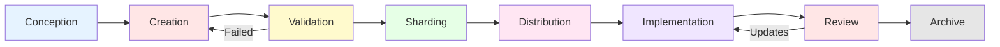
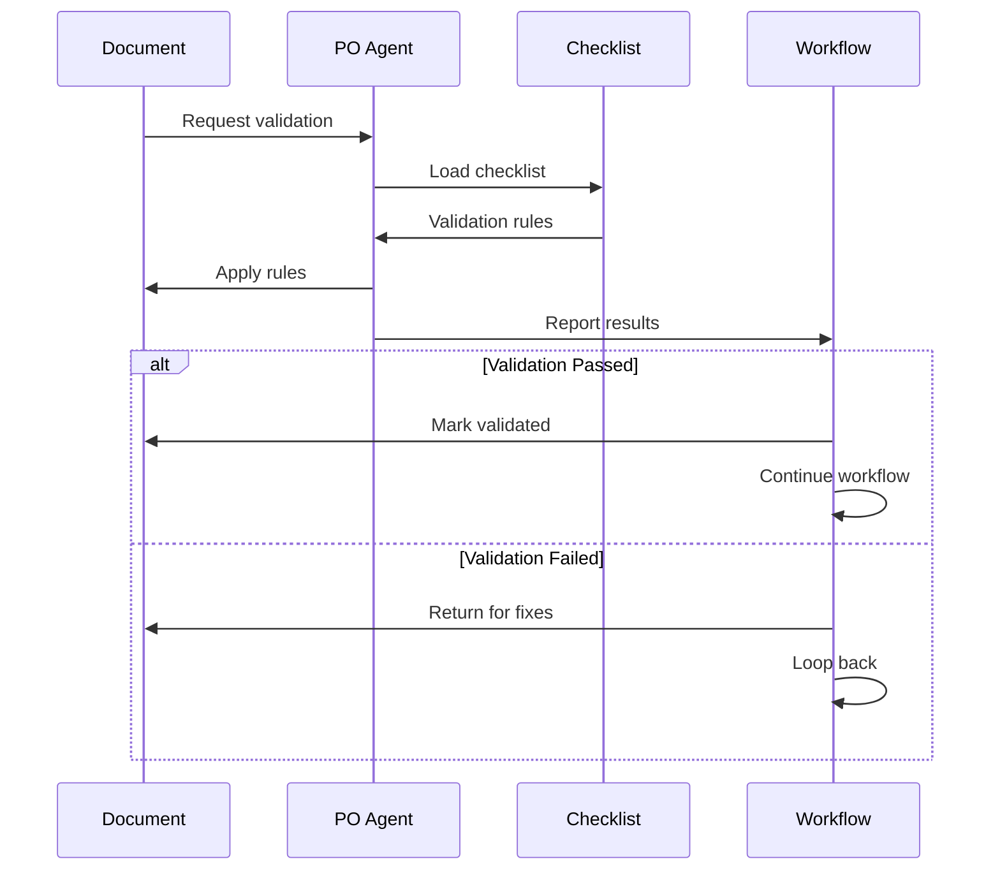
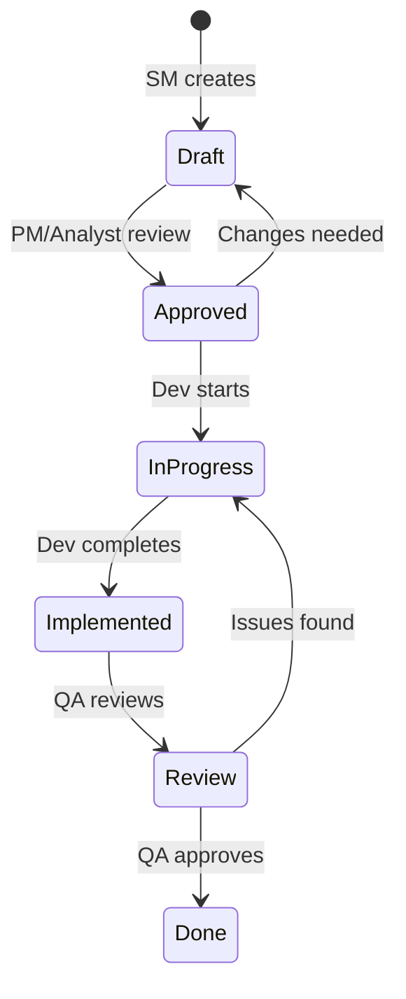
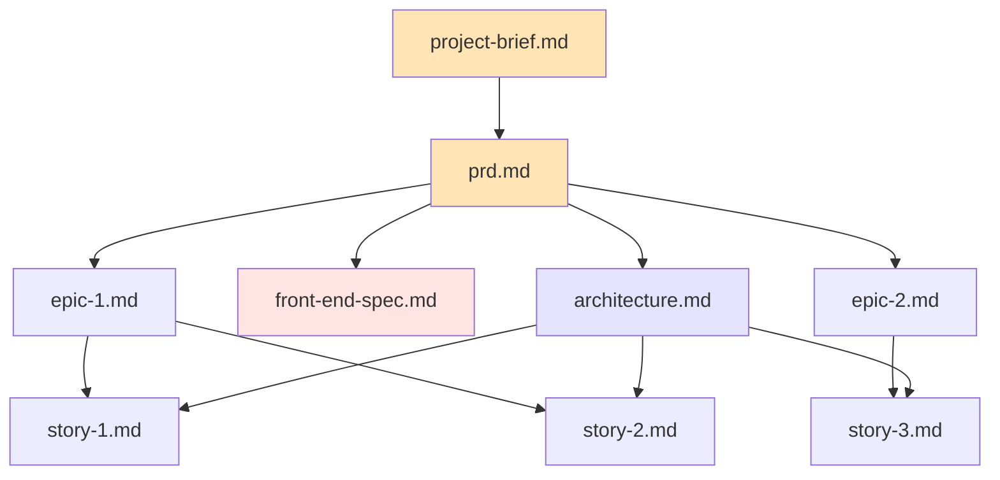
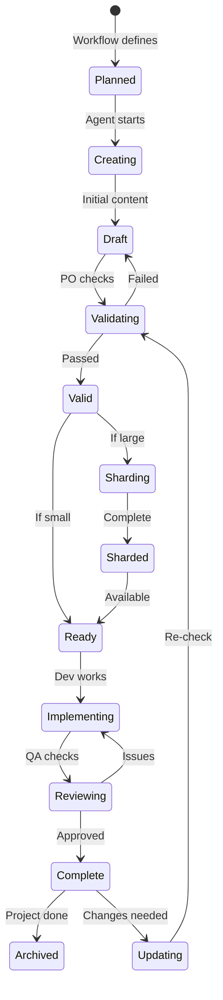

# Deep Dive: Document Lifecycle in BMad - From Creation to Implementation

## Overview

The document lifecycle in BMad represents the complete journey of project artifacts from initial creation through sharding, validation, implementation, and maintenance. Documents are not just static files but living entities that evolve through well-defined states, undergo transformations, and maintain relationships with other artifacts. Understanding this lifecycle is crucial for managing complex projects and ensuring document integrity throughout development.

## Document Lifecycle Stages

### The Complete Journey



## Stage 1: Conception

### Document Planning

Before creation, documents are conceived through:

```yaml
# Workflow defines what documents needed
workflow:
  sequence:
    - agent: analyst
      creates: project-brief.md  # Planned output
    - agent: pm
      creates: prd.md           # Planned output
```

**Conception Elements**:
- **Purpose definition**: Why document needed
- **Template selection**: Which template to use
- **Owner assignment**: Who creates it
- **Location planning**: Where it will live

### Document Types in BMad

| Document Type | Purpose | Template | Owner |
|--------------|---------|----------|-------|
| **project-brief.md** | Initial requirements | project-brief-tmpl | analyst |
| **prd.md** | Product requirements | prd-tmpl | pm |
| **architecture.md** | Technical design | architecture-tmpl | architect |
| **front-end-spec.md** | UI/UX specification | front-end-spec-tmpl | ux-expert |
| **story-*.md** | Implementation tasks | story-tmpl | sm |

## Stage 2: Creation

### Creation Patterns

Documents are created through three primary patterns:

#### 1. Template-Driven Creation

```yaml
# Agent uses create-doc task with template
agent: pm
command: create-doc
template: prd-tmpl.yaml
output: docs/prd.md
```

**Process**:
1. Load YAML template
2. Process each section
3. Apply elicitation
4. Generate content
5. Save to file

#### 2. Task-Driven Creation

```yaml
# Agent uses specific task
agent: sm
task: create-next-story
inputs: sharded PRD
output: docs/stories/epic-1/story-1.md
```

**Process**:
1. Execute task logic
2. Gather inputs
3. Apply business rules
4. Generate document
5. Save to location

#### 3. Direct Creation

```yaml
# Agent creates directly
agent: architect
action: write architecture
method: custom logic
output: docs/architecture.md
```

### Creation Metadata

Every document includes metadata:

```markdown
---
title: Product Requirements Document
version: 1.0
created_by: pm
created_at: 2024-01-15
status: draft
dependencies:
  - project-brief.md
---
```

## Stage 3: Validation

### Validation Layers

Documents undergo multiple validation layers:

#### 1. Structural Validation

```yaml
# Checklist validates structure
- Has executive summary
- Contains all required sections
- Includes success metrics
- Defines scope clearly
```

#### 2. Content Validation

```yaml
# PO validates content quality
- Requirements are clear
- No contradictions
- Technically feasible
- Business value defined
```

#### 3. Dependency Validation

```yaml
# Validate dependencies met
dependencies:
  - project-brief.md exists
  - version compatibility
  - no circular dependencies
```

### Validation Gates



### Validation Status Tracking

```yaml
validation:
  status: passed
  checked_by: po
  checklist: po-master-checklist
  issues_found: []
  timestamp: 2024-01-15T10:30:00Z
```

## Stage 4: Sharding

### Why Sharding?

Large documents are sharded for:
- **AI token limits**: Keep under context windows
- **Parallel processing**: Multiple agents work simultaneously
- **Focused context**: Relevant sections only
- **Performance**: Faster processing

### Sharding Process

#### Automatic Sharding (md-tree)

```bash
# When markdownExploder: true
md-tree explode docs/prd.md docs/prd/

# Results in:
docs/prd/
├── executive-summary.md
├── project-overview.md
├── epic-1-user-auth.md
├── epic-2-payments.md
└── non-functional.md
```

#### Manual Sharding

```yaml
# When markdownExploder: false
1. Parse document structure
2. Identify H2 sections
3. Create folder structure
4. Split into files
5. Maintain references
```

### Sharding Rules

```yaml
sharding_rules:
  split_level: 2  # Split at H2 headers
  min_size: 100   # Minimum lines for shard
  max_size: 1000  # Maximum lines per shard
  preserve:
    - code_blocks: true
    - tables: true
    - diagrams: true
```

### Shard Naming Convention

```
Original: docs/prd.md
Sharded:  docs/prd/
          ├── 01-executive-summary.md
          ├── 02-project-overview.md
          ├── 03-epic-1-user-authentication.md
          ├── 04-epic-2-payment-processing.md
          └── 05-non-functional-requirements.md
```

## Stage 5: Distribution

### Distribution Patterns

Sharded documents are distributed to agents:

```yaml
# SM agent receives specific epic
sm:
  receives: docs/prd/03-epic-1-user-authentication.md
  creates: docs/stories/epic-1/

# Dev agent receives story + context
dev:
  receives:
    - docs/stories/epic-1/story-1.md
    - docs/architecture/tech-stack.md
    - docs/architecture/coding-standards.md
```

### Context Assembly

```yaml
# Configuration defines always-loaded files
devLoadAlwaysFiles:
  - docs/architecture/coding-standards.md
  - docs/architecture/tech-stack.md
  - docs/architecture/source-tree.md

# Plus specific story context
story_context:
  - current_story.md
  - related_epic.md
  - relevant_architecture.md
```

### Distribution Tracking

```yaml
distribution_log:
  - document: epic-1.md
    distributed_to: [sm, dev]
    timestamp: 2024-01-15T11:00:00Z
  - document: story-1.md
    distributed_to: [dev, qa]
    timestamp: 2024-01-15T14:00:00Z
```

## Stage 6: Implementation

### Story Implementation Flow



### Document Updates During Implementation

```yaml
# Story document evolves
story.md:
  v1: Initial draft from SM
  v2: Approved by PM
  v3: Dev adds implementation notes
  v4: Dev updates with file list
  v5: QA adds review comments
  v6: Final version marked Done
```

### File List Tracking

Stories track implementation changes:

```markdown
## File List
- Created: src/auth/login.component.ts
- Modified: src/app/app.module.ts
- Created: src/auth/auth.service.ts
- Modified: src/api/endpoints.ts
- Created: tests/auth/login.spec.ts
```

## Stage 7: Review

### Review Layers

#### QA Review

```yaml
qa_review:
  story: story-1.md
  checks:
    - code_quality
    - test_coverage
    - documentation
    - security
  results:
    - passed: [code_quality, documentation]
    - failed: [test_coverage]
    - actions: Add unit tests for auth service
```

#### Architectural Review

```yaml
architect_review:
  implementation: epic-1-implementation
  checks:
    - follows_patterns
    - uses_approved_libraries
    - maintains_consistency
  feedback: Consider using repository pattern
```

### Review Status Tracking

```markdown
## Review Status
- [ ] Code review passed
- [x] Tests written
- [x] Documentation updated
- [ ] Security review complete
- [ ] Performance validated
```

## Stage 8: Archive

### Archival Patterns

Completed documents are archived:

```bash
project/
├── docs/           # Active documents
├── .archive/       # Completed/versioned
│   ├── v1.0/
│   │   ├── prd.md
│   │   └── architecture.md
│   └── stories/
│       └── completed/
```

### Version Management

```yaml
# Document versioning
versions:
  - version: 1.0
    date: 2024-01-01
    changes: Initial version
  - version: 1.1
    date: 2024-01-15
    changes: Added payment epic
  - version: 2.0
    date: 2024-02-01
    changes: Major architecture update
```

## Document Relationships

### Dependency Graph



### Cross-References

Documents maintain references:

```markdown
<!-- In story-1.md -->
## References
- Epic: [User Authentication](../prd/epic-1.md)
- Architecture: [Auth Design](../architecture/auth-design.md)
- API Spec: [Auth Endpoints](../api/auth-endpoints.md)
```

## Document State Machine

### Complete State Diagram



## Document Transformation Pipeline

### Transformation Steps

```yaml
transformations:
  - step: create
    input: template + context
    output: draft document
    
  - step: validate
    input: draft document
    output: validated document
    
  - step: shard
    input: validated document
    output: document fragments
    
  - step: enrich
    input: fragments
    output: contextualized fragments
    
  - step: implement
    input: contextualized fragments
    output: implemented features
```

### Format Transformations

```yaml
# Document format evolution
markdown → validated_markdown → sharded_markdown → 
contextualized_markdown → code_files → reviewed_code
```

## Best Practices

### 1. **Maintain Document Integrity**
- Always validate before sharding
- Preserve formatting in shards
- Keep references intact
- Track all versions

### 2. **Optimize for AI Processing**
- Shard large documents
- Provide focused context
- Minimize token usage
- Cache frequently used

### 3. **Enable Traceability**
- Track creation metadata
- Log all transformations
- Maintain dependency links
- Document decisions

### 4. **Handle Failures Gracefully**
- Checkpoint at each stage
- Enable rollback
- Preserve working versions
- Clear error messages

## Troubleshooting Document Issues

### Common Problems

| Issue | Cause | Solution |
|-------|-------|----------|
| Document not found | Wrong path | Check core-config paths |
| Sharding fails | Invalid structure | Validate markdown format |
| Validation loops | Conflicting requirements | Review checklist logic |
| Lost updates | Concurrent editing | Implement locking |
| Broken references | File moved | Update reference paths |

### Debugging Document Flow

1. **Trace Creation**:
```bash
# Check if document created
ls -la docs/prd.md
# Check creation log
cat .ai/debug-log.md | grep "prd.md"
```

2. **Verify Sharding**:
```bash
# Check sharded output
ls -la docs/prd/
# Verify shard count
find docs/prd -name "*.md" | wc -l
```

3. **Validate References**:
```bash
# Find broken links
grep -r "](.*\.md)" docs/ | check_links
```

## Document Lifecycle Optimization

### Performance Strategies

1. **Lazy Sharding**: Only shard when needed
2. **Smart Caching**: Cache validated documents
3. **Incremental Updates**: Update only changed sections
4. **Parallel Processing**: Process shards concurrently

### Storage Optimization

```yaml
storage_strategy:
  active: docs/          # Current working
  sharded: docs/*/       # Processed fragments
  archive: .archive/     # Historical versions
  cache: .cache/        # Temporary processing
```

## Summary

The document lifecycle in BMad represents a sophisticated system for managing project artifacts through their complete journey. Key aspects include:

- **Eight distinct stages** from conception to archive
- **Multiple validation layers** ensuring quality
- **Intelligent sharding** for AI processing
- **Complex relationships** between documents
- **State management** throughout lifecycle
- **Transformation pipeline** for different uses

Understanding the document lifecycle is essential for:
- Managing complex project documentation
- Debugging document-related issues
- Optimizing processing performance
- Ensuring document integrity
- Implementing custom document types

The document lifecycle embodies BMad's core principle: documents are not just artifacts but active participants in the development process, evolving through well-defined states while maintaining quality and relationships throughout their journey.