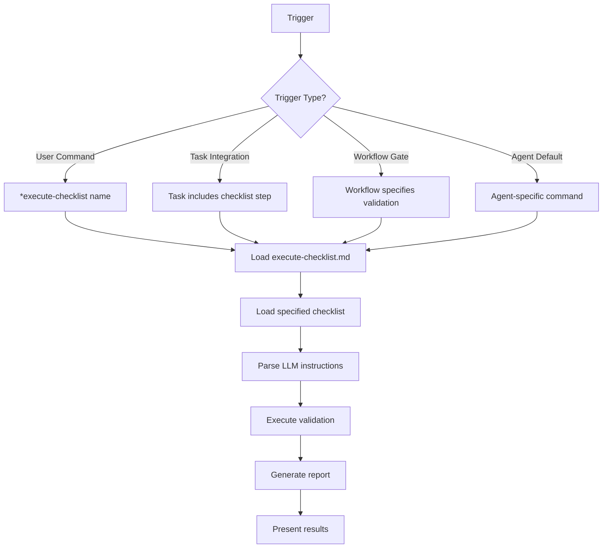
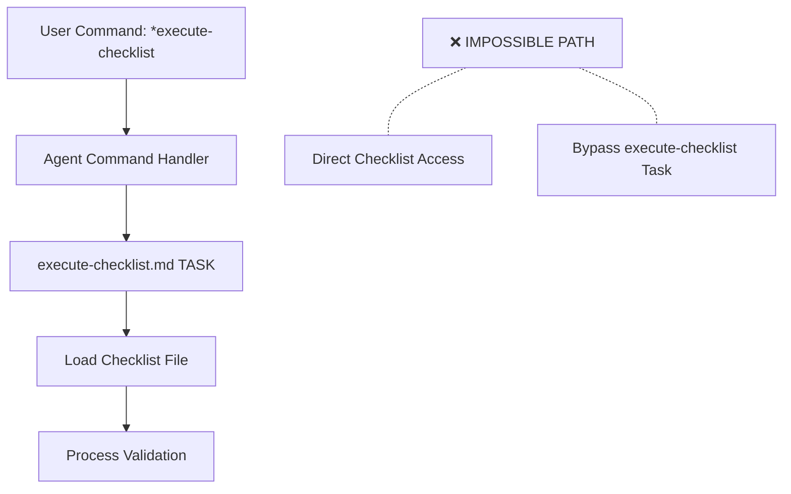

# BMad Checklist Execution Patterns and Enforcement

## Overview

Checklist execution in BMad follows strict patterns and enforcement mechanisms to ensure consistent quality validation across all components. This document explains how checklists are triggered, executed, and why the system architecturally prevents bypassing the `execute-checklist` task.

## Part 1: Execution Trigger Patterns

The `execute-checklist` task can be triggered in several different ways, both explicit and automatic.

### 1. Explicit User Commands

Users can directly invoke checklist execution through agent commands:

#### Direct Command Pattern
```yaml
Agent Command: *execute-checklist {checklist-name}
```

**Examples:**
- `*execute-checklist architect-checklist` (architect agent)
- `*execute-checklist story-dod-checklist` (dev agent)
- `*execute-checklist po-master-checklist` (PO agent)

#### Shorthand Command Pattern
```yaml
Agent Command: *story-checklist  # SM agent shorthand
Agent Command: *execute-checklist-po  # PO agent shorthand
```

**Agent-specific commands:**
- **Scrum Master**: `*story-checklist` → executes `story-draft-checklist.md`
- **Product Owner**: `*execute-checklist-po` → executes `po-master-checklist.md`
- **Architect**: `*execute-checklist` → defaults to `architect-checklist.md`

### 2. Automatic Task Integration

Checklists are automatically executed as part of other task workflows:

#### Task-Embedded Execution
Tasks include checklist execution as a mandatory step:

**In `create-next-story.md` task:**
```markdown
### 6. Story Draft Completion and Review
- Update status to "Draft" and save the story file
- Execute `{root}/tasks/execute-checklist` `{root}/checklists/story-draft-checklist`
- Provide summary including Checklist Results
```

**In `develop-story` command (dev agent):**
```yaml
completion: "All Tasks marked [x]→run the task execute-checklist for the checklist story-dod-checklist→set story status: 'Ready for Review'→HALT"
```

### 3. Workflow-Integrated Quality Gates

Workflows specify checklist execution at critical junctures:

**In workflow YAML files:**
```yaml
- agent: po
  validates: all_artifacts
  uses: po-master-checklist
  condition: po_checklist_issues
  notes: "If PO finds issues, return to relevant agent to fix"
```

### 4. Agent-Specific Integration Patterns

#### Developer Agent Pattern
```
Story Implementation Complete
↓ (automatic)
Execute story-dod-checklist 
↓ (validation)
Pass: Mark as "Ready for Review"
Fail: Fix issues and re-validate
```

#### Scrum Master Pattern
```
Create Story Complete
↓ (automatic)
Execute story-draft-checklist
↓ (validation)
Story quality validated before handoff
```

#### Product Owner Pattern
```
User Command: *execute-checklist-po
↓ (explicit)
Execute po-master-checklist
↓ (comprehensive validation)
Full project quality assessment
```

#### Architect Pattern
```
Architecture Document Complete
↓ (optional explicit command)
User: *execute-checklist
↓ (defaults to architect-checklist)
Architecture validation and sign-off
```

### 5. Command Resolution Logic

#### With Checklist Parameter
```
*execute-checklist architect-checklist
→ Load execute-checklist.md task
→ Load architect-checklist.md
→ Execute validation
```

#### Without Checklist Parameter
```
*execute-checklist
→ Show available checklists from agent dependencies
→ User selects number
→ Load selected checklist
→ Execute validation
```

#### Agent-Specific Defaults
```yaml
# Architect agent
execute-checklist {checklist}: Run task execute-checklist (default->architect-checklist)

# PO agent  
execute-checklist-po: Run task execute-checklist (checklist po-master-checklist)
```

### 6. Execution Flow Summary



### 7. When Checklists Are Executed

| **Trigger** | **When** | **Who** | **Example** |
|-------------|----------|---------|-------------|
| **Explicit Command** | User decides validation needed | Any agent with checklist dependencies | `*execute-checklist architect-checklist` |
| **Task Integration** | Task reaches validation step | Task execution | `create-next-story` → `story-draft-checklist` |
| **Workflow Gate** | Workflow reaches quality checkpoint | Workflow orchestration | PO validation step in workflows |
| **Agent Default** | User uses shorthand command | Specific agents | SM: `*story-checklist` |
| **Completion Gate** | Work phase complete | Agent finishing work | Dev: story complete → DoD checklist |

## Part 2: Architectural Enforcement Mechanisms

BMad uses several architectural patterns to ensure checklists are always executed through the `execute-checklist` task and cannot be bypassed.

### 1. Dependency Architecture Pattern

#### File Resolution System
Every agent uses the IDE-FILE-RESOLUTION pattern:

```yaml
IDE-FILE-RESOLUTION:
  - Dependencies map to {root}/{type}/{name}
  - type=folder (tasks|templates|checklists|data|utils|etc...)
  - Example: create-doc.md → {root}/tasks/create-doc.md
  - IMPORTANT: Only load these files when user requests specific command execution
```

#### Key Enforcement Rules:
- **No Direct File Access**: Agents cannot directly load checklist files
- **Dependency Declaration**: Checklists are declared as dependencies, not executables
- **Task-Mediated Access**: All checklist access must go through tasks

### 2. Command Architecture Enforcement

#### All Checklist Commands Reference execute-checklist Task

**Agent Commands Always Specify Task:**
```yaml
# Dev Agent
completion: "run the task execute-checklist for the checklist story-dod-checklist"

# SM Agent  
story-checklist: Execute task execute-checklist.md with checklist story-draft-checklist.md

# Architect Agent
execute-checklist {checklist}: Run task execute-checklist (default->architect-checklist)

# PO Agent
execute-checklist-po: Run task execute-checklist (checklist po-master-checklist)
```

**Notice the pattern**: Every command specifies "Execute task execute-checklist" - never direct checklist access.

### 3. Dependency vs Execution Separation

#### Checklists are Dependencies, NOT Executables

```yaml
# In agent dependencies
dependencies:
  tasks:                    # ← These can be executed
    - execute-checklist.md  # ← The processor
    - create-doc.md
  checklists:              # ← These are DATA, not executables
    - story-dod-checklist.md  # ← Just a dependency reference
    - architect-checklist.md
```

#### The Rule:
- **Tasks** are in the `tasks:` section and can be executed
- **Checklists** are in the `checklists:` section and are data dependencies only
- Only the `execute-checklist.md` **task** can process checklist **data**

### 4. Task Integration Pattern

#### Tasks Reference execute-checklist, Never Direct Files

```markdown
# In create-next-story.md task
- Execute `{root}/tasks/execute-checklist` `{root}/checklists/story-draft-checklist`
```

**NOT:**
```markdown
# This pattern NEVER appears in BMad
- Load story-draft-checklist.md and validate
```

### 5. No Direct File Loading Architecture

#### Critical Enforcement Rules in Agent Instructions:

```yaml
activation-instructions:
  - DO NOT: Load any other agent files during activation
  - ONLY load dependency files when user selects them for execution via command
  - When executing tasks from dependencies, follow task instructions exactly
```

#### The Key Rule:
- Agents can only load files "when user selects them for execution via command"
- Commands always reference **tasks**, never direct checklist files
- Tasks handle all file loading and processing

### 6. Universal Task Dependency Pattern

#### Every Agent with Checklists Has execute-checklist Task

```yaml
# ALL agents with checklist dependencies ALSO have:
tasks:
  - execute-checklist.md    # ← The universal processor
checklists:
  - [specific-checklist.md] # ← The data they can process
```

This creates a **mandatory coupling**: You cannot have checklist dependencies without the execute-checklist task dependency.

### 7. Command-to-Task Mapping Enforcement

#### Commands Never Bypass the Task Layer



**The architecture makes bypassing impossible because:**
1. Commands are defined to call tasks, not files
2. File resolution requires task-mediated access
3. No agent has commands that directly reference checklist files

### 8. Workflow Integration Enforcement

#### Workflows Also Enforce Task-Mediated Access

```yaml
# In workflow files
- agent: po
  validates: all_artifacts
  uses: po-master-checklist    # ← References checklist name
```

**The workflow engine:**
1. Sees `uses: po-master-checklist`
2. Tells PO agent to validate
3. PO agent uses its `execute-checklist-po` command
4. Command calls `execute-checklist.md` task
5. Task loads the specified checklist

## Part 3: The Enforcement Mechanisms

### Architectural Constraints
- File resolution system prevents direct access
- All access must be command-mediated
- Commands are pre-defined to use tasks

### Dependency Separation
- Checklists are declared as data dependencies
- Only tasks can be executed
- execute-checklist is the only task that processes checklists

### Command Design
- Every checklist-related command explicitly calls execute-checklist task
- No commands provide direct checklist access
- Agent instructions enforce this pattern

### Task Authority
- Task instructions override agent behavior
- Tasks control file loading and processing
- Agents must follow task workflows exactly

## Part 4: What Happens If Someone Tries to Bypass?

### Scenario: Agent tries to directly load checklist file

```
Agent: "Let me load story-dod-checklist.md directly"
↓
IDE-FILE-RESOLUTION: "ONLY load files when user requests command execution"
↓
No command exists for direct checklist loading
↓
Agent cannot access file - must use execute-checklist task
```

### Scenario: Create command that bypasses task

```yaml
# Hypothetical bad command
bad-command: Load checklist directly
```

This would require:
1. Adding the command to agent definition ❌ (against architecture)
2. Creating direct file access logic ❌ (violates file resolution rules)
3. Bypassing task-mediated processing ❌ (violates dependency pattern)

## Part 5: Key Insights

### Never Pre-Executed
- Checklists are NEVER automatically run during agent activation
- They are ONLY executed when explicitly triggered
- This maintains the lazy-loading principle

### Multiple Trigger Points
- **Explicit**: User commands for on-demand validation
- **Embedded**: Built into task workflows as quality gates
- **Workflow**: Specified in workflow orchestration
- **Default**: Agent-specific default behaviors

### Flexible Parameters
- Can specify exact checklist name
- Can use agent defaults
- Can show available options for selection

### Integration Points
- **Agent Commands**: Direct user control
- **Task Steps**: Automatic quality gates
- **Workflows**: Orchestrated validation
- **Agent Defaults**: Streamlined UX

## The Genius of This Design

### Benefits of Task-Mediated Checklist Access:

1. **Consistency**: All checklists processed the same way
2. **Extensibility**: Easy to enhance execute-checklist task
3. **Quality Control**: Single point for validation logic
4. **Reporting**: Standardized output format
5. **Maintenance**: One task to update, not N checklist processors
6. **Security**: Controlled access to validation logic
7. **User Experience**: Consistent interface across all agents

## Design Logic Summary

This multi-trigger approach with strict enforcement provides:

1. **Flexibility**: Multiple ways to access validation
2. **Automation**: Built-in quality gates where needed  
3. **User Control**: Explicit commands when desired
4. **Workflow Integration**: Seamless quality checkpoints
5. **Agent Specialization**: Tailored to agent responsibilities
6. **Lazy Loading**: Only executed when actually needed
7. **Architectural Guarantee**: Bypassing is impossible, not just discouraged

## Summary

BMad ensures checklists always execute via execute-checklist through:

1. **Architectural Constraints**: File resolution system prevents direct access
2. **Dependency Separation**: Checklists are data, tasks are executables
3. **Command Design**: All commands reference the execute-checklist task
4. **Universal Pattern**: Every agent with checklists has execute-checklist dependency
5. **Task Authority**: Tasks control all file processing
6. **Enforcement Rules**: Agent instructions prevent bypassing

**The system makes bypassing architecturally impossible, not just discouraged.**

This creates a robust, consistent, and maintainable checklist execution system where quality validation always follows the same patterns and can be enhanced centrally. The system ensures quality validation happens at the right times through the right mechanisms, whether user-initiated or process-integrated.

## See Also

- [13-bmad-checklists-reference.md](13-bmad-checklists-reference.md) - Checklist structure and anatomy
- [11-bmad-tasks-reference.md](11-bmad-tasks-reference.md) - Task system including execute-checklist
- [10-bmad-agents-reference.md](10-bmad-agents-reference.md) - How agents use checklists
- [14-bmad-workflows-reference.md](14-bmad-workflows-reference.md) - Workflow quality gates