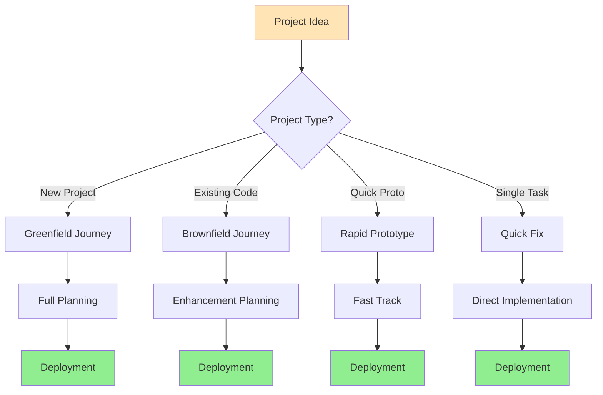
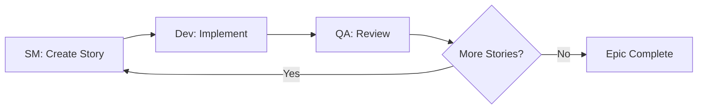
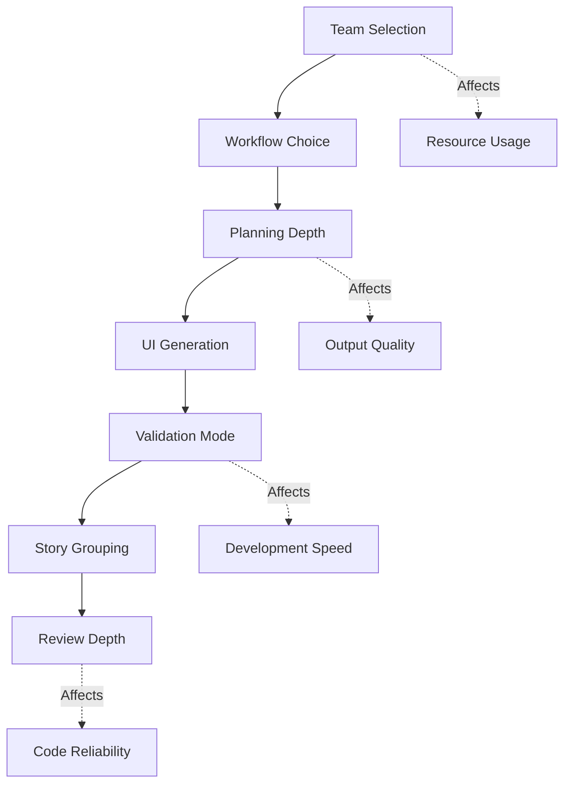
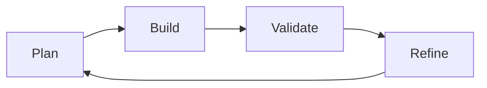
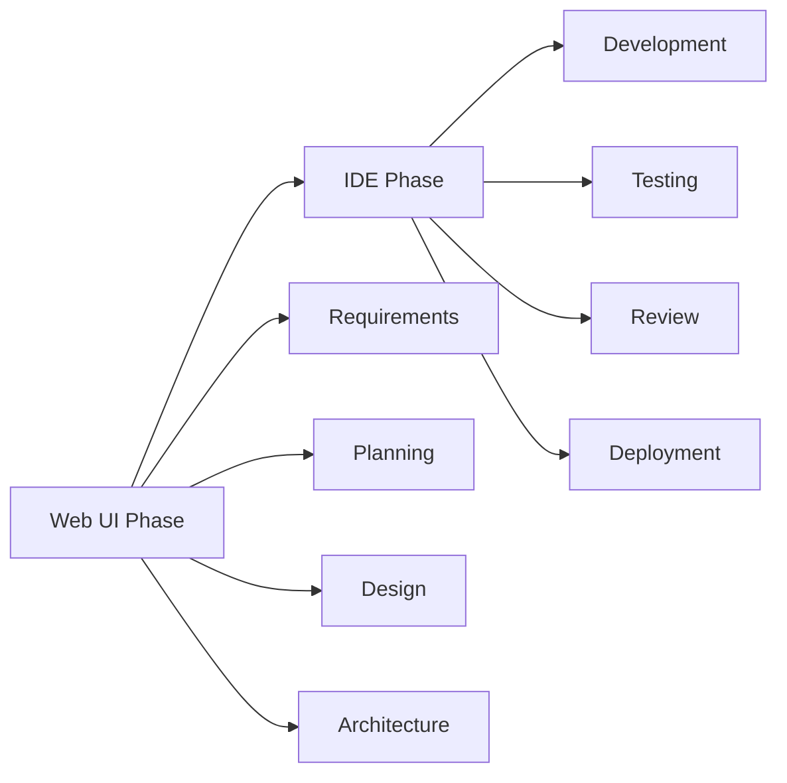

# End-to-End User Journey in BMad - From Idea to Implementation

## Overview

This document traces complete user journeys through BMad, from initial project conception to deployed code. It demonstrates how different paths through the system lead to successful outcomes, highlighting decision points, common patterns, and optimization strategies. Understanding these journeys helps users navigate BMad efficiently and choose the right path for their specific needs.

## Journey Types

### The Four Primary Journeys



## Journey 1: Greenfield Full-Stack Application

### Scenario
Building a new SaaS application from scratch with complete planning.

### Phase 1: Initialization

```bash
# User starts BMad
bmad init --team team-fullstack
```

**Decision Point 1**: Team Selection
- Chose `team-fullstack` for web application
- Alternative: `team-all` for exploration
- Alternative: `team-no-ui` for API only

### Phase 2: Workflow Selection

```yaml
# BMad Orchestrator activated
/workflows
> 1. greenfield-fullstack
> 2. greenfield-service
> 3. greenfield-ui

# User selects
/workflow-start greenfield-fullstack
```

**Decision Point 2**: Workflow Choice
- Selected full-stack for complete app
- Considered service-only for backend
- Considered ui-only for frontend

### Phase 3: Requirements Gathering

```markdown
# Analyst agent activated
@analyst

## Optional brainstorming
> Would you like to brainstorm first? 
User: Yes, let's explore payment processing options

## Brainstorming session
[Interactive brainstorming using facilitation techniques]

## Project brief creation
> create-project-brief
[Interactive document creation with elicitation]

Output: docs/project-brief.md
```

**Decision Point 3**: Depth of Analysis
- Chose brainstorming for unclear requirements
- Could skip for well-defined projects
- Could add market research for competitive analysis

### Phase 4: Product Planning

```markdown
# PM agent activated
@pm

## PRD Creation
> create-prd
[Uses project brief as input]
[Interactive creation with 1-9 elicitation options]

Output: docs/prd.md
```

**Key Artifacts**:
- Project brief → PRD transformation
- Epic breakdown
- User stories defined
- Success metrics established

### Phase 5: UX Design

```markdown
# UX Expert activated
@ux-expert

## Frontend specification
> create-front-end-spec
[Design system, components, user flows]

## Optional: AI UI Generation
> generate-ai-frontend-prompt
[Creates prompt for v0, Lovable, etc.]

User: *Goes to v0.dev with prompt*
User: *Downloads generated UI code*
```

**Decision Point 4**: UI Generation Method
- Chose AI generation for speed
- Could design manually
- Could use existing templates

### Phase 6: Architecture Design

```markdown
# Architect activated
@architect

## Architecture document
> create-architecture
[Technical stack, patterns, infrastructure]
[Incorporates v0 generated structure]

## Suggests PRD updates
"Based on technical constraints, suggest adding story for caching layer"

Output: docs/architecture.md
```

**Feedback Loop**:
- Architecture informs PRD changes
- PM updates PRD with new stories
- Maintains alignment

### Phase 7: Validation

```markdown
# PO agent activated
@po

## Run master checklist
> validate-all
[Checks PRD, architecture, frontend spec]

## Issues found
- Missing error handling stories
- Inconsistent API naming

## Resolution
[Return to PM and Architect for fixes]
[Re-validation passes]
```

**Quality Gate**:
- Must pass before proceeding
- Ensures consistency
- Catches issues early

### Phase 8: Document Sharding

```markdown
# PO shards documents
> shard docs/prd.md
> shard docs/architecture.md

Output: 
- docs/prd/epic-1-user-auth.md
- docs/prd/epic-2-payments.md
- docs/architecture/tech-stack.md
- docs/architecture/api-design.md
```

**Preparation for Development**:
- Documents ready for AI processing
- Manageable chunks
- Parallel development enabled

### Phase 9: Development Cycle

```markdown
# Switch to IDE environment
cd project-folder
code .  # Open VS Code

# SM agent in new chat
@sm
> *create
[Creates story-1 from epic-1]

Output: docs/stories/epic-1/story-1-login.md
```

**Story Creation Loop**:


### Phase 10: Implementation

```markdown
# Dev agent in new chat
@dev
[Loads story-1, architecture, coding standards]

## Implementation
- Creates src/auth/login.component.ts
- Updates src/app/app.module.ts
- Writes tests
- Updates story with file list

Status: story-1 → Review
```

**Development Pattern**:
- Story-driven development
- Test-first approach
- Documentation updates
- File tracking

### Phase 11: Quality Review

```markdown
# QA agent in new chat
@qa
> review-story

## Review results
✅ Code quality good
✅ Tests passing
⚠️ Missing error handling
❌ No loading state

## Actions
- Fixed loading state directly
- Left checklist for error handling

Status: story-1 → Done (with notes)
```

### Phase 12: Iteration

```markdown
# Continue for all stories
Repeat: SM → Dev → QA cycle

## Progress tracking
Epic 1: 5/5 stories complete
Epic 2: 3/5 stories complete
Epic 3: 0/4 stories complete
```

### Journey Metrics

| Metric | Value |
|--------|-------|
| **Total Time** | 3 days |
| **Documents Created** | 15 |
| **Stories Completed** | 12 |
| **Agents Used** | 7 |
| **Validation Loops** | 2 |

## Journey 2: Brownfield Enhancement

### Scenario
Adding major feature to existing application.

### Phase 1: Classification

```markdown
# Analyst agent
@analyst

## Enhancement scope?
"We need to add real-time notifications to our app"

## Classification
- Complexity: Major (architectural changes)
- Stories: ~8-10
- Risk: Medium (WebSocket integration)

Decision: Full brownfield workflow
```

**Routing Decision**:
- Major enhancement → Full workflow
- Could have been single story for small fix
- Could have been epic for medium feature

### Phase 2: Documentation Check

```markdown
# Analyst checks existing docs
> Check for architecture.md
❌ Not found or outdated

Decision: Run document-project first
```

### Phase 3: Project Documentation

```markdown
# Architect agent
@architect
> document-project

## Analyzes codebase
- Discovers tech stack
- Maps component structure
- Identifies patterns
- Documents constraints

Output: docs/brownfield-architecture.md
```

**Discovery Process**:
- Automatic codebase analysis
- Pattern recognition
- Dependency mapping
- Technical debt identification

### Phase 4: Enhancement Planning

```markdown
# PM agent
@pm
> create-brownfield-prd

## Uses discovered architecture
- Works within constraints
- Leverages existing patterns
- Plans incremental changes

Output: docs/prd.md (enhancement focused)
```

### Phase 5: Architecture Updates

```markdown
# Architect agent
@architect

## Notification architecture
- WebSocket service design
- Event bus integration
- Database schema changes

Output: docs/architecture.md (updated)
```

### Remaining Phases
Similar to greenfield but:
- More validation steps
- Backward compatibility checks
- Integration testing focus
- Gradual rollout strategy

## Journey 3: Rapid Prototype

### Scenario
Quick MVP for investor demo.

### Optimized Path

```markdown
# Fast track decisions
1. Team: team-fullstack
2. Workflow: greenfield-fullstack
3. Brainstorming: Skip
4. Research: Skip
5. Project brief: Minimal (5 minutes)
6. PRD: Focus on core features only
7. UX: Use v0.dev entirely
8. Architecture: Lightweight
9. Validation: YOLO mode
10. Development: Focus on happy path
```

### Time Optimization

| Phase | Standard | Rapid |
|-------|----------|-------|
| **Planning** | 8 hours | 2 hours |
| **Design** | 6 hours | 1 hour |
| **Architecture** | 4 hours | 30 minutes |
| **Development** | 40 hours | 16 hours |
| **Total** | 58 hours | 19.5 hours |

### Trade-offs

**Gained**:
- 3x faster delivery
- Quick validation
- Investor ready

**Sacrificed**:
- Comprehensive testing
- Error handling
- Scalability planning
- Documentation depth

## Journey 4: Quick Fix

### Scenario
Single bug fix or small feature.

### Direct Path

```markdown
# Bypass planning entirely
1. Team: team-ide-minimal
2. No workflow
3. Direct to SM agent

# SM agent
@sm
> create-brownfield-story
"Add password reset email"

# Dev agent
@dev
[Implements single story]

# Complete in 2 hours
```

## Decision Points Analysis

### Critical Decisions Throughout Journey



### Decision Framework

| Decision | Options | Choose Based On |
|----------|---------|-----------------|
| **Team** | All/Fullstack/Minimal | Project scope, resources |
| **Workflow** | Green/Brown/None | New vs existing code |
| **Planning** | Deep/Standard/Minimal | Project complexity |
| **UI Method** | AI/Manual/Template | Time vs customization |
| **Validation** | Interactive/YOLO | Quality requirements |
| **Review** | Thorough/Standard/Skip | Risk tolerance |

## Common Patterns

### Pattern 1: The Planning Pyramid

```
Large Project:  ████████████ Planning
                ████ Implementation

Small Project:  ██ Planning
                ████████ Implementation

Prototype:      █ Planning
                ███ Implementation
```

### Pattern 2: The Feedback Loop



### Pattern 3: The Quality Gates

```
Requirements → [Gate 1: Completeness] →
Design → [Gate 2: Feasibility] →
Architecture → [Gate 3: Consistency] →
Implementation → [Gate 4: Functionality] →
Deployment
```

## Web UI vs IDE Workflows

### Comparison

| Aspect | Web UI | IDE |
|--------|--------|-----|
| **Planning** | ✅ Optimal | ⚠️ Possible |
| **Documentation** | ✅ Best | ✅ Good |
| **Development** | ⚠️ Limited | ✅ Optimal |
| **File Management** | ❌ Manual | ✅ Automatic |
| **Context** | ⚠️ Limited | ✅ Full |
| **Speed** | Slower | Faster |

### Workflow Split Strategy



## Cost Optimization Strategies

### Token Usage Patterns

```yaml
# High token usage
- Brainstorming sessions
- Deep elicitation
- Comprehensive validation
- Multiple review cycles

# Low token usage
- YOLO mode
- Skip optional steps
- Reuse templates
- Minimal reviews
```

### Optimization Techniques

1. **Batch Operations**:
   - Create multiple stories at once
   - Review multiple files together
   - Validate in YOLO mode

2. **Context Management**:
   - Shard large documents
   - Load only needed context
   - Clear context between agents

3. **Smart Skipping**:
   - Skip brainstorming if clear
   - Skip deep research if known
   - Skip reviews for low-risk

## Journey Success Metrics

### Measurement Framework

```yaml
efficiency:
  time_to_first_commit: 4 hours
  planning_to_implementation_ratio: 1:3
  rework_percentage: 5%

quality:
  validation_pass_rate: 95%
  test_coverage: 80%
  documentation_completeness: 100%

cost:
  tokens_per_story: 5000
  agent_activations: 15
  total_interactions: 45
```

## Best Practices by Journey Type

### Greenfield Projects
1. Invest in planning (pays dividends)
2. Use brainstorming for innovation
3. Leverage AI UI generation
4. Comprehensive validation
5. Systematic story creation

### Brownfield Projects
1. Document existing first
2. Respect current patterns
3. Plan incremental changes
4. Extra integration testing
5. Careful deployment strategy

### Prototypes
1. Minimize planning overhead
2. Focus on core features
3. Use YOLO mode liberally
4. Skip non-critical validation
5. Iterate quickly

### Quick Fixes
1. Skip to implementation
2. Single story approach
3. Minimal documentation
4. Fast review cycle
5. Quick deployment

## Troubleshooting Journey Issues

### Common Problems and Solutions

| Problem | Cause | Solution |
|---------|-------|----------|
| Stuck in planning | Over-analyzing | Set time limits, use YOLO |
| Validation loops | Conflicting requirements | Clarify priorities early |
| Slow development | Too much context | Shard documents, focus scope |
| Quality issues | Skipped validation | Add review cycles |
| Lost progress | No state tracking | Use workflow-status regularly |

## Summary

The end-to-end user journey through BMad demonstrates:

- **Multiple paths** to successful outcomes
- **Critical decision points** that shape the journey
- **Trade-offs** between speed and quality
- **Optimization opportunities** at each phase
- **Clear patterns** for different project types

Understanding these journeys enables:
- Choosing the optimal path for your project
- Making informed decisions at each point
- Optimizing for your specific constraints
- Avoiding common pitfalls
- Achieving successful outcomes efficiently

The journey system embodies BMad's flexibility: providing structured paths while allowing customization based on project needs, time constraints, and quality requirements.