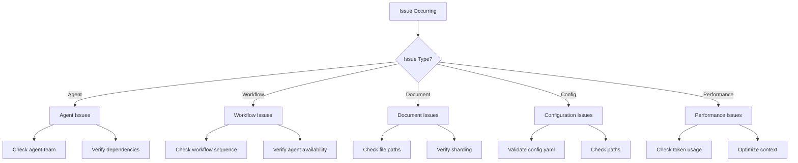

# BMad Troubleshooting Guide - Common Issues and Solutions

## Overview

This comprehensive troubleshooting guide addresses common issues encountered while using BMad, organized by component and symptom. Each issue includes diagnostic steps, root causes, and proven solutions. This guide helps users quickly resolve problems and understand the underlying system behavior.

## Quick Diagnostic Flowchart



## Agent Activation Issues

### Problem: Agent Won't Activate

**Symptoms**:
- Error: "Agent not found"
- Command not recognized
- Agent doesn't respond

**Diagnostic Steps**:
```bash
# 1. Check if agent in current team
/agent-list

# 2. Verify agent file exists
ls bmad-core/agents/

# 3. Check debug log
cat .ai/debug-log.md | grep "agent"
```

**Common Causes & Solutions**:

| Cause | Solution |
|-------|----------|
| Agent not in team bundle | Add agent to team YAML or switch teams |
| Missing agent file | Verify installation, reinstall if needed |
| Syntax error in agent file | Validate agent markdown syntax |
| Missing dependencies | Check agent's required tasks/templates |

**Example Fix**:
```yaml
# Add to agent-teams/team-fullstack.yaml
agents:
  - bmad-orchestrator
  - analyst  # Add missing agent
  - pm
```

### Problem: Agent Commands Not Working

**Symptoms**:
- Commands return errors
- "Command not found"
- Unexpected behavior

**Root Causes**:
1. **Typo in command**: Check exact command syntax
2. **Missing dependency**: Task or template not available
3. **Wrong agent active**: Different agent needed

**Solutions**:
```markdown
# 1. List available commands
> help

# 2. Check agent's command list
@agent
> help

# 3. Verify dependencies exist
ls bmad-core/tasks/
ls bmad-core/templates/
```

### Problem: Agent Persona Lost

**Symptoms**:
- Agent forgets role
- Generic responses
- No personality

**Fix**:
```markdown
# Re-activate agent
> exit
@agent-name

# Or reinforce persona
"Remember you are [agent role] with [characteristics]"
```

## Workflow Execution Problems

### Problem: Workflow Won't Start

**Symptoms**:
- "/workflow-start" fails
- Workflow not listed
- Error on selection

**Diagnostic Tree**:
```
1. Is workflow in team bundle?
   No → Add to agent-teams/*.yaml
   Yes → Continue
   
2. Do all agents exist?
   No → Add missing agents
   Yes → Continue
   
3. Are dependencies met?
   No → Install dependencies
   Yes → Check syntax
```

**Common Solutions**:

```yaml
# Fix 1: Add workflow to team
# agent-teams/team-fullstack.yaml
workflows:
  - greenfield-fullstack.yaml  # Add this
  
# Fix 2: Ensure agents available
agents:
  - analyst
  - pm
  - architect  # All workflow agents
```

### Problem: Workflow Stuck Mid-Execution

**Symptoms**:
- Progress halts
- Next agent doesn't activate
- Unclear next step

**Recovery Process**:
```markdown
# 1. Check current status
/workflow-status

# 2. Identify missing artifacts
> What documents exist in docs/?

# 3. Resume from checkpoint
/workflow-resume
> Provide completed: docs/prd.md

# 4. Force next step
/workflow-next
> Manually activate: @architect
```

### Problem: Validation Loops

**Symptoms**:
- PO validation keeps failing
- Circular correction requests
- Can't progress past validation

**Root Cause Analysis**:
```markdown
1. Conflicting requirements in PRD
2. Checklist too strict
3. Missing information
4. Misaligned expectations
```

**Solutions**:

```markdown
# Solution 1: Skip problematic checks
@po
> Run validation in YOLO mode
> Focus only on critical issues

# Solution 2: Update requirements
@pm
> Clarify requirement X
> Remove contradiction between Y and Z

# Solution 3: Override and continue
> Mark as "accepted with notes"
> Document issues for later
```

## Document Management Issues

### Problem: Documents Not Found

**Symptoms**:
- "File not found" errors
- Agents can't locate inputs
- Missing artifacts

**Diagnostic Commands**:
```bash
# Check expected locations
cat bmad-core/core-config.yaml

# Verify files exist
ls docs/
ls docs/prd/
ls docs/architecture/

# Search for documents
find . -name "*.md" -type f
```

**Common Fixes**:

| Issue | Fix |
|-------|-----|
| Wrong path in config | Update core-config.yaml paths |
| Document not created | Re-run creation task |
| Saved to wrong location | Move to correct path |
| Different naming | Rename to expected format |

### Problem: Sharding Failures

**Symptoms**:
- Sharding produces errors
- Empty shard folders
- Malformed output

**Troubleshooting Flow**:

```markdown
# 1. Check markdown exploder setting
grep "markdownExploder" core-config.yaml

# If true but failing:
# 2. Verify md-tree installed
which md-tree
npm install -g @kayvan/markdown-tree-parser

# If false:
# 3. Use manual sharding
Set markdownExploder: false
Retry sharding operation

# 4. Validate document structure
- Must have H1 title
- Must have H2 sections
- No broken markdown syntax
```

### Problem: Document Validation Errors

**Symptoms**:
- Checklist failures
- Incomplete sections
- Format issues

**Resolution Matrix**:

```markdown
| Validation Error | Check | Fix |
|-----------------|-------|-----|
| Missing section | Document structure | Add required section |
| Empty content | Section completion | Fill in content |
| Format wrong | Template compliance | Match template format |
| Dependencies missing | Related docs | Create dependencies first |
```

## Configuration Problems

### Problem: Configuration Not Loading

**Symptoms**:
- Default paths used
- Settings ignored
- Wrong file locations

**Verification Steps**:
```bash
# 1. Check config exists
ls bmad-core/core-config.yaml

# 2. Validate YAML syntax
yaml-lint core-config.yaml

# 3. Check for typos
# Common mistakes:
# - prdfile vs prdFile (case sensitive)
# - Absolute vs relative paths
# - Missing quotes around paths
```

**Example Fixes**:
```yaml
# Correct format
prd:
  prdFile: docs/prd.md  # Relative path
  prdSharded: true      # Boolean, not string
  
# Wrong format
prd:
  prdfile: /Users/me/docs/prd.md  # Absolute path wrong
  prdSharded: "true"              # String wrong
```

### Problem: Path Resolution Issues

**Symptoms**:
- Files saved to wrong location
- Can't find expected files
- Path errors

**Common Path Issues**:

```yaml
# Issue 1: Spaces in paths
devStoryLocation: docs/user stories  # Wrong
devStoryLocation: "docs/user stories"  # Correct
devStoryLocation: docs/user-stories   # Better

# Issue 2: Platform differences
Windows: docs\\stories  # Backslashes
Mac/Linux: docs/stories # Forward slashes
Solution: Always use forward slashes

# Issue 3: Relative vs absolute
/Users/name/project/docs  # Absolute - wrong
docs/                     # Relative - correct
./docs/                   # Relative - also correct
```

## Performance Issues

### Problem: Slow Response Times

**Symptoms**:
- Long delays
- Timeouts
- High token usage

**Performance Diagnostic**:
```markdown
# 1. Check document sizes
du -sh docs/*

# 2. Review sharding status
ls -la docs/prd/
ls -la docs/architecture/

# 3. Monitor token usage
Check AI interface for token counts
```

**Optimization Strategies**:

```yaml
# Strategy 1: Aggressive sharding
prd:
  prdSharded: true
  maxShardSize: 500  # Smaller shards

# Strategy 2: Selective context
devLoadAlwaysFiles:
  - docs/architecture/critical.md  # Only essential
  # Remove non-critical files

# Strategy 3: YOLO mode
Use YOLO for non-critical validations
Skip optional workflow steps
```

### Problem: Context Window Exceeded

**Symptoms**:
- "Context too long" errors
- Truncated responses
- Missing information

**Solutions by Priority**:

1. **Immediate**: Shard large documents
2. **Quick**: Clear conversation, start fresh
3. **Better**: Reduce context files
4. **Best**: Optimize workflow to minimize context

**Context Management**:
```markdown
# Calculate context usage
1. Current conversation: ~X tokens
2. Loaded documents: ~Y tokens
3. Agent definition: ~Z tokens
Total must be < model limit

# Reduce by:
- Sharding documents
- Summarizing previous work
- Starting new conversation
- Using minimal teams
```

## Task Execution Errors

### Problem: Task Not Found

**Symptoms**:
- "Task does not exist"
- Command fails
- Workflow stops

**Task Resolution**:
```bash
# 1. List available tasks
ls bmad-core/tasks/
ls common/tasks/

# 2. Check task name
# Common mistakes:
create_doc vs create-doc  # Use hyphens
Create-Doc vs create-doc  # Use lowercase

# 3. Verify task in agent dependencies
grep "task-name" agents/agent.md
```

### Problem: Template Processing Fails

**Symptoms**:
- Template errors
- Malformed output
- Section missing

**Template Debugging**:
```yaml
# 1. Validate template YAML
yaml-lint templates/template.yaml

# 2. Check required fields
template:
  id: required
  name: required
  sections: required

# 3. Verify instruction format
instruction: |
  Must be multiline string
  With proper indentation
```

## Checklist Validation Issues

### Problem: Checklist Too Strict

**Symptoms**:
- Never passes validation
- Blocks progress
- Unrealistic requirements

**Adjustment Options**:

```markdown
# Option 1: Modify checklist
Edit checklist file
Remove unrealistic items
Add "optional" markers

# Option 2: Use different checklist
Select alternate validation
Create project-specific checklist

# Option 3: Override with notes
Document why skipped
Accept with conditions
Plan future compliance
```

### Problem: Checklist Not Found

**Symptoms**:
- Validation can't run
- Missing checklist error

**Fix Checklist Issues**:
```bash
# 1. Verify checklist exists
ls bmad-core/checklists/

# 2. Check naming
architect-checklist.md  # Correct
Architect Checklist.md  # Wrong (spaces, caps)

# 3. Use fuzzy matching
"architecture checklist" → finds architect-checklist.md
```

## Integration Issues

### Problem: IDE Integration Not Working

**Symptoms**:
- Can't connect to IDE
- File changes not detected
- Context not loading

**IDE Setup Verification**:
```bash
# 1. Check working directory
pwd  # Must be in project root

# 2. Verify file structure
ls docs/
ls src/

# 3. Test file access
cat docs/prd.md  # Should work

# 4. Check permissions
ls -la docs/  # Should be readable/writable
```

### Problem: Git Integration Issues

**Symptoms**:
- Can't commit
- Changes not tracked
- Branch problems

**Git Troubleshooting**:
```bash
# 1. Check git status
git status

# 2. Verify branch
git branch

# 3. Check remote
git remote -v

# 4. Fix common issues
git add .  # Stage changes
git config user.email "you@example.com"
git config user.name "Your Name"
```

## Recovery Procedures

### Full System Reset

When nothing else works:
```bash
# 1. Backup current work
cp -r docs/ docs-backup/

# 2. Clear cache and logs
rm -rf .ai/
rm -rf .cache/

# 3. Reset configuration
cp core-config.yaml core-config.backup
# Edit core-config.yaml to defaults

# 4. Restart BMad
exit
bmad init --team team-all

# 5. Restore documents
cp -r docs-backup/* docs/
```

### Partial Recovery

For specific component issues:
```markdown
# Agent recovery
1. Exit current agent
2. Clear context
3. Re-activate agent
4. Load minimal context

# Workflow recovery  
1. Document current progress
2. Exit workflow
3. Manually complete missing steps
4. Resume from checkpoint

# Document recovery
1. Check all locations
2. Restore from backup
3. Rebuild if needed
4. Update references
```

## Prevention Strategies

### Best Practices to Avoid Issues

1. **Regular Saves**:
   - Save documents after each section
   - Commit to git frequently
   - Backup important work

2. **Validation Checks**:
   - Validate YAML files
   - Check markdown syntax
   - Test workflows incrementally

3. **Context Management**:
   - Shard large documents early
   - Use minimal teams
   - Clear context regularly

4. **Version Control**:
   - Track all changes
   - Tag stable versions
   - Document modifications

### Monitoring and Logging

```bash
# Enable debug logging
export BMAD_DEBUG=true

# Monitor in real-time
tail -f .ai/debug-log.md

# Check system resources
# Memory usage
free -h
# Disk space
df -h
# Process status
ps aux | grep bmad
```

## Common Error Messages

### Error Reference Table

| Error Message | Likely Cause | Quick Fix |
|--------------|-------------|-----------|
| "Agent not found" | Not in team | Add to team or switch teams |
| "File not found" | Wrong path | Check core-config paths |
| "Context too long" | Too much loaded | Shard documents |
| "Invalid YAML" | Syntax error | Validate with yaml-lint |
| "Task not available" | Missing dependency | Check agent dependencies |
| "Workflow stuck" | Missing artifact | Create manually or skip |
| "Validation failed" | Requirement not met | Fix or override |
| "Permission denied" | File permissions | Check file ownership |
| "Connection refused" | Service down | Restart service |
| "Timeout exceeded" | Slow processing | Reduce context or wait |

## Getting Help

### When to Seek Additional Help

After trying troubleshooting steps, seek help if:
- Error persists after multiple attempts
- Unclear error messages
- Data loss risk
- System corruption suspected
- Unusual behavior

### How to Report Issues

Include when reporting:
```markdown
1. BMad version
2. Error message (exact)
3. Steps to reproduce
4. What you expected
5. What actually happened
6. Debug log excerpt
7. Configuration (sanitized)
8. System info (OS, Node version)
```

### Support Resources

- GitHub Issues: Report bugs
- Documentation: Check guides
- Community: Ask questions
- Debug Log: Share relevant portions

## Summary

This troubleshooting guide covers:

- **Common issues** across all BMad components
- **Diagnostic procedures** for identifying problems
- **Proven solutions** for each issue type
- **Prevention strategies** to avoid problems
- **Recovery procedures** when things go wrong

Key troubleshooting principles:
1. **Diagnose first** - Understand the problem
2. **Check basics** - Files, paths, syntax
3. **Isolate issue** - One component at a time
4. **Document steps** - Track what you try
5. **Incremental fixes** - Small changes
6. **Verify resolution** - Test thoroughly

Remember: Most issues have simple solutions. Check paths, validate syntax, verify dependencies, and ensure components are properly connected.