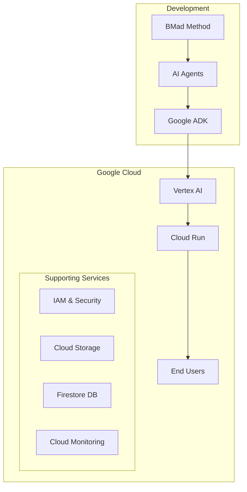

# BMad Cloud Deployment Guide - Production AI Systems

## Overview

This guide covers deploying BMad-powered AI agent systems to cloud platforms, with a focus on Google Cloud Platform (GCP) and the Vertex AI ecosystem. BMad v5.0 includes a complete expansion pack for building and deploying production-ready AI agent systems.

## Google Cloud Platform Deployment

### Architecture Overview



### Prerequisites

#### Required Accounts and Tools
1. **Google Cloud Platform Account** with billing enabled
2. **Google Cloud SDK** (`gcloud` CLI) installed
3. **Docker** for containerization
4. **Python 3.11+** for agent development
5. **Node.js 20+** for BMad tooling

#### GCP APIs to Enable
```bash
gcloud services enable \
    vertexai.googleapis.com \
    cloudbuild.googleapis.com \
    run.googleapis.com \
    artifactregistry.googleapis.com \
    secretmanager.googleapis.com \
    firestore.googleapis.com
```

### Google Agent Development Kit (ADK)

The Google ADK is the foundation for building AI agents on GCP:

#### Key Components

1. **Agent Framework**
   - Structured agent definitions
   - Tool integration capabilities
   - Memory and state management
   - Multi-turn conversation support

2. **Vertex AI Integration**
   - Native model access (Gemini, Palm)
   - Embeddings and vector search
   - Fine-tuning capabilities
   - Model versioning

3. **Deployment Infrastructure**
   - Cloud Run for serverless hosting
   - Automatic scaling
   - Regional distribution
   - Load balancing

### Setting Up Your GCP Project

#### Step 1: Initialize Project

```bash
# Set project variables
export PROJECT_ID="your-project-id"
export REGION="us-central1"
export SERVICE_NAME="bmad-agents"

# Create and configure project
gcloud projects create $PROJECT_ID
gcloud config set project $PROJECT_ID
gcloud billing projects link $PROJECT_ID --billing-account=YOUR_BILLING_ID
```

#### Step 2: Create Service Account

```bash
# Create service account for agents
gcloud iam service-accounts create bmad-agent-sa \
    --display-name="BMad Agent Service Account"

# Grant necessary permissions
gcloud projects add-iam-policy-binding $PROJECT_ID \
    --member="serviceAccount:bmad-agent-sa@$PROJECT_ID.iam.gserviceaccount.com" \
    --role="roles/vertexai.user"

gcloud projects add-iam-policy-binding $PROJECT_ID \
    --member="serviceAccount:bmad-agent-sa@$PROJECT_ID.iam.gserviceaccount.com" \
    --role="roles/datastore.user"
```

#### Step 3: Set Up Artifact Registry

```bash
# Create Docker repository
gcloud artifacts repositories create bmad-agents \
    --repository-format=docker \
    --location=$REGION \
    --description="BMad Agent Images"

# Configure Docker authentication
gcloud auth configure-docker $REGION-docker.pkg.dev
```

### BMad Agent Containerization

#### Dockerfile Template

```dockerfile
# Use official Python runtime
FROM python:3.11-slim

# Set working directory
WORKDIR /app

# Install dependencies
COPY requirements.txt .
RUN pip install --no-cache-dir -r requirements.txt

# Copy BMad agents and configurations
COPY bmad-core/ ./bmad-core/
COPY agents/ ./agents/
COPY config/ ./config/

# Copy application code
COPY main.py .
COPY settings.py .

# Set environment variables
ENV PORT=8080
ENV BMAD_ENV=production
ENV GOOGLE_APPLICATION_CREDENTIALS=/app/credentials.json

# Run the application
CMD exec gunicorn --bind :$PORT --workers 1 --threads 8 main:app
```

#### Requirements File

```txt
# requirements.txt
google-cloud-aiplatform>=1.38.0
google-cloud-firestore>=2.13.0
google-cloud-secret-manager>=2.16.0
google-generativeai>=0.3.0
flask>=3.0.0
gunicorn>=21.2.0
pyyaml>=6.0
markdown>=3.5
```

### Application Structure

#### Main Application (main.py)

```python
from flask import Flask, request, jsonify
from google.cloud import aiplatform
from bmad_agent_loader import load_agent
import settings

app = Flask(__name__)

# Initialize Vertex AI
aiplatform.init(
    project=settings.PROJECT_ID,
    location=settings.LOCATION
)

@app.route('/agent/<agent_id>', methods=['POST'])
def handle_agent_request(agent_id):
    """Handle requests to specific BMad agents"""
    try:
        # Load BMad agent configuration
        agent = load_agent(agent_id)
        
        # Get user input
        user_input = request.json.get('input')
        
        # Process through agent
        response = agent.process(user_input)
        
        return jsonify({
            'agent': agent_id,
            'response': response,
            'status': 'success'
        })
    except Exception as e:
        return jsonify({
            'error': str(e),
            'status': 'error'
        }), 500

@app.route('/health', methods=['GET'])
def health_check():
    """Health check endpoint for Cloud Run"""
    return jsonify({'status': 'healthy'})

if __name__ == '__main__':
    app.run(host='0.0.0.0', port=8080)
```

#### Settings Configuration (settings.py)

```python
import os
from pathlib import Path

# GCP Configuration
PROJECT_ID = os.environ.get('GCP_PROJECT_ID', 'your-project-id')
LOCATION = os.environ.get('GCP_LOCATION', 'us-central1')
SERVICE_ACCOUNT = os.environ.get('SERVICE_ACCOUNT', 'bmad-agent-sa')

# Vertex AI Model Configuration
MODEL_NAME = os.environ.get('MODEL_NAME', 'gemini-pro')
MODEL_VERSION = os.environ.get('MODEL_VERSION', 'latest')
TEMPERATURE = float(os.environ.get('TEMPERATURE', '0.7'))
MAX_TOKENS = int(os.environ.get('MAX_TOKENS', '8192'))

# BMad Configuration
BMAD_CORE_PATH = Path('/app/bmad-core')
AGENTS_PATH = Path('/app/agents')
TEMPLATES_PATH = Path('/app/templates')
TASKS_PATH = Path('/app/tasks')

# Security
API_KEY_SECRET = os.environ.get('API_KEY_SECRET', 'bmad-api-key')
ALLOWED_ORIGINS = os.environ.get('ALLOWED_ORIGINS', '*').split(',')

# Database
FIRESTORE_COLLECTION = os.environ.get('FIRESTORE_COLLECTION', 'bmad-sessions')
SESSION_TTL = int(os.environ.get('SESSION_TTL', '3600'))  # seconds
```

### Cloud Build Configuration

#### cloudbuild.yaml

```yaml
steps:
  # Build the container image
  - name: 'gcr.io/cloud-builders/docker'
    args:
      - 'build'
      - '-t'
      - '${_REGION}-docker.pkg.dev/${PROJECT_ID}/bmad-agents/${_SERVICE_NAME}:${SHORT_SHA}'
      - '-t'
      - '${_REGION}-docker.pkg.dev/${PROJECT_ID}/bmad-agents/${_SERVICE_NAME}:latest'
      - '.'

  # Push the container image to Artifact Registry
  - name: 'gcr.io/cloud-builders/docker'
    args:
      - 'push'
      - '--all-tags'
      - '${_REGION}-docker.pkg.dev/${PROJECT_ID}/bmad-agents/${_SERVICE_NAME}'

  # Deploy to Cloud Run
  - name: 'gcr.io/google.com/cloudsdktool/cloud-sdk'
    entrypoint: gcloud
    args:
      - 'run'
      - 'deploy'
      - '${_SERVICE_NAME}'
      - '--image'
      - '${_REGION}-docker.pkg.dev/${PROJECT_ID}/bmad-agents/${_SERVICE_NAME}:${SHORT_SHA}'
      - '--region'
      - '${_REGION}'
      - '--service-account'
      - 'bmad-agent-sa@${PROJECT_ID}.iam.gserviceaccount.com'
      - '--allow-unauthenticated'
      - '--memory'
      - '2Gi'
      - '--cpu'
      - '2'
      - '--timeout'
      - '300'
      - '--concurrency'
      - '100'

substitutions:
  _REGION: us-central1
  _SERVICE_NAME: bmad-agents

options:
  logging: CLOUD_LOGGING_ONLY
```

### Deployment Process

#### Step 1: Build and Push Image

```bash
# Build Docker image
docker build -t $REGION-docker.pkg.dev/$PROJECT_ID/bmad-agents/bmad-agents:latest .

# Push to Artifact Registry
docker push $REGION-docker.pkg.dev/$PROJECT_ID/bmad-agents/bmad-agents:latest
```

#### Step 2: Deploy to Cloud Run

```bash
# Deploy service
gcloud run deploy bmad-agents \
    --image $REGION-docker.pkg.dev/$PROJECT_ID/bmad-agents/bmad-agents:latest \
    --region $REGION \
    --platform managed \
    --allow-unauthenticated \
    --service-account bmad-agent-sa@$PROJECT_ID.iam.gserviceaccount.com \
    --memory 2Gi \
    --cpu 2 \
    --timeout 300 \
    --concurrency 100
```

#### Step 3: Configure Domain (Optional)

```bash
# Map custom domain
gcloud run domain-mappings create \
    --service bmad-agents \
    --domain agents.yourdomain.com \
    --region $REGION
```

### Security Best Practices

#### 1. API Authentication

```python
from google.cloud import secretmanager
from functools import wraps

def require_api_key(f):
    @wraps(f)
    def decorated_function(*args, **kwargs):
        api_key = request.headers.get('X-API-Key')
        
        # Retrieve secret from Secret Manager
        client = secretmanager.SecretManagerServiceClient()
        name = f"projects/{PROJECT_ID}/secrets/{API_KEY_SECRET}/versions/latest"
        response = client.access_secret_version(request={"name": name})
        valid_key = response.payload.data.decode("UTF-8")
        
        if api_key != valid_key:
            return jsonify({'error': 'Invalid API key'}), 401
            
        return f(*args, **kwargs)
    return decorated_function
```

#### 2. IAM Configuration

```yaml
# iam-policy.yaml
bindings:
  - role: roles/run.invoker
    members:
      - serviceAccount:bmad-agent-sa@PROJECT_ID.iam.gserviceaccount.com
  - role: roles/vertexai.user
    members:
      - serviceAccount:bmad-agent-sa@PROJECT_ID.iam.gserviceaccount.com
  - role: roles/secretmanager.secretAccessor
    members:
      - serviceAccount:bmad-agent-sa@PROJECT_ID.iam.gserviceaccount.com
```

#### 3. Network Security

```bash
# Configure Cloud Armor for DDoS protection
gcloud compute security-policies create bmad-security-policy \
    --description "Security policy for BMad agents"

# Add rate limiting rule
gcloud compute security-policies rules create 1000 \
    --security-policy bmad-security-policy \
    --expression "origin.region_code == 'US'" \
    --action "rate-based-ban" \
    --rate-limit-threshold-count 100 \
    --rate-limit-threshold-interval-sec 60
```

### Monitoring and Observability

#### Cloud Monitoring Setup

```python
from google.cloud import monitoring_v3
import time

def track_agent_metrics(agent_id, response_time, success):
    """Track custom metrics for agent performance"""
    client = monitoring_v3.MetricServiceClient()
    project_name = f"projects/{PROJECT_ID}"
    
    series = monitoring_v3.TimeSeries()
    series.metric.type = "custom.googleapis.com/bmad/agent_response_time"
    series.metric.labels["agent_id"] = agent_id
    series.metric.labels["success"] = str(success)
    
    point = monitoring_v3.Point()
    point.value.double_value = response_time
    point.interval.end_time.seconds = int(time.time())
    
    series.points = [point]
    client.create_time_series(name=project_name, time_series=[series])
```

#### Logging Configuration

```python
import google.cloud.logging
import logging

# Setup cloud logging
client = google.cloud.logging.Client()
client.setup_logging()

# Use structured logging
logging.info({
    "message": "Agent request processed",
    "agent_id": agent_id,
    "user_id": user_id,
    "response_time": response_time,
    "token_count": token_count
})
```

### Scaling Configuration

#### Automatic Scaling

```yaml
# service.yaml for Cloud Run
apiVersion: serving.knative.dev/v1
kind: Service
metadata:
  name: bmad-agents
  annotations:
    run.googleapis.com/execution-environment: gen2
spec:
  template:
    metadata:
      annotations:
        autoscaling.knative.dev/minScale: "1"
        autoscaling.knative.dev/maxScale: "100"
        autoscaling.knative.dev/target: "80"
    spec:
      containers:
        - image: IMAGE_URL
          resources:
            limits:
              cpu: "2"
              memory: "2Gi"
          env:
            - name: BMAD_ENV
              value: "production"
```

#### Load Testing

```bash
# Use Google Cloud Load Testing
gcloud alpha testing load create \
    --url https://bmad-agents-PROJECT_ID.REGION.run.app \
    --requests-per-second 100 \
    --duration 300s \
    --concurrent-users 50
```

### Cost Optimization

#### Resource Optimization

1. **Use Spot/Preemptible Instances**: For batch processing
2. **Implement Caching**: Cache agent responses when appropriate
3. **Optimize Model Calls**: Batch requests to Vertex AI
4. **Use Cloud CDN**: For static assets
5. **Set Budget Alerts**: Monitor spending

#### Cost Monitoring

```bash
# Set up budget alert
gcloud billing budgets create \
    --billing-account=BILLING_ACCOUNT_ID \
    --display-name="BMad Agents Budget" \
    --budget-amount=1000 \
    --threshold-rule=percent=50 \
    --threshold-rule=percent=90 \
    --threshold-rule=percent=100
```

### Disaster Recovery

#### Backup Strategy

```bash
# Backup Firestore data
gcloud firestore export gs://bmad-backups/$(date +%Y%m%d)

# Backup secrets
gcloud secrets versions list API_KEY_SECRET \
    --format="value(name)" | while read version; do
    gcloud secrets versions access $version \
        --secret=API_KEY_SECRET > backup_$version.txt
done
```

#### Multi-Region Deployment

```yaml
# Deploy to multiple regions for high availability
regions:
  - us-central1
  - us-east1
  - europe-west1
  - asia-northeast1

for region in regions:
  gcloud run deploy bmad-agents \
    --region $region \
    --image IMAGE_URL
```

### Production Checklist

- [ ] **Security**
  - [ ] API keys configured in Secret Manager
  - [ ] IAM roles properly assigned
  - [ ] Network policies configured
  - [ ] SSL/TLS enabled
  
- [ ] **Monitoring**
  - [ ] Cloud Monitoring dashboards created
  - [ ] Alert policies configured
  - [ ] Log aggregation enabled
  - [ ] Error tracking set up
  
- [ ] **Performance**
  - [ ] Caching implemented
  - [ ] Database indexes created
  - [ ] CDN configured for static assets
  - [ ] Load testing completed
  
- [ ] **Reliability**
  - [ ] Health checks configured
  - [ ] Automatic retries implemented
  - [ ] Circuit breakers in place
  - [ ] Backup strategy defined
  
- [ ] **Compliance**
  - [ ] Data retention policies configured
  - [ ] GDPR compliance if applicable
  - [ ] Audit logging enabled
  - [ ] Security scanning enabled

## Alternative Cloud Platforms

### AWS Deployment

For AWS deployment, use:
- **Amazon Bedrock**: For AI model access
- **Lambda**: For serverless compute
- **API Gateway**: For API management
- **DynamoDB**: For session storage

### Azure Deployment

For Azure deployment, use:
- **Azure OpenAI Service**: For AI models
- **Azure Functions**: For serverless compute
- **API Management**: For API gateway
- **Cosmos DB**: For data storage

## Summary

Deploying BMad agents to Google Cloud Platform provides a robust, scalable foundation for production AI systems. The combination of BMad's structured agent approach with GCP's Vertex AI and serverless infrastructure enables rapid development and deployment of sophisticated AI applications.

Key benefits:
- **Scalability**: Automatic scaling from 0 to thousands of requests
- **Reliability**: Google's infrastructure and managed services
- **Security**: Enterprise-grade security and compliance
- **Cost-Effective**: Pay-per-use pricing model
- **Integration**: Native integration with Google's AI services

This deployment guide provides the foundation for taking BMad from development to production, ensuring your AI agents are ready for real-world usage at scale.