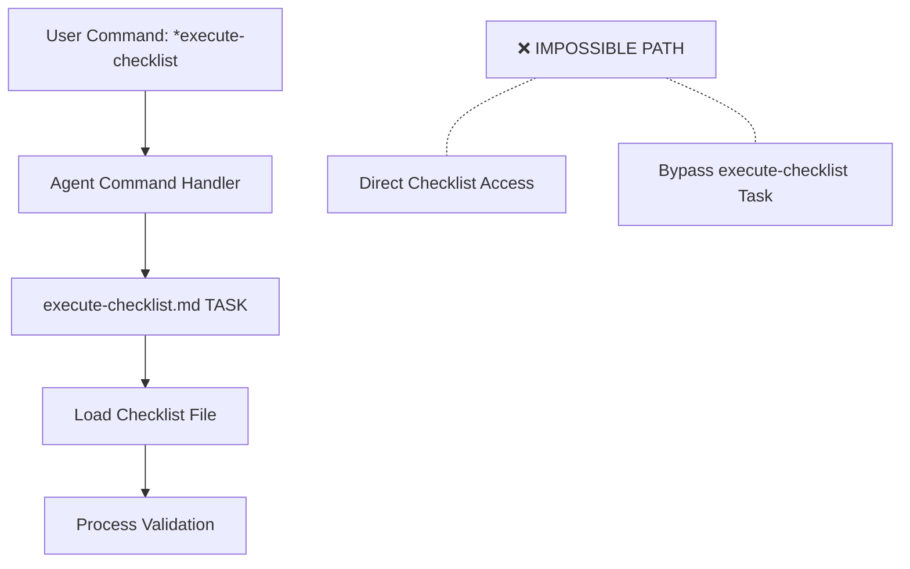

# How BMad Ensures Checklists Always Execute via execute-checklist Task

Great question! BMad uses several architectural patterns to ensure checklists are always executed through the `execute-checklist` task and cannot be bypassed.

## 1. **Dependency Architecture Pattern**

### File Resolution System
Every agent uses the IDE-FILE-RESOLUTION pattern:

```yaml
IDE-FILE-RESOLUTION:
  - Dependencies map to {root}/{type}/{name}
  - type=folder (tasks|templates|checklists|data|utils|etc...)
  - Example: create-doc.md → {root}/tasks/create-doc.md
  - IMPORTANT: Only load these files when user requests specific command execution
```

### Key Enforcement Rules:
- **No Direct File Access**: Agents cannot directly load checklist files
- **Dependency Declaration**: Checklists are declared as dependencies, not executables
- **Task-Mediated Access**: All checklist access must go through tasks

## 2. **Command Architecture Enforcement**

### All Checklist Commands Reference execute-checklist Task

**Agent Commands Always Specify Task:**
```yaml
# Dev Agent
completion: "run the task execute-checklist for the checklist story-dod-checklist"

# SM Agent  
story-checklist: Execute task execute-checklist.md with checklist story-draft-checklist.md

# Architect Agent
execute-checklist {checklist}: Run task execute-checklist (default->architect-checklist)

# PO Agent
execute-checklist-po: Run task execute-checklist (checklist po-master-checklist)
```

**Notice the pattern**: Every command specifies "Execute task execute-checklist" - never direct checklist access.

## 3. **Dependency vs Execution Separation**

### Checklists are Dependencies, NOT Executables

```yaml
# In agent dependencies
dependencies:
  tasks:                    # ← These can be executed
    - execute-checklist.md  # ← The processor
    - create-doc.md
  checklists:              # ← These are DATA, not executables
    - story-dod-checklist.md  # ← Just a dependency reference
    - architect-checklist.md
```

### The Rule:
- **Tasks** are in the `tasks:` section and can be executed
- **Checklists** are in the `checklists:` section and are data dependencies only
- Only the `execute-checklist.md` **task** can process checklist **data**

## 4. **Task Integration Pattern**

### Tasks Reference execute-checklist, Never Direct Files

```markdown
# In create-next-story.md task
- Execute `{root}/tasks/execute-checklist` `{root}/checklists/story-draft-checklist`
```

**NOT:**
```markdown
# This pattern NEVER appears in BMad
- Load story-draft-checklist.md and validate
```

## 5. **No Direct File Loading Architecture**

### Critical Enforcement Rules in Agent Instructions:

```yaml
activation-instructions:
  - DO NOT: Load any other agent files during activation
  - ONLY load dependency files when user selects them for execution via command
  - When executing tasks from dependencies, follow task instructions exactly
```

### The Key Rule:
- Agents can only load files "when user selects them for execution via command"
- Commands always reference **tasks**, never direct checklist files
- Tasks handle all file loading and processing

## 6. **Universal Task Dependency Pattern**

### Every Agent with Checklists Has execute-checklist Task

```yaml
# ALL agents with checklist dependencies ALSO have:
tasks:
  - execute-checklist.md    # ← The universal processor
checklists:
  - [specific-checklist.md] # ← The data they can process
```

This creates a **mandatory coupling**: You cannot have checklist dependencies without the execute-checklist task dependency.

## 7. **Command-to-Task Mapping Enforcement**

### Commands Never Bypass the Task Layer



**The architecture makes bypassing impossible because:**
1. Commands are defined to call tasks, not files
2. File resolution requires task-mediated access
3. No agent has commands that directly reference checklist files

## 8. **Workflow Integration Enforcement**

### Workflows Also Enforce Task-Mediated Access

```yaml
# In workflow files
- agent: po
  validates: all_artifacts
  uses: po-master-checklist    # ← References checklist name
```

**The workflow engine:**
1. Sees `uses: po-master-checklist`
2. Tells PO agent to validate
3. PO agent uses its `execute-checklist-po` command
4. Command calls `execute-checklist.md` task
5. Task loads the specified checklist

## 9. **The Enforcement Mechanisms**

### 1. **Architectural Constraint**
- File resolution system prevents direct access
- All access must be command-mediated
- Commands are pre-defined to use tasks

### 2. **Dependency Separation**
- Checklists are declared as data dependencies
- Only tasks can be executed
- execute-checklist is the only task that processes checklists

### 3. **Command Design**
- Every checklist-related command explicitly calls execute-checklist task
- No commands provide direct checklist access
- Agent instructions enforce this pattern

### 4. **Task Authority**
- Task instructions override agent behavior
- Tasks control file loading and processing
- Agents must follow task workflows exactly

## 10. **What Happens If Someone Tries to Bypass?**

### Scenario: Agent tries to directly load checklist file

```
Agent: "Let me load story-dod-checklist.md directly"
↓
IDE-FILE-RESOLUTION: "ONLY load files when user requests command execution"
↓
No command exists for direct checklist loading
↓
Agent cannot access file - must use execute-checklist task
```

### Scenario: Create command that bypasses task

```yaml
# Hypothetical bad command
bad-command: Load checklist directly
```

This would require:
1. Adding the command to agent definition ❌ (against architecture)
2. Creating direct file access logic ❌ (violates file resolution rules)
3. Bypassing task-mediated processing ❌ (violates dependency pattern)

## 11. **The Genius of This Design**

### Benefits of Task-Mediated Checklist Access:

1. **Consistency**: All checklists processed the same way
2. **Extensibility**: Easy to enhance execute-checklist task
3. **Quality Control**: Single point for validation logic
4. **Reporting**: Standardized output format
5. **Maintenance**: One task to update, not N checklist processors
6. **Security**: Controlled access to validation logic
7. **User Experience**: Consistent interface across all agents

## 12. **Summary**

BMad ensures checklists always execute via execute-checklist through:

1. **Architectural Constraints**: File resolution system prevents direct access
2. **Dependency Separation**: Checklists are data, tasks are executables
3. **Command Design**: All commands reference the execute-checklist task
4. **Universal Pattern**: Every agent with checklists has execute-checklist dependency
5. **Task Authority**: Tasks control all file processing
6. **Enforcement Rules**: Agent instructions prevent bypassing

**The system makes bypassing architecturally impossible, not just discouraged.**

This creates a robust, consistent, and maintainable checklist execution system where quality validation always follows the same patterns and can be enhanced centrally.