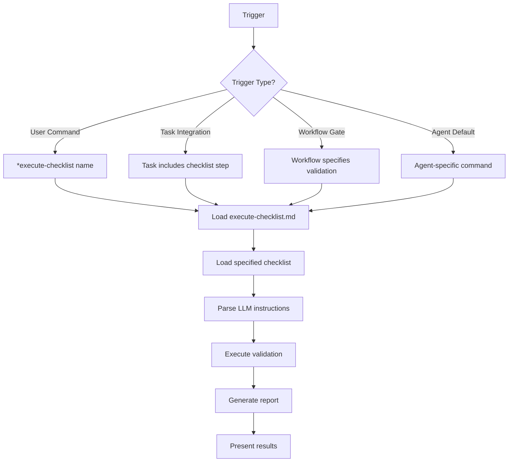

# How Checklists Are Executed: Trigger Patterns

The `execute-checklist` task can be triggered in several different ways, both explicit and automatic. Here are the patterns:

## 1. **Explicit User Commands**

Users can directly invoke checklist execution through agent commands:

### Direct Command Pattern
```yaml
Agent Command: *execute-checklist {checklist-name}
```

**Examples:**
- `*execute-checklist architect-checklist` (architect agent)
- `*execute-checklist story-dod-checklist` (dev agent)
- `*execute-checklist po-master-checklist` (PO agent)

### Shorthand Command Pattern
```yaml
Agent Command: *story-checklist  # SM agent shorthand
Agent Command: *execute-checklist-po  # PO agent shorthand
```

**Agent-specific commands:**
- **Scrum Master**: `*story-checklist` → executes `story-draft-checklist.md`
- **Product Owner**: `*execute-checklist-po` → executes `po-master-checklist.md`
- **Architect**: `*execute-checklist` → defaults to `architect-checklist.md`

## 2. **Automatic Task Integration**

Checklists are automatically executed as part of other task workflows:

### Task-Embedded Execution
Tasks include checklist execution as a mandatory step:

**In `create-next-story.md` task:**
```markdown
### 6. Story Draft Completion and Review
- Update status to "Draft" and save the story file
- Execute `{root}/tasks/execute-checklist` `{root}/checklists/story-draft-checklist`
- Provide summary including Checklist Results
```

**In `develop-story` command (dev agent):**
```yaml
completion: "All Tasks marked [x]→run the task execute-checklist for the checklist story-dod-checklist→set story status: 'Ready for Review'→HALT"
```

## 3. **Workflow-Integrated Quality Gates**

Workflows specify checklist execution at critical junctures:

**In workflow YAML files:**
```yaml
- agent: po
  validates: all_artifacts
  uses: po-master-checklist
  condition: po_checklist_issues
  notes: "If PO finds issues, return to relevant agent to fix"
```

## 4. **Agent-Specific Integration Patterns**

### Developer Agent Pattern
```
Story Implementation Complete
↓ (automatic)
Execute story-dod-checklist 
↓ (validation)
Pass: Mark as "Ready for Review"
Fail: Fix issues and re-validate
```

### Scrum Master Pattern
```
Create Story Complete
↓ (automatic)
Execute story-draft-checklist
↓ (validation)
Story quality validated before handoff
```

### Product Owner Pattern
```
User Command: *execute-checklist-po
↓ (explicit)
Execute po-master-checklist
↓ (comprehensive validation)
Full project quality assessment
```

### Architect Pattern
```
Architecture Document Complete
↓ (optional explicit command)
User: *execute-checklist
↓ (defaults to architect-checklist)
Architecture validation and sign-off
```

## 5. **Command Resolution Logic**

### With Checklist Parameter
```
*execute-checklist architect-checklist
→ Load execute-checklist.md task
→ Load architect-checklist.md
→ Execute validation
```

### Without Checklist Parameter
```
*execute-checklist
→ Show available checklists from agent dependencies
→ User selects number
→ Load selected checklist
→ Execute validation
```

### Agent-Specific Defaults
```yaml
# Architect agent
execute-checklist {checklist}: Run task execute-checklist (default->architect-checklist)

# PO agent  
execute-checklist-po: Run task execute-checklist (checklist po-master-checklist)
```

## 6. **Execution Flow Summary**



## 7. **Key Insights**

### **Never Pre-Executed**
- Checklists are NEVER automatically run during agent activation
- They are ONLY executed when explicitly triggered
- This maintains the lazy-loading principle

### **Multiple Trigger Points**
- **Explicit**: User commands for on-demand validation
- **Embedded**: Built into task workflows as quality gates
- **Workflow**: Specified in workflow orchestration
- **Default**: Agent-specific default behaviors

### **Flexible Parameters**
- Can specify exact checklist name
- Can use agent defaults
- Can show available options for selection

### **Integration Points**
- **Agent Commands**: Direct user control
- **Task Steps**: Automatic quality gates
- **Workflows**: Orchestrated validation
- **Agent Defaults**: Streamlined UX

## 8. **When Checklists Are Executed**

| **Trigger** | **When** | **Who** | **Example** |
|-------------|----------|---------|-------------|
| **Explicit Command** | User decides validation needed | Any agent with checklist dependencies | `*execute-checklist architect-checklist` |
| **Task Integration** | Task reaches validation step | Task execution | `create-next-story` → `story-draft-checklist` |
| **Workflow Gate** | Workflow reaches quality checkpoint | Workflow orchestration | PO validation step in workflows |
| **Agent Default** | User uses shorthand command | Specific agents | SM: `*story-checklist` |
| **Completion Gate** | Work phase complete | Agent finishing work | Dev: story complete → DoD checklist |

## 9. **The Design Logic**

This multi-trigger approach provides:

1. **Flexibility**: Multiple ways to access validation
2. **Automation**: Built-in quality gates where needed  
3. **User Control**: Explicit commands when desired
4. **Workflow Integration**: Seamless quality checkpoints
5. **Agent Specialization**: Tailored to agent responsibilities
6. **Lazy Loading**: Only executed when actually needed

The system ensures quality validation happens at the right times through the right mechanisms, whether user-initiated or process-integrated.