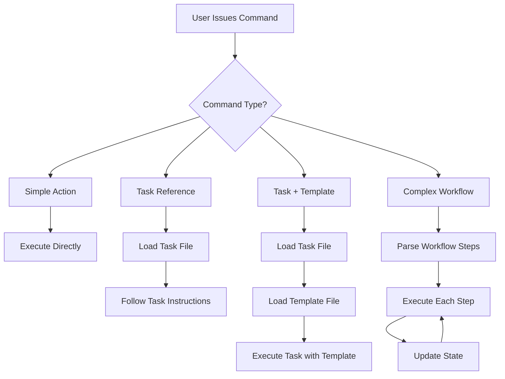

# Deep Dive: How Agent Commands and Tasks Work Together

## Command Definition Patterns

Commands in BMad agents are not just simple function calls - they represent different types of actions with varying levels of complexity. Here's a comprehensive breakdown:

### 1. Command Structure Types

#### **Simple Action Commands**
These execute immediate actions without external dependencies:
```yaml
- help: Show numbered list of commands
- exit: Exit agent persona
- yolo: Toggle Yolo Mode
- doc-out: Output full document to current destination
```

#### **Task Reference Commands**
These explicitly call a task file:
```yaml
- document-project: execute the task document-project.md
- brainstorm {topic}: run task facilitate-brainstorming-session.md
- elicit: run the task advanced-elicitation
- shard-doc: run the task shard-doc.md
```

#### **Task + Template Combination Commands**
These combine a task with a specific template:
```yaml
- create-prd: run task create-doc.md with template prd-tmpl.yaml
- create-architecture: use create-doc with architecture-tmpl.yaml
- create-project-brief: use task create-doc with project-brief-tmpl.yaml
```

#### **Conditional/Contextual Commands**
These have conditional behavior or defaults:
```yaml
- task {task}: Execute task, if not found show available tasks
- create-doc {template}: execute task (no template = show available)
- execute-checklist {checklist}: Run task (no checklist = show available)
```

#### **Complex Workflow Commands**
These define multi-step processes inline:
```yaml
- develop-story:
    order-of-execution: "Read task→Implement→Test→Validate→Update→Repeat"
    story-file-updates-ONLY: [specific sections]
    blocking: [halt conditions]
    ready-for-review: [completion criteria]
```

#### **Mode Toggle Commands**
These change agent behavior state:
```yaml
- kb-mode: Toggle knowledge base mode on/off
- chat-mode: Start conversational mode
- party-mode: Group chat with all agents
```

#### **Transformation Commands**
These change the agent persona entirely:
```yaml
- agent {name}: Transform into specialized agent
- workflow {name}: Start specific workflow
```

### 2. Command-to-Task Mapping Patterns

#### **Direct Mapping**
Command directly executes a task with the same or similar name:
```
Command: document-project
Action: execute task document-project.md
```

#### **Parameterized Mapping**
Command passes parameters to a generic task:
```
Command: create-prd
Action: run task create-doc.md WITH template prd-tmpl.yaml
```

#### **Conditional Mapping**
Command behavior changes based on parameters:
```
Command: execute-checklist {checklist}
If checklist provided: Run execute-checklist.md with that checklist
If no checklist: Show available checklists from dependencies
```

#### **Fuzzy Matching**
Commands use fuzzy matching for user convenience:
```
User types: "draft story"
Maps to: create-next-story task
Via: REQUEST-RESOLUTION fuzzy matching
```

### 3. Command Execution Flow



### 4. Task Loading and Resolution

#### **File Resolution Pattern**
All tasks are resolved using the IDE-FILE-RESOLUTION pattern:
```yaml
IDE-FILE-RESOLUTION:
  - Dependencies map to {root}/{type}/{name}
  - type=folder (tasks|templates|checklists|data)
  - Example: create-doc.md → {root}/tasks/create-doc.md
```

#### **Lazy Loading Principle**
- Tasks are NEVER pre-loaded during agent activation
- Only loaded when command is executed
- Reduces memory footprint and startup time

### 5. Special Command Behaviors

#### **Commands with State Management**
Some commands maintain state across execution:
```yaml
develop-story:
  - Tracks task completion with checkboxes
  - Updates specific file sections
  - Maintains debug log
  - Has blocking conditions
```

#### **Commands with User Interaction**
Commands that require user input:
```yaml
create-doc:
  - Uses elicitation when elicit: true
  - Presents numbered options (1-9)
  - Waits for user response
  - Cannot skip interaction
```

#### **Commands with Validation**
Commands that include quality checks:
```yaml
execute-checklist:
  - Validates against criteria
  - Marks items as PASS/FAIL/PARTIAL/N/A
  - Generates reports
  - Can run interactive or YOLO mode
```

### 6. Task Execution Principles

#### **Task Override Authority**
When a task is executed:
1. Task instructions OVERRIDE agent's default behavior
2. Interactive requirements (elicit: true) CANNOT be bypassed
3. Task workflow steps must be followed exactly

#### **Task-Template Integration**
Tasks can reference templates via:
1. **Frontmatter**: `template: "{root}/templates/xxx.yaml"`
2. **Command parameter**: Passed when command is invoked
3. **Dynamic selection**: User chooses from available templates

#### **Task Output Management**
Tasks specify output locations:
```yaml
docOutputLocation: docs/brainstorming-session-results.md
```

### 7. Command Dependencies

Commands declare their dependencies explicitly:
```yaml
dependencies:
  tasks:
    - create-doc.md
    - execute-checklist.md
  templates:
    - prd-tmpl.yaml
    - architecture-tmpl.yaml
  checklists:
    - architect-checklist.md
  data:
    - technical-preferences.md
```

These dependencies:
- Are NOT loaded at agent startup
- Are loaded on-demand when command executes
- Must exist for command to work properly
- Can be shared across multiple agents

### 8. Command Naming Conventions

#### **Prefix Requirements**
- All commands require `*` prefix when invoked
- Example: User types `*create-prd` not `create-prd`

#### **Naming Patterns**
- **Action-Object**: create-prd, execute-checklist
- **Single Word**: help, exit, yolo
- **Mode Toggles**: kb-mode, chat-mode
- **Object-Action**: doc-out, story-review

### 9. Command Discovery and Help

Agents implement command discovery through:
1. **help command**: Lists all available commands
2. **Numbered lists**: Allows selection by number
3. **Fuzzy matching**: Maps user intent to commands
4. **Context hints**: Shows when to use each command

### 10. Advanced Command Patterns

#### **Chained Commands**
Some workflows chain multiple commands:
```
Workflow: Create PRD
1. *create-project-brief (if needed)
2. *create-prd
3. *execute-checklist prd-checklist
4. *shard-prd
```

#### **Conditional Commands**
Commands that check conditions:
```yaml
agent: po
validates: all_artifacts
condition: po_checklist_issues
```

#### **Recursive Commands**
Commands that can call themselves or related commands:
```yaml
create-next-story:
  - Can trigger validate-next-story
  - Which can trigger review-story
  - Which can update and re-validate
```

## Key Insights for Expansion Pack Creation

1. **Commands are the API**: They define what users can do with an agent
2. **Tasks are the implementation**: They contain the actual logic
3. **Templates provide structure**: They ensure consistency
4. **Dependencies enable modularity**: Components can be shared
5. **Lazy loading is critical**: Never pre-load resources
6. **User interaction is sacred**: Never skip elicitation
7. **Task authority is absolute**: Tasks override agent defaults
8. **Fuzzy matching improves UX**: Users don't need exact commands
9. **State management enables complex workflows**: Like story development
10. **Validation ensures quality**: Through checklists and tests

## Command Definition Best Practices

When creating commands for your expansion pack:

1. **Be Descriptive**: Command names should clearly indicate their purpose
2. **Use Consistent Patterns**: Follow existing naming conventions
3. **Document Dependencies**: List all required tasks/templates
4. **Support Discovery**: Implement help and list commands
5. **Enable Fuzzy Matching**: Use REQUEST-RESOLUTION
6. **Respect User Control**: Include exit and mode toggles
7. **Validate Inputs**: Check parameters before execution
8. **Provide Feedback**: Announce what's happening
9. **Handle Errors Gracefully**: Include blocking conditions
10. **Enable Both Modes**: Support interactive and YOLO where appropriate